# Hướng dẫn nhập môn dự án EMINEL Gateway (E-GW)

> Tài liệu dành cho người **mới vào dự án**, kể cả người **mới học IT**.
> Đọc xong bạn sẽ trả lời được ba câu: **dự án này là về cái gì**, **đã làm được đến đâu**, **giờ phải làm gì tiếp**.

| | |
|---|---|
| Phiên bản | 1.3 |
| Ngày cập nhật | 2026-08-18 |
| **Đối chiếu với repo** | `eminel_gw_project` **commit `1100487` (2026-08-12)** |
| Bộ khung & tiêu chuẩn | xem [README.md](README.md) — cùng thư mục (workspace: đọc `../CLAUDE.md` + `../memory/00_INDEX.md` trước) |

⚠️ **Số dòng trong mọi trích dẫn ứng với bản repo commit `1100487` (2026-08-12).** Trước khi tra, hãy `git fetch` + `git pull` để repo local ở đúng bản này. Nếu file gốc đã bị sửa sau đó, số dòng sẽ trôi — khi đó hãy tìm theo **tên mục** (mỗi trích dẫn đều ghi kèm tên mục để phòng trường hợp này).

---

# Mục lục

**[Phần mở đầu](#phần-mở-đầu)**
- [0.1 Tài liệu này dành cho ai](#01-tài-liệu-này-dành-cho-ai)
- [0.2 Ký hiệu dùng trong tài liệu](#02-ký-hiệu-dùng-trong-tài-liệu)
- [0.3 Quy ước trích dẫn nguồn](#03-quy-ước-trích-dẫn-nguồn)
- [0.4 ⭐ Tóm tắt một trang](#04--tóm-tắt-một-trang)
- [0.5 Sống sót với tài liệu tiếng Nhật](#05-sống-sót-với-tài-liệu-tiếng-nhật)
- [0.6 Mười bảy thuật ngữ IT cơ bản](#06-mười-bảy-thuật-ngữ-it-cơ-bản)
- [0.7 Giới hạn của tài liệu này](#07-giới-hạn-của-tài-liệu-này)

**[Chương 1 — Dự án này là về cái gì](#chương-1--dự-án-này-là-về-cái-gì)**
- [1.1 Bắt đầu từ một ngôi nhà ở Hokkaido](#11-bắt-đầu-từ-một-ngôi-nhà-ở-hokkaido)
- [1.2 Ba cái tên dễ lẫn nhất](#12-ba-cái-tên-dễ-lẫn-nhất)
- [1.3 Bốn bên và ai làm gì cho ai](#13-bốn-bên-và-ai-làm-gì-cho-ai)
- [1.4 Vì sao có dự án này](#14-vì-sao-có-dự-án-này)
- [1.5 Ai trả tiền cho phần nào](#15-ai-trả-tiền-cho-phần-nào)
- [1.6 Phạm vi: cái gì làm, cái gì không](#16-phạm-vi-cái-gì-làm-cái-gì-không)
- [1.7 Dòng thời gian từ 2022 đến nay](#17-dòng-thời-gian-từ-2022-đến-nay)
- [1.8 Bạn sẽ đụng vào công nghệ gì](#18-bạn-sẽ-đụng-vào-công-nghệ-gì)
- [Kiểm tra nhanh — Chương 1](#kiểm-tra-nhanh--chương-1)

**[Chương 2 — Hệ thống mới được xây thế nào](#chương-2--hệ-thống-mới-được-xây-thế-nào)**
- [2.1 Bức tranh tổng thể](#21-bức-tranh-tổng-thể)
- [2.2 Tám thành phần](#22-tám-thành-phần)
- [2.3 Ranh giới trách nhiệm giữa hai đám mây](#23-ranh-giới-trách-nhiệm-giữa-hai-đám-mây)
- [2.4 Hai server nói chuyện với nhau thế nào](#24-hai-server-nói-chuyện-với-nhau-thế-nào)
- [2.5 Bản đồ 24 interface](#25-bản-đồ-24-interface)
- [2.6 Hai đường lấy dữ liệu điện](#26-hai-đường-lấy-dữ-liệu-điện)
- [2.7 Chín cấu hình lắp đặt trong nhà](#27-chín-cấu-hình-lắp-đặt-trong-nhà)
- [Kiểm tra nhanh — Chương 2](#kiểm-tra-nhanh--chương-2)

**[Chương 3 — Câu chuyện của một điểm dữ liệu](#chương-3--câu-chuyện-của-một-điểm-dữ-liệu)**
- [3.1 Chiều lên: từ cảm biến đến biểu đồ](#31-chiều-lên-từ-cảm-biến-đến-biểu-đồ)
- [3.2 Chiều xuống: từ nút bấm đến máy sưởi](#32-chiều-xuống-từ-nút-bấm-đến-máy-sưởi)
- [3.3 Vì sao dữ liệu bị lưu ở hai nơi](#33-vì-sao-dữ-liệu-bị-lưu-ở-hai-nơi)
- [3.4 "Realtime" nghĩa là gì trong dự án này](#34-realtime-nghĩa-là-gì-trong-dự-án-này)
- [Kiểm tra nhanh — Chương 3](#kiểm-tra-nhanh--chương-3)

**[Chương 4 — Hệ thống cũ, cái đang bị thay](#chương-4--hệ-thống-cũ-cái-đang-bị-thay)**
- [4.1 Vì sao người mới vẫn phải học hệ cũ](#41-vì-sao-người-mới-vẫn-phải-học-hệ-cũ)
- [4.2 Bẫy tên gọi lớn nhất](#42-bẫy-tên-gọi-lớn-nhất)
- [4.3 Hệ cũ được xây bằng gì](#43-hệ-cũ-được-xây-bằng-gì)
- [4.4 Bốn logic nghiệp vụ đặc thù](#44-bốn-logic-nghiệp-vụ-đặc-thù)
- [4.5 Dữ liệu sống được bao lâu](#45-dữ-liệu-sống-được-bao-lâu)
- [4.6 App cũ trông như thế nào](#46-app-cũ-trông-như-thế-nào)
- [4.7 Cái gì kế thừa, cái gì bỏ](#47-cái-gì-kế-thừa-cái-gì-bỏ)
- [Kiểm tra nhanh — Chương 4](#kiểm-tra-nhanh--chương-4)

**[Chương 5 — Người dùng thực sự trải qua những gì](#chương-5--người-dùng-thực-sự-trải-qua-những-gì)**
- [5.1 Bản đồ bốn use case](#51-bản-đồ-bốn-use-case)
- [5.2 Onboarding: từ mở hộp đến thấy dữ liệu](#52-onboarding-từ-mở-hộp-đến-thấy-dữ-liệu)
- [5.3 Hiển thị: biểu đồ và report](#53-hiển-thị-biểu-đồ-và-report)
- [5.4 Thông báo: bốn kênh không giống nhau](#54-thông-báo-bốn-kênh-không-giống-nhau)
- [5.5 Điều khiển sưởi — phần khó nhất](#55-điều-khiển-sưởi--phần-khó-nhất)
- [5.6 Điều khiển lạnh](#56-điều-khiển-lạnh)
- [5.7 DR — điều tiết nhu cầu điện](#57-dr--điều-tiết-nhu-cầu-điện)
- [5.8 Vận hành và quản trị](#58-vận-hành-và-quản-trị)
- [Kiểm tra nhanh — Chương 5](#kiểm-tra-nhanh--chương-5)

**[Chương 6 — Làm cái gì, khi nào](#chương-6--làm-cái-gì-khi-nào)**
- [6.1 Bốn nhóm mã chức năng](#61-bốn-nhóm-mã-chức-năng)
- [6.2 Cách đọc bảng chức năng](#62-cách-đọc-bảng-chức-năng)
- [6.3 Quyết định phạm vi cuối 2026](#63-quyết-định-phạm-vi-cuối-2026)
- [6.4 Danh sách bị lùi sang 2027](#64-danh-sách-bị-lùi-sang-2027)
- [6.5 Tiền và hợp đồng](#65-tiền-và-hợp-đồng)
- [Kiểm tra nhanh — Chương 6](#kiểm-tra-nhanh--chương-6)

**[Chương 7 — Bộ tài liệu của dự án](#chương-7--bộ-tài-liệu-của-dự-án)**
- [7.1 Bản đồ sáu tầng](#71-bản-đồ-sáu-tầng)
- [7.2 Ba hệ thống, ba thư mục](#72-ba-hệ-thống-ba-thư-mục)
- [7.3 Requirement app: 23 section](#73-requirement-app-23-section)
- [7.4 Spec màn hình quản trị](#74-spec-màn-hình-quản-trị)
- [7.5 機能仕様 app — tầng vừa mở](#75-機能仕様-app--tầng-vừa-mở)
- [7.6 Bản thiết kế nháp](#76-bản-thiết-kế-nháp)
- [7.7 設計書 — định dạng file của bản giao nộp](#77-設計書--định-dạng-file-của-bản-giao-nộp)
- [Kiểm tra nhanh — Chương 7](#kiểm-tra-nhanh--chương-7)

**[Chương 8 — Đã làm được đến đâu](#chương-8--đã-làm-được-đến-đâu)**
- [8.1 Cỗ máy quản lý bốn tài liệu](#81-cỗ-máy-quản-lý-bốn-tài-liệu)
- [8.2 Những gì đã chốt](#82-những-gì-đã-chốt)
- [8.3 Những gì đang mở](#83-những-gì-đang-mở)
- [8.4 Ba vấn đề chặn SYP](#84-ba-vấn-đề-chặn-syp)
- [Kiểm tra nhanh — Chương 8](#kiểm-tra-nhanh--chương-8)

**[Chương 9 — Giờ phải làm gì tiếp](#chương-9--giờ-phải-làm-gì-tiếp)**
- [9.1 Lịch tính ngược từ deadline](#91-lịch-tính-ngược-từ-deadline)
- [9.2 Hôm nay đang đứng ở đâu](#92-hôm-nay-đang-đứng-ở-đâu)
- [9.3 Năm tiền đề mới từ trại tập trung](#93-năm-tiền-đề-mới-từ-trại-tập-trung)
- [9.4 Vai trò và môi trường của SYP](#94-vai-trò-và-môi-trường-của-syp)
- [9.5 Sáu rủi ro lớn nhất](#95-sáu-rủi-ro-lớn-nhất)
- [Kiểm tra nhanh — Chương 9](#kiểm-tra-nhanh--chương-9)

**[Chương 10 — Ngày đầu tiên của bạn](#chương-10--ngày-đầu-tiên-của-bạn)**
- [10.1 Checklist chuẩn bị](#101-checklist-chuẩn-bị)
- [10.2 Đọc gì trước, theo thứ tự nào](#102-đọc-gì-trước-theo-thứ-tự-nào)
- [10.3 Gặp vấn đề thì hỏi ai](#103-gặp-vấn-đề-thì-hỏi-ai)
- [10.4 Ba việc bạn làm được ngay](#104-ba-việc-bạn-làm-được-ngay)
- [Kiểm tra nhanh — Chương 10](#kiểm-tra-nhanh--chương-10)

**Phụ lục**
- [A. Từ điển thuật ngữ](#phụ-lục-a--từ-điển-thuật-ngữ)
- [B. Bảng mâu thuẫn giữa các tài liệu](#phụ-lục-b--bảng-mâu-thuẫn-giữa-các-tài-liệu)
- [C. Danh mục T.B.D đang chặn việc](#phụ-lục-c--danh-mục-tbd-đang-chặn-việc)
- [D. Bản đồ tra cứu](#phụ-lục-d--bản-đồ-tra-cứu)
- [E. Cách truy về nguồn gốc](#phụ-lục-e--cách-truy-về-nguồn-gốc)
- [F. Đề tự kiểm tra 42 câu](#phụ-lục-f--đề-tự-kiểm-tra-42-câu)
- [G. Đáp án](#phụ-lục-g--đáp-án)

---
---

# Phần mở đầu

## 0.1 Tài liệu này dành cho ai

Dành cho bạn nếu bạn **vừa được phân vào dự án EMINEL Gateway** và đang mở repo `eminel_gw_project` ra mà không biết bắt đầu từ đâu.

Tài liệu **không** giả định bạn biết trước:
- Tiếng Nhật (mọi thuật ngữ đều được chú thích)
- Ngành năng lượng, HEMS, IoT
- Các khái niệm IT như MQTT, Webhook, firmware, batch

Tài liệu **có** giả định bạn biết: file là gì, thư mục là gì, server và client khác nhau ra sao.

### Ba lộ trình đọc

| Bạn có | Đọc |
|---|---|
| **5 phút** | Chỉ [mục 0.4](#04--tóm-tắt-một-trang) |
| **Nửa ngày** | Chương 1 → 2 → 3 → 6 → 9 → 10 *(bỏ qua chương 4, 5, 7, 8 lúc đầu)* |
| **2–3 ngày, muốn nắm chắc** | Đọc tuần tự từ đầu đến cuối, làm "Kiểm tra nhanh" ở cuối mỗi chương |

Nếu bạn chỉ cần **tra một thứ cụ thể** → nhảy thẳng tới [Phụ lục D — Bản đồ tra cứu](#phụ-lục-d--bản-đồ-tra-cứu).

---

## 0.2 Ký hiệu dùng trong tài liệu

| Ký hiệu | Nghĩa |
|---|---|
| 📖 | **Giải thích thuật ngữ** — khái niệm IT hoặc ngành, giải thích cho người ngoài ngành |
| 💡 | **Ví dụ đời thường / diễn giải sư phạm** — ẩn dụ hoặc *lý do thiết kế do tài liệu này tự suy ra cho dễ nhớ*. ⚠️ Nội dung trong box 💡 **không phải căn cứ từ nguồn** (trừ khi có 🔍 kèm) — đừng trích lại làm căn cứ với khách |
| 🔍 | **Dẫn chứng** — trích nguyên văn kèm nguồn |
| ⚠️ | **Bẫy** — chỗ rất dễ hiểu sai |
| ❌ | **Mâu thuẫn** — hai tài liệu trong dự án nói ngược nhau |
| 🔴 | **Chưa quyết** — T.B.D đang chặn công việc |
| 🔸 | **Giả thuyết** — suy đoán của người viết, CHƯA được nguồn nào xác nhận; không dùng làm căn cứ |

Lưu ý: ✅/❌ khi đứng **trong ô bảng** chỉ là dấu "có / không (ngoài phạm vi)", không phải box mâu thuẫn ❌ ở trên.

Riêng ký hiệu **trạng thái vấn đề** thì lấy đúng từ repo, không tự chế:

| | |
|---|---|
| 🔴 未着手 | Chưa động tới |
| 🔵 進行中 | Đang chạy |
| 🟡 情報待ち | Đang chờ thông tin từ bên khác |
| 🟣 レビュー・確認中 | Đang review / xác nhận |
| ✅ 決着 | Đã quyết xong |

🔍 Nguồn: `eminel_gw_project/docs/eminel/2_management/20_open_issues.md`
→ mục 「状態凡例」, dòng 10

---

## 0.3 Quy ước trích dẫn nguồn

Mỗi khẳng định trong tài liệu này đều kèm nguồn theo định dạng:

```
🔍 Nguồn: eminel_gw_project/docs/eminel/1_product/10_feature_list.md
   → mục 「サマリ（劣後可能工数）」, dòng 16–23
   → nguyên văn: 「合計 13人月」
```

**Đường dẫn luôn bắt đầu từ `eminel_gw_project/`** — tức là từ thư mục gốc của repo dự án, không phải từ ổ đĩa máy bạn.

**Vì sao ghi cả tên mục lẫn số dòng?** Số dòng giúp bạn nhảy tới ngay (`Ctrl+G` trong VSCode). Tên mục giúp bạn vẫn tìm lại được khi ai đó sửa file và số dòng trôi đi.

⚠️ **Ảnh trong tài liệu này là bản copy** nằm ở `assets/`, nhưng **dòng dẫn chứng luôn trỏ về file gốc trong repo**. Bảng đối chiếu ảnh copy ↔ ảnh gốc nằm ở [README.md](README.md) mục 7.

⚠️ **Hai mốc kiểm khác nhau — đừng gộp làm một:**

| Loại nguồn | Mốc | Nghĩa |
|---|---|---|
| Repo (`docs/`, code) | commit `1100487`, kiểm **2026-08-18** | Số dòng và nội dung đúng tại mốc này |
| QAデータベース Notion | **kiểm 2026-08-20** — 11 phiếu: **No. 1 · 2 · 3 · 4 · 5 · 7 · 9 · 10** đều ✅ **完了**; **No. 6 và No. 8** còn 🟡 **回答中** (đều có comment mới **08-19**); **No. 12** còn 🔶 **確認中, chưa có câu trả lời**. Phiếu ngoài danh sách này vẫn là **lần đọc 2026-08-04** | Notion là dữ liệu sống. Trạng thái `回答中` còn sót ở đâu trong tài liệu này thì ứng với **ngày 08-04** và **rất có thể đã lạc hậu** — cả 6 phiếu đã kiểm đều được mui đóng trong **cùng 2 phút** ngày 08-13. ⚠️ **Phiếu 完了 không có nghĩa là hết dè dặt**: đóng phiếu không thêm chữ nào vào câu trả lời, nên các chữ nhượng bộ (「基本的には」「今の所」) và chuyện "mui trả lời ≠ 北ガス xác nhận" vẫn còn nguyên. **Phải mở trang gốc trước khi trích lại**; cách đọc property và 4 cái bẫy: [Phụ lục E.2](#e2-bước-2--đi-theo-thứ-tự) |

---

## 0.4 ⭐ Tóm tắt một trang

### Dự án này là về cái gì?

Công ty **北海道ガス** (Hokkaido Gas, viết tắt 北ガス / KG) đang bán một dịch vụ tên **EMINEL** cho khách hàng của họ — một hệ thống giúp gia đình theo dõi và điều khiển việc sưởi ấm, xem mình dùng bao nhiêu gas và điện.

Hệ thống đó có một **thiết bị đặt trong nhà khách** (gọi là *gateway*) do hãng Maxell làm, cộng với **máy chủ** chạy nền PHP đã vận hành nhiều năm.

**Dự án E-GW làm hai việc**:
1. **Thay thiết bị trong nhà** — từ gateway Maxell sang gateway do **mui Lab** làm, dựa trên phần cứng **Aqara M300**
2. **Dời máy chủ** sang một nền tảng khác đã có sẵn, tên là **EMINEL-Smart / ESTA** *(cách chạy: server E-GW làm thành hệ **độc lập** với bản E-Smart hiện hành — đã chốt qua QA 08-13; màn hình quản trị thì **dùng chung** — xem [1.2](#12-ba-cái-tên-dễ-lẫn-nhất))*

🔍 Nguồn: `eminel_gw_project/docs/eminel/0_foundation/01_overview.md`
→ mục 「一言で」, dòng 5
→ nguyên văn: 「北ガス向けに、現行EMINELのHEMS Gateway（マクセル製）を mui製の新Gateway（E-GW）にリプレースし、サーバーをEMINEL-Smart基盤へ移行する」

### Bức tranh toàn cảnh

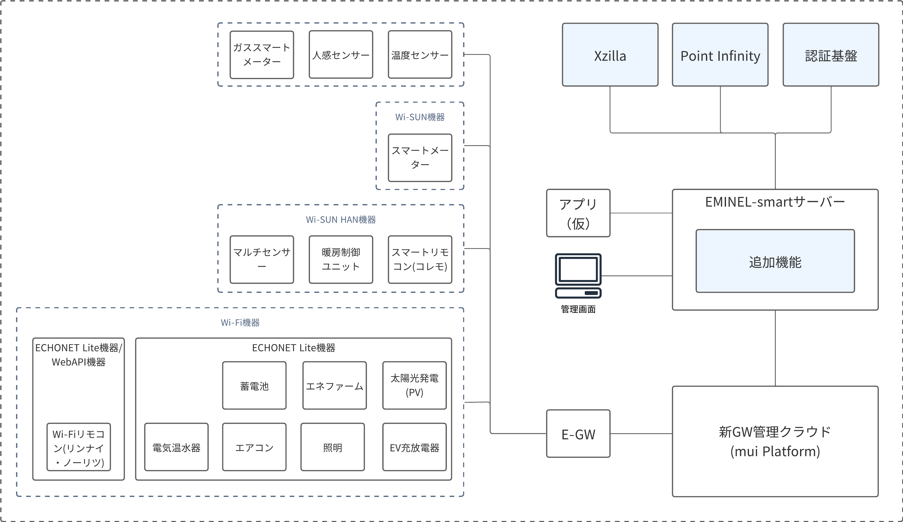

🔍 Nguồn ảnh: `eminel_gw_project/docs/eminel/3_requirements/images/3-1_system_overview.png`
→ được nhúng tại `00_integrated_requirements_v1.2.md`, mục 「3-1. システム全体構成」, dòng 75

Diễn giải bằng chữ:

```
   [Trong nhà khách hàng]              [Đám mây]                    [Người dùng]

  Cảm biến, máy sưởi,                                                📱 App
  đồng hồ điện, pin ...                                              🖥️ Màn hình quản trị
        │                                                                  ▲
        │ ECHONET Lite                                                     │
        ▼                                                                  │
    ┌───────┐   MQTT    ┌──────────────────┐  Webhook  ┌──────────────────┐│
    │ E-GW  │──────────▶│  GW管理クラウド     │──────────▶│ EMINEL-smart     │┘
    │ (hub) │◀──────────│  (tầng thiết bị)  │◀──────────│ server(nghiệp vụ)│
    └───────┘           └──────────────────┘   API Pull└──────────────────┘
                                                              ▲
                                                              │
                                          Xzilla · TagTag · Point Infinity
                                              (hệ thống của 北ガス)
```

*Các chữ trên mũi tên (ECHONET Lite, MQTT, Webhook, API Pull) là **tên các cách hai máy nói chuyện với nhau** — chưa cần hiểu ngay; bảng 0.6 có giải thích ngắn, chi tiết ở [mục 2.4–2.5](#24-hai-server-nói-chuyện-với-nhau-thế-nào). TagTag là nền tảng thành viên của 北ガス — mã hội viên TagTag ID sẽ gặp lại nhiều lần.*

### Đã làm được đến đâu?

| Hạng mục | Trạng thái |
|---|---|
| Định nghĩa yêu cầu & thiết kế cơ bản | ✅ **Đã xong, đã bàn giao** (bản v1.2, ngày 2026-04-07) |
| Requirement cho mobile app | 🔵 Đang viết — 23 section đều đã có nội dung; **5 section nhóm C đã qua review của khách**, còn lại chưa |
| Spec màn hình quản trị | 🔵 Đang viết — 10 chức năng, tất cả ở trạng thái DRAFT |
| Spec (機能仕様) mobile app | 🔵 **Vừa khởi động 2026-08-12** — mới có bản索引 kế hoạch **30 tài liệu**, trong đó **2 bản nháp đầu tiên** (biểu đồ · report). Xem [§7.5](#75-機能仕様-app--tầng-vừa-mở) |
| Bản thiết kế giao diện | 🔵 Bản nháp HTML đã có đủ 10 chức năng |
| Code | ⬜ **Chưa bắt đầu phần chính** — còn chờ spec API |

🔍 Nguồn (a) — trạng thái pha: `eminel_gw_project/docs/eminel/0_foundation/01_overview.md`
→ mục 「現フェーズ」, dòng 6 *(lưu ý: file này ghi 最終更新 2026-07-16, cũ hơn mốc đối chiếu của guide)*

🔍 Nguồn (b) — con số 23 section và mức review: `eminel_gw_project/docs/eminel/3_requirements/app/README.md`
→ mục 「セクション一覧」, dòng 24–74 (23 hàng: A1–A4 · B1–B6 · C1–C5 · D1–D4 · E1–E4); riêng C1–C5 ở dòng 52–56 đều ghi ステータス = 「レビュー済」

### Giờ phải làm gì tiếp?

**Tháng 9/2026 là hạn chốt cứng cho toàn bộ design + spec.** Sau đó tháng 10 ghép lần đầu, tháng 12 bàn giao, tháng 1–2/2027 thử nghiệm thực địa tại ~10 nhà nhân viên 北ガス.

🔍 Nguồn: `eminel_gw_project/docs/eminel/2_management/minutes/20260624_egw_camp_day2.md`
→ bảng 「大枠スケジュール（デッドライン逆算「まずいメソッド」）」, dòng 146–153
→ nguyên văn (dòng 148): 「2026/9 | デザイン・仕様がすべてフィックス」

Vướng mắc lớn nhất đang chặn phía phát triển: **chưa có spec API giữa gateway và tầng quản lý thiết bị** → chưa giao được việc cho SYP.

🔍 Nguồn: `eminel_gw_project/docs/eminel/2_management/20_open_issues.md`
→ mục 「CLD-01 GW⇔GW管理クラウドのAPI仕様未策定」, dòng 149–153
→ nguyên văn: 「API仕様が決まらないとSYPへ管理画面・モバイルアプリの開発依頼ができない」

---

## 0.5 Sống sót với tài liệu tiếng Nhật

Toàn bộ tài liệu gốc, Slack, Notion và các cuộc họp của dự án đều bằng **tiếng Nhật**. Bạn không cần giỏi tiếng Nhật, nhưng cần nhận ra vài mẫu lặp lại.

### Bảng đầu file — luôn đọc trước

Gần như mọi file trong repo đều mở đầu bằng một bảng nhỏ như sau:

```markdown
| | |
|---|---|
| 出典 | Slack #proj_kitagas_eminel-gateway、input各資料 |
| 最終更新 | 2026-06-08 |
| 凡例 | 資料で確認できたものを記載。推定・未確認は「※要確認」 |
```

| Từ | Đọc | Nghĩa | Vì sao quan trọng |
|---|---|---|---|
| **出典** | shutten | Nguồn gốc | Cho biết thông tin lấy từ đâu — Slack? Excel? Notion? |
| **最終更新** | saishū kōshin | Cập nhật lần cuối | **Quan trọng nhất.** File cập nhật tháng 6 có thể đã lỗi thời so với quyết định tháng 7 |
| **凡例** | hanrei | Chú giải ký hiệu | Giải thích các ký hiệu dùng trong file đó |

### Sáu từ khoá cảnh báo

| Từ | Nghĩa | Phải làm gì |
|---|---|---|
| **※要確認** | *cần xác nhận* | **Đừng tin.** Đây là suy đoán của người viết, chưa được xác nhận |
| **T.B.D** / **TBD** | *chưa quyết* | Chưa có quyết định. Nếu bạn cần nó để làm việc → đây là vật cản, phải đi hỏi |
| **要検討** | *cần bàn thêm* | Đã nhận ra vấn đề nhưng chưa bàn xong |
| **🔴 (chữ đỏ)** | *thay đổi / mới* | Trong spec màn hình quản trị: đánh dấu chỗ khác với hệ ESTA có sẵn |
| **【新規】** | *mới* | Trong requirement app: chức năng này **không có** trong app hiện hành |
| **劣後** | rekko — *xếp sau* | Chức năng được phép lùi sang năm 2027 |

🔍 Nguồn: `eminel_gw_project/docs/eminel/0_foundation/04_glossary.md`
→ mục 「開発・体制」, dòng 71
→ nguyên văn: 「劣後 / 劣後可能機能 | 後回しにできる機能。年内スコープ圧縮のため一部を2027年度上期リリースに分割する対象」

### Mẹo đọc nhanh

- **Bảng thì đọc được ngay** — tiếng Nhật trong bảng thường là danh từ ngắn, dịch máy rất chính xác
- **Câu văn dài thì cẩn thận** — dịch máy hay đảo ngược ý phủ định. Gặp câu quan trọng nên nhờ người biết tiếng Nhật đọc lại
- **Chú ý 「〜ない」 và 「〜対象外」** — đây là phủ định. `対象外` = *ngoài phạm vi*, cực kỳ hay gặp và cực kỳ quan trọng

---

## 0.6 Mười bảy thuật ngữ IT cơ bản

Những từ dưới đây xuất hiện **xuyên suốt** tài liệu. Nếu bạn mới học IT, đọc bảng này trước sẽ đỡ vấp rất nhiều. *(Thuật ngữ chuyên ngành năng lượng và thuật ngữ tiếng Nhật được giải thích tại chỗ khi xuất hiện lần đầu, và gom ở [Phụ lục A](#phụ-lục-a--từ-điển-thuật-ngữ).)*

| Thuật ngữ | Giải thích cho người ngoài ngành |
|---|---|
| **Firmware** | Phần mềm **nằm bên trong một thiết bị phần cứng**, điều khiển chính thiết bị đó. Khác với app trên điện thoại ở chỗ nó gắn liền với máy, người dùng không cài/gỡ được. Firmware của gateway chính là thứ quyết định gateway biết làm gì. |
| **API** | *Application Programming Interface* — **cách hai phần mềm nói chuyện với nhau**. Giống như thực đơn nhà hàng: liệt kê "gọi được món gì, cần đưa gì, nhận lại gì". Bên A không cần biết bên B làm thế nào, chỉ cần gọi đúng theo thực đơn. |
| **Webhook** | Cơ chế **bên có tin mới chủ động báo** cho bên kia (như người đưa thư bấm chuông khi có bưu kiện) — ngược với việc bên kia phải hỏi đi hỏi lại. Hai đám mây của dự án nói chuyện bằng cách này. Chi tiết ở [mục 2.4](#24-hai-server-nói-chuyện-với-nhau-thế-nào). |
| **MQTT** | Giao thức nhắn tin **siêu nhẹ cho thiết bị nhỏ** — gateway và đám mây quản lý thiết bị nói chuyện bằng nó. Cứ hiểu là "đường dây nóng tiết kiệm pin/băng thông giữa thiết bị và server". |
| **Server** | Máy tính chạy liên tục để phục vụ các máy khác. Không có màn hình, không ai ngồi trước nó. |
| **Client** | Bên gọi tới server — app điện thoại, trình duyệt, màn hình quản trị đều là client. |
| **Repo** *(repository)* | **Kho chứa mã nguồn và tài liệu**, có ghi lại lịch sử mọi lần sửa. Dự án này có 5 repo. |
| **Branch** | **Nhánh** — một bản sao của repo để làm việc riêng mà không ảnh hưởng bản chính. Xong thì **gộp (merge)** lại. Vấn đề `CLD-02` chính là chuyện gộp nhánh. |
| **Codebase** | Toàn bộ mã nguồn của một sản phẩm. "Chung codebase" = hai đội cùng sửa một bộ mã. |
| **Build** | Quá trình **biến mã nguồn thành ứng dụng chạy được**. Cùng một mã nguồn có thể build ra hai app khác nhau bằng cách đổi cấu hình. |
| **Batch** | **Xử lý theo lô, chạy tự động theo lịch** — ví dụ 2 giờ sáng mỗi ngày tính tổng dữ liệu hôm qua. Không ai bấm nút, máy tự chạy. Hệ cũ có 35 batch, hệ mới dự kiến ~46. |
| **Token** | **Vé thông hành tạm thời** — sau khi đăng nhập, hệ thống phát cho bạn một chuỗi ký tự. Các lần gọi sau chỉ cần đưa vé này, không phải nhập lại mật khẩu. Vé có hạn, hết hạn thì xin vé mới. |
| **Push** *(thông báo đẩy)* | Thông báo **server chủ động đẩy xuống điện thoại**, hiện lên cả khi app đang đóng. Ngược với việc bạn phải mở app ra xem. |
| **CSV** | File bảng biểu dạng văn bản thuần, mỗi dòng một bản ghi, các cột cách nhau bằng dấu phẩy. Mở được bằng Excel. Dùng để xuất dữ liệu. |
| **E2E test** *(end-to-end)* | Kiểm thử **chạy thử toàn bộ đường đi từ đầu đến cuối** như người dùng thật — bấm app, xem thiết bị có phản ứng không. Khác với kiểm thử từng phần riêng lẻ. |
| **ST** *(system test)* | Kiểm thử toàn hệ thống sau khi tất cả các phần đã ghép lại. Trong lịch dự án, ST bắt đầu tháng 11/2026. |
| **Figma** | Công cụ thiết kế giao diện chạy trên trình duyệt. Bản thiết kế màn hình quản trị sẽ được chuyển vào đây sau khi chốt. |

💡 **Mẹo**: nếu gặp từ lạ không có trong bảng này và cũng không có box 📖 giải thích, rất có thể đó là **thuật ngữ riêng của dự án** — tra ở [Phụ lục A](#phụ-lục-a--từ-điển-thuật-ngữ).

---

## 0.7 Giới hạn của tài liệu này

Phải nói thẳng bốn điều, để bạn không tin nhầm:

### ① Repo `eminel_gw_project` là tài liệu **cấp 2**

Nó không phải nguồn gốc. Nó là kết quả người ta **đọc tài liệu gốc rồi tóm tắt lại**. Chính các file trong repo tự khai điều đó.

🔍 Nguồn: `eminel_gw_project/docs/old_eminel/01_overview.md`
→ dòng 5
→ nguyên văn: 「二次資料。原典は参照リポジトリ `legacy_eminel_docs`（`docs/` 設計書＋`sources/` コード…）。各記述の裏取りは原典に当たる」*(… = lược phần chú vị trí file)*

Nghĩa là: **gặp chỗ nghi ngờ, phải truy ngược về nguồn gốc** — xem [Phụ lục E](#phụ-lục-e--cách-truy-về-nguồn-gốc).

### ② Ba thư mục được nhắc tới nhưng **không có** ở bản local

| Thư mục | Chứa gì | Vì sao không có |
|---|---|---|
| `input/` | Bản gốc tài liệu (PowerPoint, Excel) | Bị `.gitignore` — chứa thông tin mật, dung lượng lớn |
| `tasks/` | Bảng tiến độ, đặc biệt `app_requirements_plan.md` | Không được commit |
| `scripts/` | Script sinh slide từ markdown | Không được commit |

⚠️ Điều này rất đáng chú ý vì `docs/eminel/3_requirements/app/README.md` **liên tục trỏ tới** `tasks/app_requirements_plan.md` như nguồn trạng thái chính thức — mà file đó bạn không mở được.

🔍 Nguồn: `eminel_gw_project/docs/eminel/3_requirements/app/README.md`
→ mục 「進め方」, dòng 8
→ nguyên văn: 「進捗（状態の正）は `tasks/app_requirements_plan.md` の進捗表」

### ③ Các repo tham chiếu cần được đăng ký riêng

Muốn truy về code và spec gốc, bạn cần thêm quyền truy cập:

| Repo | Chứa gì |
|---|---|
| `legacy_eminel_docs` | Spec + code của **hệ thống EMINEL hiện hành** |
| `syp-eminelstandard-app` / `-backend` / `-web-admin` | Code của **ESTA** |

🔍 Nguồn: `eminel_gw_project/CLAUDE.md`
→ mục 「必須セットアップ」, dòng 5

### ④ Tài liệu này chụp lại thời điểm 2026-08-12 (commit `1100487`)

Dự án đang chuyển động nhanh: tháng 7/2026 có 4 lần **cấu trúc** requirement bị đổi, tháng 8 lại có **bốn đợt sửa nội dung liên tiếp** — 08-03: **B2** (section điều khiển sưởi) bỏ hẳn khái niệm 設定値運転 (*"chạy theo giá trị đặt sẵn"*, nay gọi là lịch tuần không có 室温制御 — [§5.5](#55-điều-khiển-sưởi--phần-khó-nhất)); 08-05: **B6** (điều khiển phát điện tại nhà) lần đầu được viết nội dung + **bảng index 23 section** chuyển sang lấy trạng thái thẳng từ slide gửi khách ([§7.3](#73-requirement-app-23-section)); 08-06: E2/E3 đổi trạng thái; **08-12: đợt 「要件fix」 đụng 10 file cùng lúc** — phản ánh kết quả 北ガス review slide đối khách ngày 08-07, đóng hàng loạt câu 要確認事項 về 「なし」 và **đảo kết luận của B6** (từ "chỉ gợi ý" sang "tự động điều khiển" — [§7.3](#73-requirement-app-23-section)).

Cùng ngày 08-12 còn có một việc lớn hơn: **tầng 機能仕様 app (`4_spec/app/`) được mở** — xem [§7.5](#75-機能仕様-app--tầng-vừa-mở). Nghĩa là từ nay một chức năng có tài liệu ở **hai tầng**, đọc requirement thôi là chưa đủ.

Nếu bạn đọc tài liệu này sau nhiều tuần, hãy `git fetch` rồi đối chiếu lại dòng `経緯` (*lịch sử sửa đổi*, ở bảng đầu mỗi file requirement) — và cả `git log`, vì có file quên cập nhật `経緯`.

---
---

# Chương 1 — Dự án này là về cái gì

## 1.1 Bắt đầu từ một ngôi nhà ở Hokkaido

Hãy tưởng tượng một gia đình ở **Sapporo, Hokkaido** — vùng lạnh nhất Nhật Bản, mùa đông xuống dưới −15°C.

Trong nhà họ có:
- Một **nồi hơi đốt gas** để sưởi ấm cả nhà (không phải điều hoà — ở Hokkaido người ta sưởi bằng nước nóng chạy trong ống)
- **Đồng hồ gas** và **đồng hồ điện** thông minh
- Có thể có **tấm pin mặt trời**, **pin lưu trữ**, **xe điện**

Họ ký hợp đồng gas với **北海道ガス**. Và 北海道ガス bán kèm một dịch vụ tên **EMINEL**:

| Người dùng nhận được gì | Ví dụ cụ thể |
|---|---|
| Xem nhà mình dùng bao nhiêu gas, điện | Biểu đồ theo giờ / ngày / tháng |
| Đặt lịch sưởi tự động | *"7h sáng bật 22°C, 9h đi làm hạ xuống 16°C, 18h về nhà bật lại"* |
| Nhận lời khuyên tiết kiệm | *"Nhiệt độ ban ngày nhà bạn cao hơn khuyến nghị, hạ 1°C tiết kiệm được X yên"* |
| Tích điểm thưởng | Đổi được sang điểm mua hàng của 北ガス |
| Người thân biết mình vẫn khoẻ | Cảm biến thấy có người di chuyển → gửi thông báo "đã về nhà" |

Để làm được những việc đó, cần **một thiết bị nhỏ đặt trong nhà** nói chuyện với tất cả máy móc kia, rồi gửi dữ liệu lên internet.

📖 **Gateway (viết tắt GW) là gì?**
Là thiết bị trung gian ngồi giữa **các thiết bị trong nhà** và **internet**. Nó giống như một phiên dịch viên: máy sưởi nói một thứ tiếng, pin mặt trời nói thứ tiếng khác, gateway hiểu hết rồi dịch sang một ngôn ngữ chung để gửi lên server. Cục Wi-Fi router trong nhà bạn cũng là một loại gateway.

💡 **Ví dụ đời thường**
Gateway giống **người quản gia**. Bạn không nói chuyện trực tiếp với đầu bếp, thợ điện, người làm vườn — bạn nói với quản gia, quản gia đi truyền đạt. Khi bạn muốn biết tình hình ngôi nhà, bạn hỏi quản gia chứ không đi hỏi từng người.

**Dự án E-GW chính là thay người quản gia đó.**

---

## 1.2 Ba cái tên dễ lẫn nhất

Đây là chỗ khiến người mới nhầm nhiều nhất. Ba cái tên, nghe giống nhau, nhưng là ba thứ hoàn toàn khác:

| Tên | Là gì | Vai trò trong dự án |
|---|---|---|
| **EMINEL** *(現行EMINEL)* | Dịch vụ **đang chạy thật** cho khách hàng 北ガス. Gateway của Maxell, server PHP | 🔻 **Cái sẽ bị thay** |
| **E-GW** / **EMINEL Gateway** | **Chính dự án này**. Gateway mới do mui làm + server dời sang nền mới | 🔨 **Cái đang xây** |
| **EMINEL-Smart** | Một dịch vụ **khác cũng đang chạy thật**, nền tảng công nghệ mới hơn | 🏗️ **Nền móng để xây E-GW lên** |

### ⚠️ Bẫy số 1: EMINEL-Smart có **bốn** tên gọi

| Tên | Xuất hiện ở đâu |
|---|---|
| **EMINEL-Smart** | Tài liệu chính thức |
| **E-Smart** | Cách gọi tắt nội bộ mui |
| **EMINEL-standard** | Trong hợp đồng và một số tài liệu cũ |
| **ESTA** | **Trong code** — tên các repo là `syp-eminelstandard-*`, Bundle ID là `jp.co.hokkaido_gas.esta` |

🔍 Nguồn: `eminel_gw_project/docs/eminel/0_foundation/04_glossary.md`
→ mục 「サービス・プロジェクト」, dòng 16–18
→ nguyên văn: 「EMINEL-Smart / E-Smart | 北ガス向けに既に商用稼働している現行サービス。E-GWのサーバーはこの基盤に統合される。実体はESTA」

⚠️ **「統合される」 (được tích hợp) không có nghĩa là chạy chung một chỗ.** Theo hai trả lời trên QAデータベース Notion (cùng 起票 2026-08-03):

- **Server E-GW** — swan (mui) trả lời — **về cơ bản (基本的には) phát triển theo hướng một hệ độc lập** với EMINEL-smart server đang chạy, kèm lời nhờ *"nếu có chức năng nên dùng tiếp hệ hiện hữu thì báo lại"*. Phiếu **No. 2, đã 完了** (chốt 08-13) ⇒ **hướng này đã chốt**; nhưng chữ 「基本的には」 vẫn nguyên trong câu trả lời và **mức độ** độc lập thì chưa nói.
- **Màn hình quản trị** — masao takahashi (mui) trả lời — **chung source code, chung cả deploy** (*デプロイ/triển khai — bản chạy thật đưa lên server*) với E-Smart, lý do: **cùng một lớp người vận hành sử dụng**. Phiếu **No. 3, đã 完了** (chốt 08-13) ⇒ **đã chốt**, và câu trả lời này **không kèm chữ nhượng bộ nào** — khác với phiếu server ở trên.

Chi tiết + nguyên văn + trạng thái từng phiếu: xem [9.4](#94-vai-trò-và-môi-trường-của-syp).

### ⚠️ Bẫy số 2: `EMINEL` và `EMINEL-Smart` **không phải một**

Chỉ khác nhau chữ "Smart" nhưng là hai hệ thống hoàn toàn riêng biệt, hai bộ code khác nhau, hai nhóm khách hàng khác nhau.

| | **EMINEL** (hiện hành) | **EMINEL-Smart** (ESTA) |
|---|---|---|
| Khách hàng | Người có hợp đồng EMINEL | Rộng hơn — chỉ cần có thiết bị RM2 là dùng được |
| Gateway | Có, của Maxell | Không cần gateway |
| Công nghệ | CakePHP + PostgreSQL | Flutter + AWS Lambda + DynamoDB |
| Số phận | Bị thay thế | Được mở rộng để đỡ E-GW |

🔍 Nguồn: `eminel_gw_project/docs/eminel/2_management/minutes/20260623_egw_camp_day1.md`
→ mục 「システム構成」, dòng 82–84
→ nguyên văn: 「エミネルアプリ＝エミネル契約者のみ／E-Smart＝RM2があれば広く使える」

### Cách nhớ đơn giản

```
EMINEL        =  cái CŨ, sắp bị thay
E-GW          =  cái ĐANG LÀM
EMINEL-Smart  =  cái ĐANG CHẠY, sẽ đỡ cái đang làm
   = ESTA = E-Smart = EMINEL-standard  (một thứ, bốn tên)
```

---

## 1.3 Bốn bên và ai làm gì cho ai

```
北海道ガス (khách hàng)
     │  đặt hàng, trả tiền, quyết định
     ▼
mui Lab (nhà thầu chính)
     │                    │  mua phần cứng
     │ thuê lại           ▼
     ▼                  Aqara (Trung Quốc)
   SYP (Việt Nam)
```

| Bên | Là ai | Làm gì |
|---|---|---|
| **北海道ガス** (北ガス / KG) | Công ty gas vùng Hokkaido. Có quan hệ **góp vốn và hợp tác kinh doanh** với mui Lab | Đặt hàng, trả tiền, quyết định mọi thứ về nghiệp vụ |
| **mui Lab** | Công ty Nhật, nhà thầu chính | Thiết kế toàn bộ, làm firmware gateway, làm tầng quản lý thiết bị |
| **SYP** | Công ty Việt Nam, vendor của mui Lab (email `@syp.vn`) | Hiện thực hoá — đã làm ESTA; ở E-GW đảm nhận **server EMINEL-smart + màn hình quản trị + mobile app** (mui xác nhận 2026-08-13, [§1.6](#16-phạm-vi-cái-gì-làm-cái-gì-không)) |
| **Aqara** | Công ty Trung Quốc | Cung cấp phần cứng hub **M300**. Phần mềm thì mui tự làm |

🔍 Nguồn: `eminel_gw_project/docs/eminel/0_foundation/03_stakeholders.md`
→ mục 「外部ベンダー」, dòng 43
→ nguyên văn: 「SYP | mui Lab の外部開発ベンダー（ベトナム拠点、`@syp.vn`）。EMINEL-Smart（ESTA）の実装・テスト・リリースの実働部隊。E-GWのサーバー開発も担当想定」
→ ⚠️ chữ 「担当想定」 (*dự kiến đảm nhận*) trong nguyên văn là cách viết **cũ**, từ lúc phân công còn chưa chắc. Đến 2026-08-13 mui đã xác nhận dứt khoát — nên bảng trên ghi là đã đảm nhận, không còn "dự kiến"

### Những cái tên bạn sẽ gặp hằng ngày

**Phía mui Lab:**

| Tên | Vai trò |
|---|---|
| **masao** | Kiến trúc sư tổng thể. Chịu trách nhiệm tiến độ phía đám mây của mui |
| **kihara** (木原) | Trung tâm kỹ thuật. Phụ trách gateway, phần cứng, firmware, liên kết thiết bị |
| **oi** / **大井** | Dẫn dắt phát triển app và màn hình quản trị |
| **jumpei.oda** (小田) | PM — cửa liên lạc chính với 北ガス |
| **Takuya Saito** (齋藤) | PM/PMO — soạn biên bản, tài liệu yêu cầu, báo giá |

**Phía 北ガス** *(bạn không nói chuyện trực tiếp, mọi thứ đi qua PM của mui)*:

| Tên | Vai trò |
|---|---|
| **徳田** (Tokuda) | Người phụ trách chính hiện tại. Cửa vào cho mọi yêu cầu và câu hỏi |
| **高橋** (Takahashi) | Phụ trách chi tiết về điều khiển sưởi và DR |
| **鈴木** (Suzuki) | Nhóm vận hành điện — cung cấp dữ liệu điện |
| **中村室長** | Cấp trên, nắm chiến lược gateway |

🔍 Nguồn: `eminel_gw_project/docs/eminel/0_foundation/03_stakeholders.md`
→ mục 「mui Lab 側」dòng 11–25, mục 「北海道ガス（北ガス／KG）側」dòng 31–37

⚠️ **Chuỗi liên lạc là 北ガス → mui Lab → SYP.** SYP không trao đổi trực tiếp với 北ガス. Mọi câu hỏi nghiệp vụ phải đi qua PM của mui.

---

## 1.4 Vì sao có dự án này

Ba lý do, ghi thẳng trong tài liệu tổng quan:

| # | Lý do | Giải thích cho người mới |
|---|---|---|
| **1** | Giảm chi phí vận hành hệ EMINEL hiện hành và tăng tiện ích | Hệ cũ tốn tiền duy trì. Máy chủ không có dự phòng (システムランクC・非冗長) — *lưu ý: stack đã được làm mới khi thay máy chủ (PHP 8.0 / CakePHP 4.4 / PostgreSQL 16), "cũ" là về kiến trúc và chi phí vận hành, không phải code 10 năm không đổi* |
| **2** | Đổi mới gateway cũ (Maxell) + gộp server về nền EMINEL-Smart | Thay vì nuôi hai hệ thống song song, gộp về một nền |
| **3** | Đồng phát triển giữa 北ガス và mui Lab | mui góp tài sản có sẵn (phần cứng, firmware, đám mây), 北ガス trả tiền cho chức năng riêng của họ |

🔍 Nguồn: `eminel_gw_project/docs/eminel/0_foundation/01_overview.md`
→ mục 「目的・背景」, dòng 13–20

### Một động cơ ngầm cần biết

Ngoài ba lý do chính thức trên, **nội bộ mui còn có định hướng riêng**: coi gateway mới là *"thiết bị thể hiện trải nghiệm người dùng của nền tảng AI quản lý năng lượng"*, và có chủ trương **ưu tiên hướng sản phẩm của mui hơn là chỉ chiều theo yêu cầu 北ガス**.

🔍 Nguồn: `eminel_gw_project/docs/eminel/0_foundation/01_overview.md`
→ mục 「目的・背景」, dòng 19–20
→ nguyên văn: 「北ガス仕様にただ合わせるのではなく、muiプロダクトとしての方向性を優先する社内方針あり」

⚠️ Điều này giải thích vì sao đôi khi có tranh luận kiểu *"cái này có thật sự cần không?"* thay vì làm y hệt hệ cũ.

---

## 1.5 Ai trả tiền cho phần nào

Đây là chuyện tưởng chỉ liên quan kế toán, nhưng thực ra **quyết định luôn phạm vi công việc**.

| Phần | Ai chịu chi phí | Vì sao |
|---|---|---|
| Phần cứng gateway, firmware nền, đám mây quản lý thiết bị | **mui** | Đây là **tài sản có sẵn** của mui, dùng lại cho nhiều khách hàng |
| Điều khiển sưởi, hiển thị, DR *(điều tiết nhu cầu điện — giải thích kỹ ở [5.7](#57-dr--điều-tiết-nhu-cầu-điện))*, điểm thưởng… | **北ガス** | Đây là **chức năng riêng** chỉ 北ガス cần |

🔍 Nguồn: `eminel_gw_project/docs/eminel/0_foundation/01_overview.md`
→ mục 「目的・背景」, dòng 17–18
→ nguyên văn: 「GWハードウェア・ファームウェア・GW管理クラウドは mui の既存開発アセットを使用 / 北ガス独自機能（暖房制御、見える化、DR等）を本PJで追加開発」

Trong bảng chức năng, đây chính là cột **負担** (futan — *gánh chịu*) ghi `KG` hoặc `mui`. Xem chi tiết ở [mục 6.2](#62-cách-đọc-bảng-chức-năng).

---

## 1.6 Phạm vi: cái gì làm, cái gì không

Có **hai câu hỏi khác nhau** rất dễ trộn vào nhau, và trộn là hiểu sai:

- **対象範囲** (*taishō han'i — phạm vi đối tượng*): dự án này **có làm** cái đó hay không
- **担当** (*tantō — đảm nhận*): trong những cái có làm, **ai** làm

Mục này trả lời cả hai, theo thứ tự đó.

### ① 対象範囲 — dự án có làm gì

| Hạng mục | Trong phạm vi? |
|---|---|
| Firmware gateway | ✅ **Có** |
| Server EMINEL-smart (gồm cả tầng quản lý thiết bị) | ✅ **Có** |
| Màn hình quản trị | ✅ **Có** |
| **Mobile app** | ❌ **Ngoài phạm vi** *(chỉ chỉnh phần giao tiếp)* |
| Phần cứng | ❌ **Ngoài phạm vi** *(hai bên chỉ chia sẻ tiến độ)* |

🔍 Nguồn: `eminel_gw_project/docs/eminel/3_requirements/00_integrated_requirements_v1.2.md`
→ mục 「1-2. 対象範囲」, dòng 28–38

### ② 担当 — mui Lab làm gì, SYP làm gì

Bảng dưới đây **đã được phía mui xác nhận là đúng**, và là căn cứ mới nhất về phân công:

| Khối chức năng | 担当 |
|---|---|
| **7-1. E-GW機能（ファームウェア）** — phần mềm nhúng chạy trong gateway | **mui Lab** |
| **7-2. GW管理クラウド機能** — tầng quản lý thiết bị (sổ gateway, MQTT, dữ liệu thô) | **mui Lab** |
| **7-3. EMINEL-smartサーバー機能** — server nghiệp vụ (hiển thị, thông báo, DR, liên kết ngoài) | **SYP** |
| **7-4. 管理画面機能** — màn hình quản trị | **SYP** |
| **モバイルアプリ** — app điện thoại | **SYP** |

🔍 Nguồn: Notion — QAデータベース dự án, trang 「SYP開発範囲の確認」 (No. 10)
→ 質問者 (*người hỏi*) Nguyen Van Tung (SYP, 起票/*tạo phiếu* 2026-08-12 16:17) · 回答者 (*người trả lời*) swan (mui) · phiếu được **chốt 2026-08-13 12:28** (更新日時)
→ nguyên văn (回答内容): 「認識に相違ないです。」 (*"Cách hiểu không có gì sai lệch."*)
→ trạng thái khi đọc (2026-08-20): **完了** (đã đóng — tương đương 回答済)
→ câu hỏi trích căn cứ từ 「統合要件定義書および開発費見積もりの記載」 (*tài liệu yêu cầu tích hợp + bảng báo giá phát triển*); các số 7-1〜7-4 là **mục lục của chính tài liệu v1.2**, xem [§6.1](#61-bốn-nhóm-mã-chức-năng)

⚠️ **Ba điều phải đọc kỹ ở bảng ②:**

1. **Mobile app: 対象範囲 nói ❌, 担当 nói SYP làm.** Hai bảng không mâu thuẫn — chúng trả lời hai câu hỏi khác nhau, và chữ 「対象外」 của v1.2 đã lạc hậu (giải thích ngay dưới đây).
2. **GW管理クラウド là của mui Lab, KHÔNG phải SYP.** Bảng ① gộp nó vào chung một hàng với server EMINEL-smart *(vì v1.2 viết vậy)*, nhưng về phân công thì hai thứ này **tách ra hai bên khác nhau**. Đây là chỗ dễ hiểu sai nhất của cả mục.
3. **Firmware cũng là của mui Lab.** SYP không đụng tới phần mềm chạy trong gateway.

### ⚠️ Bẫy lớn: "mobile app ngoài phạm vi" **không có nghĩa là không làm app**

Câu đó chỉ đúng **với riêng tài liệu v1.2**. Thực tế:

- Trong bảng chức năng, riêng mobile app cộng lại **≈ 11 người-tháng** công số (các dòng F-AP). ⚠️ Con số **2.75 người-tháng** hay gặp ở bảng サマリ đầu file là **phần có thể lùi sang 2027** (劣後可能工数), *không phải* tổng công số app
- Bộ requirement app riêng gồm **23 section (A1–E4)** đang được viết **ngay lúc này** (B6 マイホーム発電制御 tách từ B4 ngày 2026-07-30, nội dung đã được viết đầy đủ)

🔍 Nguồn: `eminel_gw_project/docs/eminel/1_product/10_feature_list.md`
→ mục 「モバイルアプリ開発（Stream3｜主担当 oi）」, dòng 119–138 (bảng công số) và dòng 16–23 (bảng サマリ（劣後可能工数）)

🔍 Nguồn: `eminel_gw_project/docs/eminel/3_requirements/app/README.md`
→ mục 「位置づけ」, dòng 3
→ nguyên văn: 「統合要件定義書 v1.2 の §1-2 で「対象外(IF前提の整理のみ)」とされた**モバイルアプリ**を対象に、「機能ごとに何ができるか(What)」を要件化する」

Nghĩa là: tài liệu v1.2 nói "chưa định nghĩa app", còn công việc định nghĩa app **đang diễn ra trong một bộ tài liệu khác**.

**Phía mui đã xác nhận trực tiếp cách đọc này.** Khi SYP hỏi trên QAデータベース của dự án (Notion) rằng *"mobile app (EMINEL-smart) nằm ngoài phạm vi đảm nhận, đúng không?"*, câu trả lời là ngược lại:

🔍 Nguồn: Notion — QAデータベース dự án, trang 「担当範囲（サーバー／管理画面）とアプリ対象外の確認」 (**No. 1**)
→ 質問者 (*người hỏi*) Bui Trong Dat (SYP, 起票/*tạo phiếu* 2026-08-03 17:30) · 回答者 (*người trả lời*) masao takahashi (mui)
→ nguyên văn (回答内容): 「モバイルアプリは開発対象です。」 — nội dung này **đã có từ 2026-08-03/04**
→ trạng thái khi đọc (2026-08-20): **完了** (đã đóng) — phiếu được chốt ngày **2026-08-13 12:27** (更新日時), tức **10 ngày sau khi câu trả lời được viết**

⚠️ **Đọc kỹ hai mốc ngày ở trên, đừng gộp làm một**: câu trả lời có nội dung từ 08-03/04 nhưng lúc đó phiếu còn 回答中 (*chưa chốt, có thể bị bổ sung*); nó chỉ thành căn cứ dùng được khi chuyển sang 完了 ngày 08-13. Giải thích cơ chế: [Phụ lục E.2](#e2-bước-2--đi-theo-thứ-tự).

Câu trả lời này để hở hai chỗ, và **cả hai đã được lấp bằng QA 「SYP開発範囲の確認」 (No. 10, chốt 2026-08-13 12:28 — chỉ sau phiếu No. 1 một phút)** ở bảng ② phía trên:

| Chỗ còn hở hồi 08-03 | Nay ra sao |
|---|---|
| Trạng thái còn **回答中** nên câu trả lời có thể được bổ sung | Phiếu No. 1 nay **完了** — câu 「モバイルアプリは開発対象です」 là **kết luận cuối**, không còn chờ bổ sung |
| Vế hỏi kèm *"phạm vi SYP đảm nhận = EMINEL-smartサーバー + 管理画面, đúng không"* **chưa được trả lời** | Đã được trả lời bằng phiếu No. 10, và **rộng hơn vế hỏi**: server + 管理画面 + **app** |
| Câu 「モバイルアプリは開発対象です」 không nói rõ **ai** làm app | Đã rõ: **SYP** (phiếu No. 10) |

💡 **Vì sao chú ý chuyện "cách nhau một phút"**: hai phiếu No. 1 và No. 10 được mui đóng trong cùng một lượt dọn (12:27 và 12:28 ngày 08-13). Nghĩa là **đừng tin trạng thái đã đọc từ lâu** — mui xử lý QA theo đợt, một hôm đóng nhiều phiếu cùng lúc. Suy luận đó **đã được kiểm và đúng**: mở lại toàn bộ ngày 08-20 thì thấy **8 phiếu cùng được đóng trong 7 phút** hôm ấy. Bảng đầy đủ + hai ngoại lệ: [§9.4](#94-vai-trò-và-môi-trường-của-syp).

*(Ghi chú cho ai đọc lại câu hỏi gốc 08-03: nó ghi *"① EMINEL-smartサーバー + ④ 管理画面 theo bảng 「3-3. コンポーネント一覧」"* — theo đánh số bảng 3-3 thì EMINEL-smartサーバー là component **3**, 管理画面 là **4**, nên số ① trong câu hỏi là nhầm.)*

⚠️ **Nhưng chữ trên giấy của v1.2 §1-2 thì vẫn chưa sửa** — vẫn còn ghi 「対象外」 cho mobile app *(đã kiểm lại tại commit `1100487`)*. Nếu sau này v1.2 được cập nhật, bảng ① đầu mục 1.6 phải sửa theo.

---

## 1.7 Dòng thời gian từ 2022 đến nay

| Thời điểm | Chuyện gì xảy ra |
|---|---|
| **2022-06** | 北ガス gửi yêu cầu đấu thầu EMINEL. mui báo giá theo cấu trúc cũ |
| **2024-09-30** | Báo giá so sánh hai phương án: cấu trúc cũ vs cấu trúc ESTA *(nguồn: `02_customer.md` dòng 42 — không nằm trong 意思決定ログ)* |
| **2025-08-20** | 北ガス đưa trần ngân sách **50 triệu yên**. Chốt đại thể đi theo **cấu trúc ESTA**. **Loại bỏ** tính năng giao tiếp nội bộ trong nhà |
| **2025-11-12** | **Ký hợp đồng** — báo giá 68,1 triệu yên |
| **2026-02** | Chốt dùng phần cứng **Aqara M300** |
| **2026-03** | Tính năng giao tiếp nội bộ **sống lại** do 北ガス yêu cầu giữ như hệ cũ → **một trong các nguyên nhân** làm đội giá (CTR-03 liệt kê nhiều điểm chênh ngang hàng: làm lạnh, realtime monitor, huy hiệu, dashboard thống kê…) |
| **2026-03-27** | ✅ **Bàn giao và nghiệm thu xong** giai đoạn định nghĩa yêu cầu + thiết kế cơ bản *(bản tài liệu v1.2 đề ngày phát hành 2026-04-07 — nghiệm thu trước, bản cập nhật ra sau, nên hai ngày này không mâu thuẫn)* |
| **2026-06-03/04** | Họp tại Sapporo. Chốt lịch, chốt giá. Chuyển hợp đồng bảo trì **Maxell → mui** (từ tháng 5, cơ bản 10万円/tháng). Thống nhất **việc app gộp hay tách do 北ガス quyết** |
| **2026-06-10** | ✅ **Chốt lịch tổng thể** và **chốt phạm vi bắt buộc cuối 2026**: trục chính là **sưởi** (暖房機能・暖房制御), kèm 照明アドバイス※, liên kết điểm thưởng, gom nhóm & report. *※nguyên văn ghi 「照明アドバイス」 (tư vấn chiếu sáng) — nghi là lỗi gõ của 「省エネアドバイス」, xem [Phụ lục B.2](#b2-điểm-thưởng-và-tư-vấn-tiết-kiệm)* |
| **2026-06-23~25** | Trại tập trung 3 ngày của mui — nhiều tiền đề mới xuất hiện |
| **2026-08-12** | *(mốc repo mà tài liệu này đối chiếu — commit `1100487`)* — cùng ngày có hai việc: đợt 「要件fix」 phản ánh review 北ガス, và **mở tầng 機能仕様 app** |

🔍 Nguồn: `eminel_gw_project/docs/eminel/2_management/22_decisions.md`
→ bảng 「意思決定ログ」, dòng 11–31

⚠️ **Chú ý mốc 2025-08-20 và 2026-03**: tính năng "giao tiếp nội bộ trong nhà" (ローカル通信) bị **loại bỏ rồi lại được thêm vào**, và đây là nguồn cơn của tranh cãi về giá đang chưa xong. Xem [mục 6.5](#65-tiền-và-hợp-đồng).

---

## 1.8 Bạn sẽ đụng vào công nghệ gì

Vì E-GW được xây trên nền **ESTA**, nên công nghệ bạn thực sự làm việc chính là công nghệ của ESTA.

💡 **Chỉ cần nhớ 3 ý**: app viết bằng **Flutter**, màn hình quản trị viết bằng **Vue (Nuxt)**, backend chạy **serverless trên AWS**. Bảng dưới là danh mục đầy đủ để tra cứu khi cần — không cần thuộc, và không cần hiểu từng cái tên ngay bây giờ.

| Thành phần | Công nghệ |
|---|---|
| **Mobile app** | **Flutter 3.29.2** / Dart · quản lý trạng thái Riverpod + flutter_hooks · giao tiếp dio + retrofit · xác thực Keycloak · Firebase (thông báo đẩy, phân tích) |
| **Màn hình quản trị** | **Nuxt 3** (Vue 3 + TypeScript) · Pinia · Vuetify 3 + Element Plus + Tailwind · xác thực AWS Amplify → Cognito |
| **Backend** | **AWS SAM / TypeScript** · Lambda (Node.js 20.x, arm64) · **DynamoDB** · API Gateway · S3 · Step Functions |

🔍 Nguồn: `eminel_gw_project/docs/eminel-smart/02_product_overview.md`
→ mục 「技術スタック（リポジトリ別）」, dòng 34–52

📖 **AWS SAM là gì?**
*Serverless Application Model* — cách viết ứng dụng mà bạn không quản máy chủ. Bạn chỉ viết từng hàm nhỏ (gọi là *Lambda*), AWS tự chạy chúng khi có người gọi. Không có "server đang bật 24/7" nào cả.

📖 **DynamoDB là gì?**
Cơ sở dữ liệu của AWS, thuộc loại **NoSQL** — khác với cơ sở dữ liệu quan hệ (MySQL, PostgreSQL) ở chỗ không có bảng cố định với các cột định sẵn, và không JOIN được giữa các bảng. Truy vấn phải thiết kế trước theo cách bạn định đọc dữ liệu.

⚠️ **Điểm cần chú ý** *(phân tích của tài liệu này, không phải nội dung có sẵn trong repo)*: hệ EMINEL cũ dùng **PostgreSQL** — cơ sở dữ liệu quan hệ, 54 bảng, truy vấn được bằng JOIN. Hệ mới dùng **DynamoDB** — NoSQL, không JOIN.

Hai mô hình dữ liệu này khác nhau về bản chất, nên **logic nghiệp vụ viết bằng SQL của hệ cũ nhiều khả năng không chuyển thẳng sang được**, mà phải thiết kế lại cách truy vấn. Đây là suy luận từ hai nguồn (`old_eminel/01_overview.md` dòng 25 và `eminel-smart/02_product_overview.md` dòng 50), **không phải điều tài liệu dự án nói ra**. Nếu bạn được giao chuyển đổi phần nào, hãy xác nhận lại với người phụ trách trước khi ước lượng.

Luồng dữ liệu tổng thể phía backend ESTA:

```
[Mobile app] [Màn hình quản trị] [Hệ thống ngoài (Webhook)]
        \           |          /
         → Amazon API Gateway (+ Lambda Authorizer: Cognito/Keycloak/Basic)
              → AWS Lambda (API / Batch / Authorizer)
                   → Lambda Layer (dùng chung: models/repositories/services/business-logic)
                        → DynamoDB / S3 / Step Functions / Secrets Manager
```

🔍 Nguồn: `eminel_gw_project/docs/eminel-smart/02_product_overview.md`
→ mục 「システム構成」, dòng 20–27

---

## Kiểm tra nhanh — Chương 1

1. `ESTA`, `E-Smart`, `EMINEL-standard`, `EMINEL-Smart` — có bao nhiêu hệ thống ở đây?
2. Ai là người quyết định cuối cùng việc app E-GW gộp chung hay tách riêng với app hiện có?
3. Vì sao phần cứng gateway và firmware nền lại do mui tự trả tiền, không tính vào hoá đơn cho 北ガス?
4. Câu "mobile app ngoài phạm vi" trong tài liệu v1.2 có nghĩa là dự án không làm app phải không?

<details>
<summary>Đáp án</summary>

1. **Một.** Bốn tên gọi của cùng một thứ. `ESTA` là tên trong code.
2. **北ガス.** Đã thống nhất tại cuộc họp Sapporo 2026-06-03/04, căn cứ theo định hướng thương hiệu và lộ trình dịch vụ của họ. mui chỉ đưa ra khuyến nghị (là tách riêng — ghi ở mục 補足 dòng 33–35, kèm chú rõ **北ガス chưa đồng ý, chỉ tham khảo**). *(Nguồn: `22_decisions.md` dòng 26 và 33–35)*
3. Vì đó là **tài sản có sẵn của mui**, dùng lại được cho nhiều khách hàng khác. 北ガス chỉ trả cho phần chức năng riêng của họ.
4. **Không.** Câu đó chỉ mô tả phạm vi của riêng tài liệu v1.2. App vẫn được làm, và requirement app đang được viết trong một bộ tài liệu riêng ở `docs/eminel/3_requirements/app/`. Phía mui cũng đã xác nhận trực tiếp qua QAデータベース Notion (回答 2026-08-03, còn 回答中): 「モバイルアプリは開発対象です。」

</details>

---
---

# Chương 2 — Hệ thống mới được xây thế nào

## 2.1 Bức tranh tổng thể


🔍 Nguồn ảnh: `eminel_gw_project/docs/eminel/3_requirements/images/3-1_system_overview.png`
→ nhúng tại `00_integrated_requirements_v1.2.md`, mục 「3-1. システム全体構成」, dòng 71–75

Tài liệu gốc mô tả 8 nguyên tắc cấu trúc. Ba nguyên tắc quan trọng nhất:

🔍 Nguồn: `eminel_gw_project/docs/eminel/3_requirements/00_integrated_requirements_v1.2.md`
→ mục 「3-2. システム構成の基本方針」, dòng 79–86
→ nguyên văn:
> 「E-GWは専用の管理サーバー（GW管理クラウド）に接続する」
> 「EMINEL-smartサーバーが計測データのビジネス上のマスターを保持する。GW管理クラウドにもデバイス運用監視用として保存するが、管理画面・アプリからの参照先はEMINEL-smartサーバーとする」
> 「GW管理クラウドはGW IDベースで管理し、顧客情報を持たない。GW-顧客紐付けはEMINEL-smartサーバーが管理する」

Dịch gọn:
1. Gateway chỉ nói chuyện với **một** server chuyên trách, tên là **GW管理クラウド**
2. Dữ liệu đo được lưu **ở cả hai** đám mây, nhưng app và màn hình quản trị **chỉ đọc từ EMINEL-smart server**
3. **GW管理クラウド cố ý không biết khách hàng là ai**

---

## 2.2 Tám thành phần

| # | Thành phần | Vai trò |
|---|---|---|
| 1 | **E-GW** | Thiết bị hub trong nhà: nói chuyện với thiết bị, thu dữ liệu, điều khiển sưởi |
| 2 | **GW管理クラウド** | **Tầng thiết bị**: xác thực gateway, sổ đăng ký, phân phối cập nhật firmware, quản MQTT, lưu dữ liệu thô |
| 3 | **EMINEL-smartサーバー** | **Tầng nghiệp vụ**: khách hàng, dữ liệu đã xử lý, hiển thị, thông báo, DR |
| 4 | **管理画面** | Màn hình quản trị, nối vào EMINEL-smart server |
| 5 | **Xzilla** | Hệ thống của 北ガス: thông tin khách, hợp đồng, lượng điện/gas |
| 6 | **認証基盤** | Nền tảng xác thực — phát token đăng nhập bằng TagTag ID *(TagTag = nền tảng thành viên của 北ガス; TagTag ID = mã hội viên, dùng làm khoá định danh khách trong cả hệ thống — xem thêm Phụ lục A.6)* |
| 7 | **Point Infinity** | Hệ thống điểm thưởng bên ngoài |
| 8 | **モバイルアプリ** | App cho người dùng *(nguồn ghi 「本PJ対象外」 — nhưng app vẫn được phát triển, mui đã xác nhận qua QA 2026-08-03: xem bẫy ở [1.6](#16-phạm-vi-cái-gì-làm-cái-gì-không))* |

🔍 Nguồn: `eminel_gw_project/docs/eminel/3_requirements/00_integrated_requirements_v1.2.md`
→ mục 「3-3. コンポーネント一覧」, dòng 88–99

📖 **"Đám mây" (cloud) ở đây nghĩa là gì?**
Đơn giản là **máy chủ đặt ở đâu đó trên internet**, không phải máy đặt trong văn phòng. Trong dự án này có **hai** đám mây riêng biệt do hai nhóm chức năng khác nhau, chạy độc lập với nhau.

📖 **Tên gọi thứ hai của GW管理クラウド**
Trong biên bản họp gần đây, thành phần này được gọi là **「muiプラットフォーム」** (nền tảng mui). Cùng một thứ, hai tên — tuỳ tài liệu.

🔍 Nguồn: `eminel_gw_project/docs/eminel/2_management/minutes/20260623_egw_camp_day1.md`
→ mục 「共有された前提（既定事項）」, dòng 29
→ nguyên văn: 「コンシェルジュ機能をE-Smartサーバーに載せ、GWサーバー相当をmuiプラットフォームで作る」

---

## 2.3 Ranh giới trách nhiệm giữa hai đám mây

Đây là **phần quan trọng nhất của cả chương**. Nếu chỉ nhớ một bảng trong tài liệu này, hãy nhớ bảng dưới.

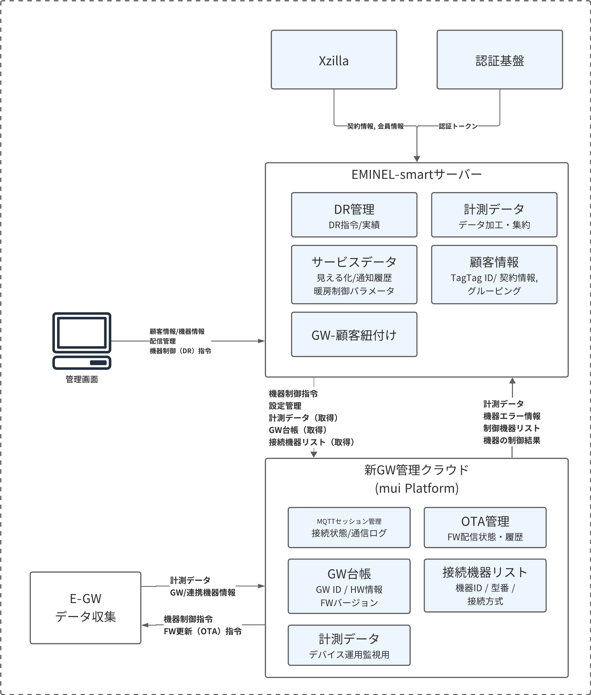

🔍 Nguồn ảnh: `eminel_gw_project/docs/eminel/3_requirements/images/4-5_dataflow_responsibility.png`
→ nhúng tại `00_integrated_requirements_v1.2.md`, mục 「4-5. データフロー概要」, dòng 235

| Lĩnh vực | **GW管理クラウド** | **EMINEL-smartサーバー** |
|---|---|---|
| **Khoá quản lý** | **GW ID** | **TagTag ID** |
| **Thông tin khách hàng** | ❌ **Không giữ** | ✅ Master |
| Xác thực gateway | ✅ Chủ trì | Nhận thông báo, quản việc gắn với khách |
| Sổ đăng ký gateway (phần cứng, phiên bản firmware, còn sống không) | ✅ **Master** | Đồng bộ để tham chiếu |
| Cập nhật firmware (OTA) | ✅ **Master** | — |
| Danh sách thiết bị kết nối | ✅ **Master** | Đồng bộ để tham chiếu |
| Dữ liệu đo **thô** | ✅ Lưu (giám sát vận hành thiết bị) | — |
| Dữ liệu đo **nghiệp vụ** (đã xử lý, gắn với khách) | — | ✅ **Master** |
| Gắn gateway ↔ khách hàng | — | ✅ **Master** |
| Tham số điều khiển sưởi | Chỉ **trung chuyển** qua MQTT | ✅ **Master** (sinh + quản) |
| Lệnh DR và kết quả | Chỉ **trung chuyển** qua MQTT | ✅ **Master** |
| Dữ liệu hiển thị (biểu đồ, report) | — | ✅ **Master** |
| Lịch sử thông báo | — | ✅ **Master** |
| **Lỗi** | Lỗi **gateway / đường truyền** (MQTT đứt, gateway hỏng) | Lỗi **dịch vụ** (mất dữ liệu, vượt ngưỡng) |
| Điều khiển từ xa | Trung chuyển qua MQTT | ✅ **Nơi ra quyết định** |

🔍 Nguồn: `eminel_gw_project/docs/eminel/3_requirements/00_integrated_requirements_v1.2.md`
→ mục 「3-4. GW管理クラウドとEMINEL-smartサーバーの責任分解点」→「責任範囲一覧」, dòng 113–130

📖 **"Master" nghĩa là gì?**
Là **bản gốc duy nhất được coi là đúng**. Khi cùng một thông tin tồn tại ở nhiều nơi, phải chỉ định một nơi là master — nếu hai nơi khác nhau thì tin master. Các nơi khác chỉ là bản sao để đọc cho nhanh.

💡 **Ví dụ đời thường**
Giống như **sổ hộ khẩu ở phường** và **bản photo bạn giữ trong nhà**. Bản ở phường là master. Bản photo dùng cho tiện, nhưng khi có tranh chấp thì lấy bản ở phường làm chuẩn.

### Ba hệ quả bạn phải nhớ

**① App và màn hình quản trị chỉ đọc từ EMINEL-smart server.** Không bao giờ gọi thẳng GW管理クラウド, kể cả khi bên đó có dữ liệu mới hơn.

**② GW管理クラウド cố ý không biết khách là ai.** Đây là quyết định thiết kế về bảo vệ dữ liệu cá nhân — thu hẹp phạm vi chứa thông tin cá nhân về đúng một chỗ.

🔍 Nguồn: cùng file trên
→ mục 「基本方針」, dòng 111
→ nguyên văn: 「GW管理クラウドは顧客情報を持たない：個人情報の管理範囲をEMINEL-smartサーバーに限定する」

**③ Quyết định điều khiển nằm ở EMINEL-smart server**, GW管理クラウド chỉ là ống dẫn.

---

## 2.4 Hai server nói chuyện với nhau thế nào

Không phải một bên đẩy hết dữ liệu sang bên kia. Cơ chế là **báo nhẹ rồi tự sang lấy**:

```
GW管理クラウド ──[IF-04 Webhook: "có dữ liệu mới đấy"]───▶ EMINEL-smart server
                                                                  │
GW管理クラウド ◀─[IF-02 Client API: "cho tôi xin chi tiết"]────────┘
```

🔍 Nguồn: `eminel_gw_project/docs/eminel/3_requirements/00_integrated_requirements_v1.2.md`
→ mục 「4-3. サーバー間通信方式（IF-02, IF-04）」, dòng 215–222
→ nguyên văn: 「GW管理クラウドからEMINEL-smartサーバーへのリアルタイム通知はWebhook（軽量イベント通知）で行い、EMINEL-smartサーバーが詳細データをGW管理APIでPull取得する」

📖 **Webhook là gì?**
Là cách một hệ thống **tự động gọi sang** hệ thống khác khi có sự kiện xảy ra. Ngược lại với việc bên kia phải liên tục hỏi *"có gì mới không?"*.

💡 **Ví dụ đời thường**
- **Polling** (hỏi liên tục): bạn cứ 5 phút lại chạy ra hòm thư xem có thư chưa. Mệt và phần lớn là chạy không.
- **Webhook**: người đưa thư bấm chuông khi có thư. Bạn chỉ ra khi có chuông.
- **Webhook + Pull** (cách dự án này dùng): người đưa thư bấm chuông nói *"có bưu kiện"*, bạn ra bưu điện lấy. Chuông nhẹ, bưu kiện nặng — tách hai việc.

Các sự kiện được báo qua Webhook: có dữ liệu đo mới, gateway đổi trạng thái, kết quả điều khiển, cập nhật firmware xong.

---

## 2.5 Bản đồ 24 interface

📖 **Interface (viết tắt IF) là gì?**
Là **điểm tiếp xúc giữa hai thành phần** — quy ước về việc "tôi gửi cái gì, anh trả lại cái gì". Giống như ổ cắm điện: có quy chuẩn chung nên mọi thiết bị cắm vào đều dùng được.

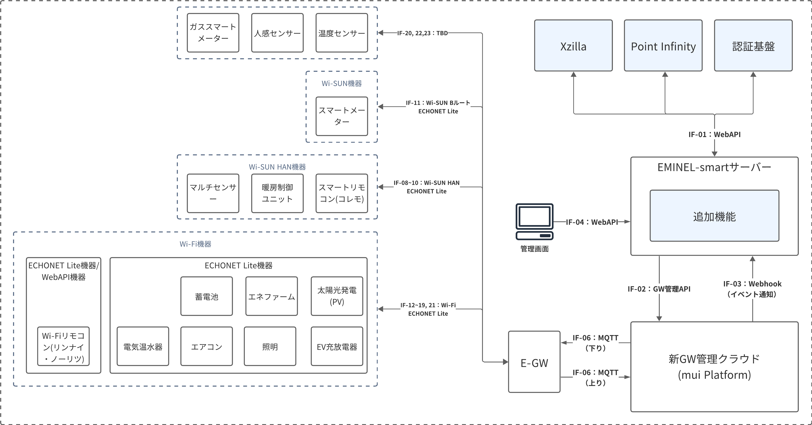

🔍 Nguồn ảnh: `eminel_gw_project/docs/eminel/3_requirements/images/4-2_interface.png`
→ nhúng tại `00_integrated_requirements_v1.2.md`, mục 「4-2. インタフェース構成図」, dòng 213

24 interface chia làm 4 nhóm rõ rệt:

| Nhóm | Mã | Giao thức | Nội dung |
|---|---|---|---|
| **Server ↔ hệ ngoài & quản trị** | IF-01, IF-05 | WebAPI | Nối với đám mây 北ガス, nối với màn hình quản trị |
| **Server ↔ server** | IF-02, IF-04 | WebAPI + Webhook | Hai đám mây nói chuyện với nhau |
| **Gateway ↔ đám mây** | IF-03, IF-06, IF-07 | ⚠️ **MQTT** | Lên: dữ liệu đo, trạng thái. Xuống: lệnh điều khiển, cấu hình |
| **Gateway ↔ thiết bị trong nhà** | IF-08 → IF-24 | Hầu hết **ECHONET Lite** | Cảm biến, máy sưởi, đồng hồ điện, pin mặt trời, điều hoà… |

🔍 Nguồn: `eminel_gw_project/docs/eminel/3_requirements/00_integrated_requirements_v1.2.md`
→ mục 「4-1. インタフェース一覧」, dòng 184–209

📖 **MQTT là gì?**
Giao thức nhắn tin nhẹ dành cho thiết bị IoT. Khác với HTTP (kiểu hỏi–đáp: client hỏi, server trả lời), MQTT giữ **một đường kết nối mở liên tục**, nên server có thể **chủ động đẩy lệnh xuống** thiết bị bất cứ lúc nào mà không cần thiết bị hỏi trước.

💡 Vì sao dùng MQTT cho gateway? Vì gateway nằm sau router nhà khách, không có địa chỉ công khai để server gọi vào. Gateway phải **tự mở kết nối ra ngoài trước** và giữ đường đó luôn — như một cuộc điện thoại không cúp máy.

📖 **ECHONET Lite là gì?**
Là **tiêu chuẩn Nhật Bản** quy định cách các thiết bị gia dụng nói chuyện với nhau. Nhờ có nó, gateway hiểu được điều hoà Daikin, pin mặt trời Panasonic, đồng hồ điện… mà không cần viết code riêng cho từng hãng. Đây là lý do dự án phải xin **chứng nhận ECHONET Lite** (tốn 3 triệu yên).

📖 **Wi-SUN là gì?**
Chuẩn kết nối không dây chuyên dùng cho đồng hồ đo thông minh và thiết bị trong nhà ở Nhật. Sóng đi xa hơn và tốn ít điện hơn Wi-Fi, nhưng tốc độ chậm.

⚠️ **Bẫy hay gặp**: `IF-03` là **MQTT**, không phải WebAPI. Nhiều người nhìn tên "GW管理 Device API" rồi tưởng là REST API.

---

## 2.6 Hai đường lấy dữ liệu điện

Cùng là "dữ liệu điện", nhưng dự án có **hai đường lấy khác nhau** cho hai mục đích khác nhau. Nhầm chỗ này là sai kiến trúc.

| | **Bルート** (B-route) | **Cルート** (C-route) |
|---|---|---|
| Ai lấy | **E-GW đọc thẳng** từ đồng hồ thông minh | Đi qua **Xzilla** vào EMINEL-smart server |
| Đường truyền | Wi-SUN, trong nhà (cần dongle Wi-SUN) | Hệ thống nội bộ 北ガス |
| Nội dung | **Giá trị tức thời + giá trị 30 phút** | Giá trị **30 phút** chính thức |
| Dùng để | Hiển thị realtime, điều khiển | Tính toán, đối soát |
| Độ phủ | **Hiếm** — chỉ nhà kết nối trực tiếp | **Đường chính** cho đại đa số hộ |

🔍 Nguồn: `eminel_gw_project/docs/eminel/3_requirements/00_integrated_requirements_v1.2.md`
→ mục 「3-2. システム構成の基本方針」, dòng 84
→ nguyên văn: 「電力30分値はCルート（Xzilla経由）で取得する」

🔍 Nguồn: `eminel_gw_project/docs/eminel/0_foundation/04_glossary.md`, dòng 39
→ nguyên văn: 「30分値・瞬時値を取得し、見える化・制御に使う」 *(Bルート lấy cả hai loại giá trị, không chỉ tức thời)*

🔍 Nguồn độ phủ: `eminel_gw_project/docs/eminel/2_management/minutes/20260623_egw_camp_day1.md`, dòng 96
→ nguyên văn: 「Bルート=直結でレア／Cルート=北ガス取得・メイン」— ảnh hưởng trực tiếp tới độ phủ của tính năng realtime monitor

📖 **Ba tuyến A / B / C là gì?**
Đồng hồ điện thông minh ở Nhật gửi dữ liệu ra ba hướng:

| Tuyến | Đi đâu |
|---|---|
| **Aルート** | Về công ty truyền tải điện *(dự án không dùng)* |
| **Bルート** | Vào thẳng thiết bị trong nhà của người dùng ← **E-GW dùng tuyến này** |
| **Cルート** | Từ công ty truyền tải sang bên thứ ba (công ty bán lẻ điện, doanh nghiệp) ← **Xzilla dùng tuyến này** |

🔍 Nguồn: `eminel_gw_project/docs/eminel/0_foundation/04_glossary.md`
→ mục 「機器・制御」, dòng 39, 44, 45

---

## 2.7 Chín cấu hình lắp đặt trong nhà

Không phải nhà nào cũng giống nhau. Tài liệu định nghĩa **9 cấu hình** — 6 cho nhà xây mới, 3 cho nhà đã có sẵn. Mỗi cấu hình = một tổ hợp (loại thiết bị nhiệt × số mạch sưởi):

| Nhà xây mới (新築) | Nhà có sẵn (既築) |
|---|---|
| ① エコジョーズ · 1 mạch | ⑦ エコジョーズ · 1 mạch |
| ② コレモ · 1 mạch ← **mục tiêu chính** | ⑧ コレモ · 1 mạch |
| ③ エネファーム · 1 mạch | ⑨ エネファーム · 1 mạch |
| ④ エコジョーズ · 2 mạch | |
| ⑤ コレモ · 2 mạch | |
| ⑥ エネファーム · 2 mạch | |

🔍 Nguồn: `00_integrated_requirements_v1.2.md`, mục 「3-5-1. 新築住宅パターン」 dòng 133–143 và 「3-5-2. 既築住宅パターン」 dòng 149–156

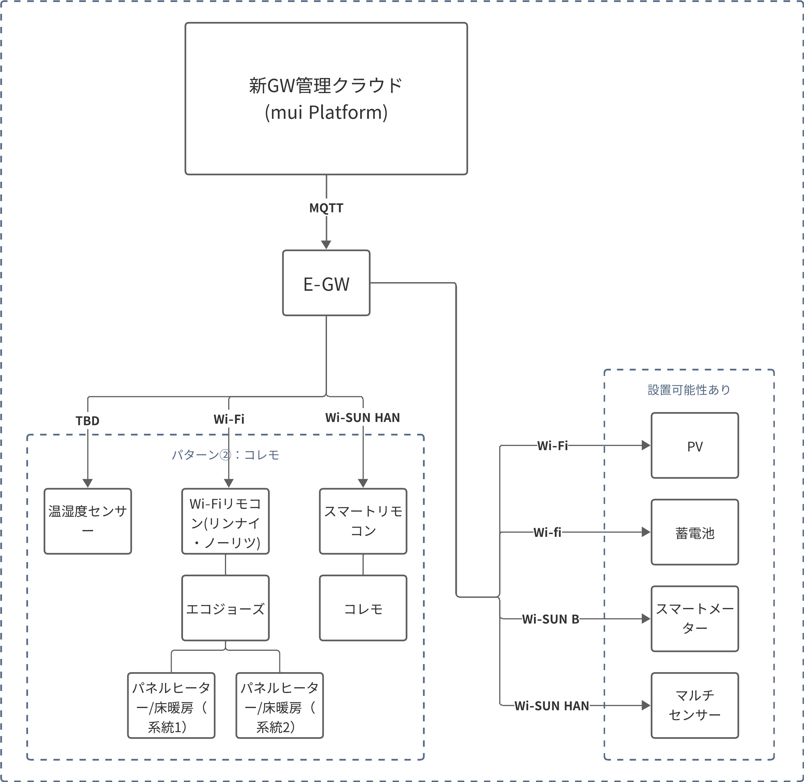

🔍 Nguồn ảnh: `eminel_gw_project/docs/eminel/3_requirements/images/3-5-3_pattern2_koremo.png`
→ nhúng tại `00_integrated_requirements_v1.2.md`, mục 「3-5-3. パターン別構成図」, dòng 159

### Hai điều phải nhớ

**① Mục tiêu chính là pattern ② — nhà có コレモ**

🔍 Nguồn: `eminel_gw_project/docs/eminel/3_requirements/00_integrated_requirements_v1.2.md`
→ mục 「3-5-1. 新築住宅パターン」, dòng 147
→ nguyên văn: 「**メインターゲット : パターン②（コレモ）**　※2系統の場合は、別途温湿度センサーを設置」

📖 **コレモ (Koremo) là gì?**
Một loại thiết bị phát điện bằng gas do 北ガス bán — vừa sưởi ấm vừa phát ra điện. Nó đi kèm một bộ điều khiển thông minh gọi là **スマリモ** (sumarimo, viết tắt của "smart remote"). Chi tiết vì sao thiết bị này đặc biệt quan trọng: xem [mục 5.5](#55-điều-khiển-sưởi--phần-khó-nhất).

**② Cột 系統数 — số hệ thống sưởi trong nhà, có thể là 1 hoặc 2**

📖 **系統 (keitō) nghĩa là gì?**
Là **một mạch sưởi độc lập**. Nhà một tầng thường có 1 mạch. Nhà hai tầng có thể có 2 mạch riêng — tầng 1 một mạch, tầng 2 một mạch — điều khiển độc lập với nhau.

🔍 Nguồn: `eminel_gw_project/docs/eminel/3_requirements/00_integrated_requirements_v1.2.md`
→ mục 「8-1. E-GW機能詳細」→ F-GW-05 「複数系統対応」, dòng 498–505
→ nguyên văn:
> 「スマートリモコンがある場合：1系統目=スマートリモコン無線センサー、2系統目=温湿度センサー」
> 「1系統目はエコジョーズ（リンナイ・ノーリツ）を対象とし、冷温水熱源機クラスを使用して制御する」
> 「2系統目は床暖房クラスを使用して制御する」
> 「対応系統数は2系統を必須とする。3系統以降はレアケースのため実現可能性含め検討する（**TBD**）」

⚠️ **Nhà 2 mạch là bắt buộc phải hỗ trợ. Từ 3 mạch trở lên vẫn TBD.** Và có một ràng buộc kỹ thuật khó chịu: bộ điều khiển Wi-Fi chỉ tạo được **một** đối tượng loại "nguồn nhiệt nước lạnh/nóng" (冷温水熱源機クラス), nên mạch thứ hai phải mượn loại "sàn sưởi" (床暖房クラス) — **có thể** dẫn tới việc giao diện phải cho người dùng tự gán mạch nào là mạch nào *(biên bản gốc ghi 「〜必要があるかもしれない」 — mới là khả năng đang cân nhắc, chưa chốt; đã đưa vào câu 6 của `qa_kitagas.md`)*.

📖 **"Tạo đối tượng theo lớp" nghĩa là gì?** Giao thức ECHONET Lite phân thiết bị thành các **lớp** (class) — mỗi lớp là một "khuôn" mô tả một loại thiết bị (nguồn nhiệt, sàn sưởi, điều hoà…). Bộ điều khiển khai báo mình có thiết bị gì bằng cách **tạo một thực thể (instance) theo khuôn đó**. "Chỉ tạo được một instance lớp nguồn nhiệt" = về mặt giao thức chỉ khai báo được *một* máy nguồn nhiệt, dù nhà có hai mạch — nên mạch thứ hai đành khai báo bằng khuôn khác (sàn sưởi).

🔍 Nguồn: `eminel_gw_project/docs/eminel/2_management/minutes/20260623_egw_camp_day1.md`
→ mục 「暖房制御の系統問題」, dòng 213–215

**Ngoại lệ đáng nhớ**: nhà lắp エネファーム (thiết bị phát điện bằng pin nhiên liệu) thì **không hỗ trợ nhiều mạch**, vì không dùng được lớp giao thức cần thiết.

🔍 Nguồn: `00_integrated_requirements_v1.2.md`, dòng 505
→ nguyên văn: 「エネファーム設置物件ではELクラスが使用できないため、複数系統対応を不可とする」

---

## Kiểm tra nhanh — Chương 2

1. App muốn lấy dữ liệu nhiệt độ phòng thì gọi vào đâu? Vì sao không gọi thẳng vào nơi nhận dữ liệu sớm nhất?
2. Vì sao `GW管理クラウド` được thiết kế để **không** biết khách hàng là ai?
3. Dữ liệu điện của một hộ đến hệ thống bằng mấy đường? Khác nhau chỗ nào?
4. Nhà có 2 mạch sưởi — hệ thống có bắt buộc hỗ trợ không? Nhà 3 mạch thì sao?

<details>
<summary>Đáp án</summary>

1. Gọi vào **EMINEL-smart server**, vì đó là **master của dữ liệu nghiệp vụ**. Dữ liệu ở `GW管理クラウド` là dữ liệu thô chỉ phục vụ giám sát vận hành thiết bị, không phải để hiển thị cho người dùng. *(Nguồn: `00_integrated_requirements_v1.2.md` dòng 85)*
2. Để **thu hẹp phạm vi chứa thông tin cá nhân** về đúng một chỗ (EMINEL-smart server). Đây là quyết định về bảo vệ dữ liệu cá nhân. *(dòng 111)*
3. **Hai đường.** `Bルート` — gateway đọc thẳng từ đồng hồ (30分値 + 瞬時値), hiếm gặp. `Cルート` — qua Xzilla, giá trị 30 phút chính thức, **đường chính** cho đại đa số hộ, dùng tính toán.
4. **2 mạch: bắt buộc hỗ trợ.** **3 mạch trở lên: vẫn TBD**, coi là trường hợp hiếm, còn đang xem xét khả năng thực hiện. *(dòng 504)*

</details>

---
---

# Chương 3 — Câu chuyện của một điểm dữ liệu

Chương này không giới thiệu khái niệm mới. Nó **ghép các mảnh ở chương 2 lại thành một câu chuyện liền mạch**, để bạn thấy hệ thống vận hành ra sao trong thực tế.

## 3.1 Chiều lên: từ cảm biến đến biểu đồ

Hãy theo chân **một con số**: nhiệt độ phòng khách, 21.5°C, lúc 8h00 sáng thứ Hai.

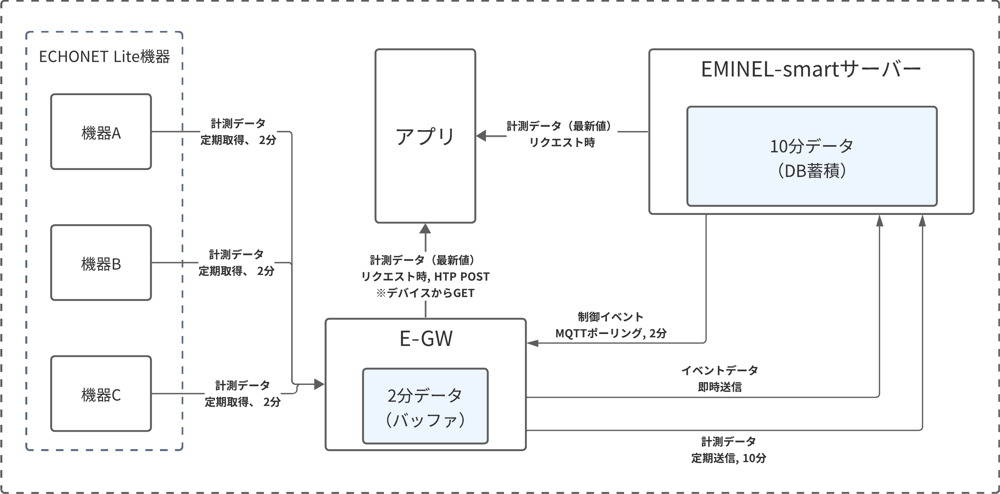

🔍 Nguồn ảnh: `eminel_gw_project/docs/eminel/3_requirements/images/4-5_dataflow_local.png`
→ nhúng tại `00_integrated_requirements_v1.2.md`, mục 「4-5. データフロー概要」, dòng 239

### Bước 1 — Cảm biến đo, gateway lấy về (chu kỳ **2 phút**)

Cảm biến nhiệt độ/độ ẩm trong phòng khách đo được 21.5°C. E-GW thu dữ liệu đo **2 phút một lần**.

🔍 Nguồn: `eminel_gw_project/docs/eminel/3_requirements/00_integrated_requirements_v1.2.md`
→ mục 「8-1. E-GW機能詳細」→ F-GW-01 「計測データ収集」, dòng 448
→ nguyên văn: 「計測データの収集は2分周期で実施する」

⚠️ Kèm chú thích ngay dòng dưới (dòng 449): một số hạng mục dữ liệu **không bắt buộc đúng 2 phút** và chu kỳ sẽ được xem lại — đừng coi "2 phút" là cố định cho mọi loại dữ liệu. *(Con số 2 phút còn xuất hiện ở 「暖房制御指示」 dòng 487 — nhưng đó là chu kỳ SET nhiệt độ điều khiển, một việc khác.)*

### Bước 2 — Gateway gửi lên đám mây (chu kỳ **10 phút**)

E-GW gom dữ liệu và đẩy lên `GW管理クラウド` qua **MQTT**, **10 phút một lần**.

🔍 Nguồn: `eminel_gw_project/docs/eminel/2_management/minutes/20260624_egw_camp_day2.md`
→ mục 「共有された前提（既定事項）」, dòng 37
→ nguyên văn: 「GW⇔デバイス＝2分周期で取得／GW→muiプラットフォーム＝10分値を上げる」

⚠️ **Chú ý sự chênh lệch**: gateway biết nhiệt độ với độ mới 2 phút, nhưng đám mây chỉ biết với độ mới 10 phút. Khoảng chênh này chính là lý do tồn tại của tính năng "giao tiếp nội bộ trong nhà" — xem [mục 3.4](#34-realtime-nghĩa-là-gì-trong-dự-án-này).

### Bước 3 — Đám mây thiết bị lưu dữ liệu thô

`GW管理クラウド` lưu con số này **theo GW ID**, không biết nó thuộc về ai. Với nó, đây chỉ là *"gateway số ABC123 báo 21.5"*.

### Bước 4 — Báo sang đám mây nghiệp vụ

`GW管理クラウド` bắn một **Webhook** nhẹ sang `EMINEL-smart server`: *"gateway ABC123 có dữ liệu mới"*. Không kèm dữ liệu.

### Bước 5 — Đám mây nghiệp vụ sang lấy chi tiết

`EMINEL-smart server` gọi ngược lại qua **IF-02 Client API** để lấy dữ liệu đầy đủ.

### Bước 6 — Gắn dữ liệu với con người

Đây là bước biến dữ liệu **thiết bị** thành dữ liệu **nghiệp vụ**:

```
"gateway ABC123 báo 21.5°C"     ← dữ liệu thiết bị
            ↓ tra bảng gắn GW ID ↔ TagTag ID
"nhà anh Tanaka, 21.5°C lúc 8h00"  ← dữ liệu nghiệp vụ
```

*(Anh Tanaka chính là gia đình Hokkaido ở mục 1.1 — từ đây đặt tên cho dễ theo dõi.)* Chỉ `EMINEL-smart server` làm được bước này, vì chỉ nó giữ bảng ghép.

💡 **Bảng ghép đó từ đâu ra?** Nó được tạo lúc **onboarding** — ở bước "Đăng ký gateway", thông tin được lưu vào **cả hai** đám mây. Tầng thiết bị lưu theo GW ID, tầng nghiệp vụ lưu thêm mối nối GW ID ↔ TagTag ID. Xem chi tiết ở [mục 5.2](#52-onboarding-từ-mở-hộp-đến-thấy-dữ-liệu).

Nói cách khác: **onboarding chính là bước tạo ra khả năng "biết dữ liệu này của ai"**. Trước khi onboarding xong, gateway có gửi dữ liệu lên thì cũng không ai biết nó thuộc về nhà nào.

### Bước 7 — Xử lý thành dữ liệu hiển thị

Server tính ra **giá trị theo giờ / theo ngày / theo tháng** rồi lưu lại.

🔍 Nguồn: `eminel_gw_project/docs/eminel/1_product/11_business_process/readme.md`
→ mục 「01-2. レポートで利用するデータの生成〜保存（Slide 17）」, dòng 307
→ nguyên văn: 「E-smartサーバー：各計測データの1時間値・1日値・1月値のデータを生成」

### Bước 8 — App hiển thị

Người dùng mở app, chọn tab. App gọi `EMINEL-smart server` (không bao giờ gọi `GW管理クラウド`), nhận dữ liệu đã xử lý, vẽ biểu đồ.

### Tóm tắt cả hành trình

```
Cảm biến ──2 phút──▶ E-GW ──10 phút / MQTT──▶ GW管理クラウド
                                                     │
                                    Webhook "có dữ liệu mới"
                                                     ▼
                                          EMINEL-smart server
                                                     │
                                    ◀── API Pull lấy chi tiết ──┘
                                                     │
                              gắn GW ID → TagTag ID (biết là nhà ai)
                                                     │
                                  tính giá trị giờ / ngày / tháng
                                                     ▼
                                            📱 App vẽ biểu đồ
```

---

## 3.2 Chiều xuống: từ nút bấm đến máy sưởi

Giờ đi ngược lại. Người dùng mở app, đặt lịch: *"7h sáng thứ Hai, bật sưởi 22°C"*.

### Bước 1 — App gửi lên server

App gọi `EMINEL-smart server`. Server lưu cấu hình điều khiển sưởi — nó là **master** của thông tin này.

### Bước 2 — Server đẩy cấu hình xuống gateway

🔍 Nguồn: `eminel_gw_project/docs/eminel/1_product/11_business_process/readme.md`
→ mục 「01-1. 暖房制御（室温制御の設定）（Slide 35）」, dòng 685–687
→ nguyên văn: 「E-smartサーバー：暖房制御設定情報を保存 → 暖房制御設定情報を送信する」「（GW）暖房制御設定を保存」

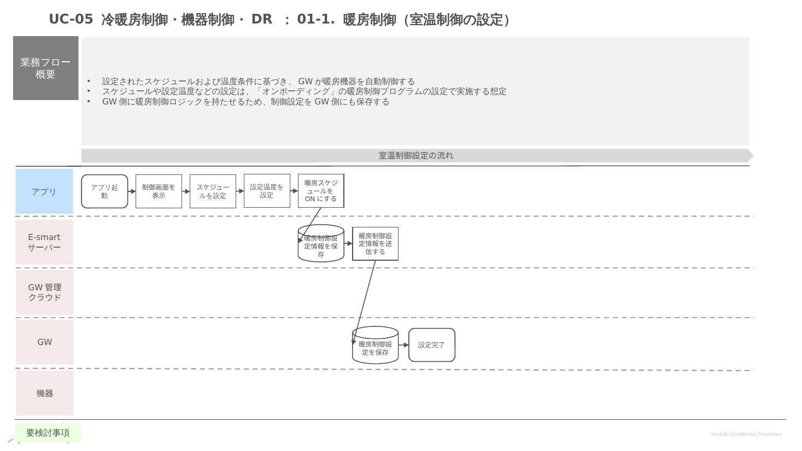

⚠️ **Chú ý: gateway cũng lưu cấu hình.** Không phải server ra lệnh từng bước, mà server **giao cả kế hoạch** cho gateway, gateway tự chạy.

🔍 Nguồn: cùng file
→ mục 「業務フロー概要（原文）」, dòng 676
→ nguyên văn: 「GW側に暖房制御ロジックを持たせるため、制御設定をGW側にも保存する」

### Bước 3 — Đến giờ, gateway tự chạy

7h sáng thứ Hai. Gateway **tự** bắt đầu, không cần server nhắc:

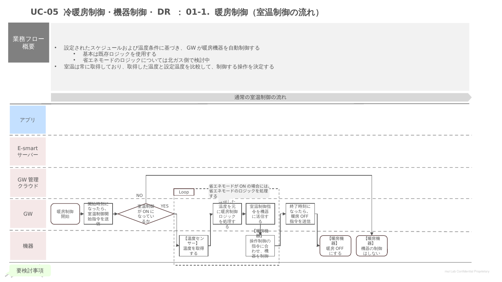

```
GW: bắt đầu điều khiển sưởi
  └─ Kiểm tra: điều khiển theo nhiệt độ phòng có đang BẬT không?
       ├─ Không → không làm gì
       └─ Có ↓
  ┌──────────── VÒNG LẶP ────────────┐
  │ Cảm biến: đo nhiệt độ            │
  │ GW: chạy logic điều khiển        │
  │     (nếu chế độ tiết kiệm bật    │
  │      thì chạy thêm logic đó)     │
  │ GW: gửi lệnh xuống máy sưởi      │
  │ Máy sưởi: chạy theo lệnh         │
  └──────────── lặp lại ─────────────┘
  Đến giờ kết thúc → GW gửi lệnh TẮT
```

🔍 Nguồn: `eminel_gw_project/docs/eminel/1_product/11_business_process/readme.md`
→ mục 「01-1. 暖房制御（室温制御の流れ）（Slide 36）」, dòng 704–717

💡 **Vì sao thiết kế như vậy?**
Nếu server phải ra lệnh từng bước, thì mất internet là nhà lạnh cóng. Giao cả kế hoạch cho gateway thì mất mạng vẫn sưởi bình thường — chỉ không đổi được cấu hình. Ở Hokkaido mùa đông −15°C, đây không phải chuyện nhỏ.

### ⚠️ Bước 3 có một ngoại lệ rất lớn

Ở **nhà lắp コレモ** — tức **pattern ②, mục tiêu chính của dự án** — vòng lặp chạy ở chỗ khác:

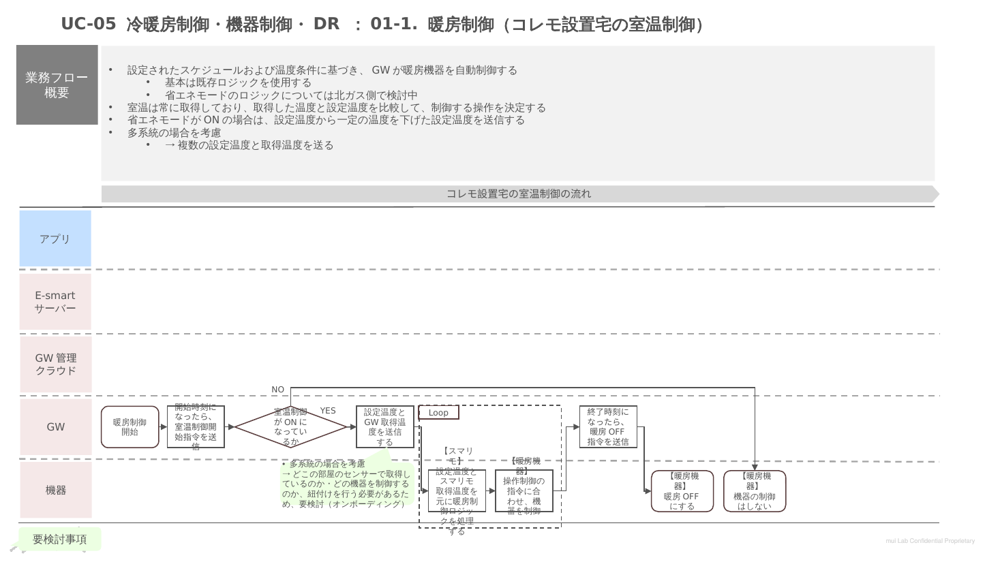

```
Nhà thường:  GW đọc cảm biến → GW chạy logic → GW gửi lệnh → máy sưởi
Nhà コレモ:   GW gửi (nhiệt độ cài đặt + nhiệt độ GW đo) → スマリモ chạy logic → máy sưởi
```

🔍 Nguồn: `eminel_gw_project/docs/eminel/1_product/11_business_process/readme.md`
→ mục 「01-1. 暖房制御（コレモ設置宅の室温制御）（Slide 37）」, dòng 742–743
→ nguyên văn: 「（GW）設定温度とGW取得温度を送信する」「（機器）【スマリモ】設定温度とスマリモ取得温度を元に暖房制御ロジックを処理する」

Tức là **ở cấu hình phổ biến nhất, gateway KHÔNG phải nơi chạy logic điều khiển** — nó chỉ chuyển tiếp con số xuống cho スマリモ tự lo.

❌ **Hai tài liệu vênh nhau về việc gửi MẤY con số.** Business flow (slide 37, trích trên) ghi gửi *hai* con số (設定温度 + GW取得温度). Nhưng tài liệu yêu cầu v1.2 ghi **cơ bản chỉ gửi 設定温度**; 現在温度 chỉ gửi khi lắp thêm cảm biến nhiệt riêng — mà ở pattern スマリモ cơ bản (chính là mục tiêu chính ②) thì *không cần lắp cảm biến*, nên 現在温度 để trống. Nghĩa là **trường hợp phổ biến nhất chỉ gửi MỘT con số**. Khi làm firmware/API chỗ này, phải hỏi lại bên nào đúng.

🔍 Nguồn: `eminel_gw_project/docs/eminel/3_requirements/00_integrated_requirements_v1.2.md`
→ mục 「8-1」→ F-GW-05 「北ガススマリモ対応」, dòng 494–497
→ nguyên văn: 「基本は「設定温度」のみだが、別途温度センサーを設置している場合は「現在温度」も送信する」「※スマリモ設置の基本パターンの場合はセンサー設置不要のため、「現在温度」は空となる」

---

## 3.3 Vì sao dữ liệu bị lưu ở hai nơi

Người mới nhìn vào sẽ thấy dữ liệu bị lưu trùng ở cả hai đám mây và nghĩ *"thừa"*. Không thừa — có lý do rõ ràng:

🔍 Nguồn: `eminel_gw_project/docs/eminel/1_product/11_business_process/readme.md`
→ mục 「01-1. グラフ表示（Slide 15）」→「業務フロー概要（原文）」, dòng 252
→ nguyên văn: 「GW管理クラウドで障害があった場合でも、表示に支障をきたさないため、お客様に紐づくデータについてはコンシェルジュサーバーに保存する」

Dịch: *"Để khi `GW管理クラウド` gặp sự cố mà việc hiển thị vẫn không bị ảnh hưởng, dữ liệu gắn với khách hàng được lưu ở server nghiệp vụ."*

| Nếu chỉ lưu một nơi | Hậu quả |
|---|---|
| Chỉ lưu ở `GW管理クラウド` | Tầng thiết bị sập → app trắng trơn, người dùng không xem được cả dữ liệu tháng trước |
| Chỉ lưu ở `EMINEL-smart` | Không giám sát được sức khoẻ thiết bị theo góc nhìn vận hành |

⇒ **Lưu hai nơi với hai mục đích khác nhau** — không phải trùng lặp, mà là **phân tách trách nhiệm**.

💡 **Ví dụ đời thường**
Giống như bệnh viện lưu **hồ sơ bệnh án của bệnh nhân** (theo tên người) và **nhật ký bảo trì máy chụp X-quang** (theo số máy). Cùng nói về một lần chụp, nhưng hai mục đích, hai người dùng, hai vòng đời khác nhau. Máy hỏng thì nhật ký máy có vấn đề, nhưng hồ sơ bệnh nhân vẫn nguyên.

---

## 3.4 "Realtime" nghĩa là gì trong dự án này

Đây là chỗ gây hiểu nhầm giữa người làm nghiệp vụ và người viết code.

| Cách người dùng thấy | Thực tế kỹ thuật |
|---|---|
| "Xem tình trạng năng lượng ngay lúc này" | Dữ liệu mới nhất **10 phút một lần** |
| "Realtime monitor" | Chỉ **giá trị tức thời** của một số thiết bị nhất định (đồng hồ điện, pin mặt trời, pin lưu trữ) |

🔍 Nguồn: `eminel_gw_project/docs/eminel/2_management/minutes/20260623_egw_camp_day1.md`
→ mục 「10分値・リアルタイムモニター」, dòng 124–128
→ nguyên văn:
> 「データ粒度＝10分値」
> 「リアルタイムモニター＝瞬時値（スマートメーター/太陽光/蓄電池残量など対応機器のみ）」

### Còn con số 2 phút thì sao?

Gateway biết dữ liệu ở độ mới 2 phút. Muốn app thấy con số đó, app phải **nói thẳng với gateway** thay vì đi vòng qua đám mây. Đó chính là tính năng **ローカル通信** (giao tiếp nội bộ trong nhà).

🔍 Nguồn: `eminel_gw_project/docs/eminel/2_management/minutes/20260624_egw_camp_day2.md`
→ mục 「共有された前提（既定事項）」, dòng 38
→ nguyên văn: 「アプリは通常クラウド（10分値）を見る。ローカル通信時はGWが持つ2分値が見える＝リアルタイム表示」

⚠️ **Nhưng tính năng đó đã bị lùi sang 2027.**

🔍 Nguồn: `eminel_gw_project/docs/eminel/2_management/22_decisions.md`
→ dòng 29
→ nguyên văn: 「2026-06-03 | アプリ⇔GWローカル通信を第一段階から除外し2027/4〜6開発に整理」

**Kết luận cho phạm vi 2026: "realtime" trên thực tế là 10 phút.** Nếu ai đó nói "hiển thị realtime" trong ngữ cảnh năm nay, hãy hỏi lại họ đang nói 10 phút hay 2 phút.

---

## Kiểm tra nhanh — Chương 3

1. Một con số nhiệt độ đi từ cảm biến tới biểu đồ trên app phải qua mấy chặng chính? Ở chặng nào nó "biết được mình thuộc về ai"?
2. Vì sao gateway phải lưu cả cấu hình điều khiển sưởi, thay vì để server ra lệnh từng bước?
3. Ở nhà lắp コレモ, vòng lặp so sánh nhiệt độ chạy ở đâu? Gateway làm gì trong trường hợp đó?
4. Trong phạm vi 2026, "hiển thị realtime" thực tế nghĩa là bao nhiêu phút?

<details>
<summary>Đáp án</summary>

1. **8 bước** (cảm biến → GW → đám mây thiết bị → Webhook → Pull → gắn khách → xử lý → app). Nó "biết thuộc về ai" ở **bước 6**, khi `EMINEL-smart server` tra bảng gắn GW ID ↔ TagTag ID.
2. Để **mất internet vẫn sưởi được**. Server giao cả kế hoạch cho gateway, gateway tự chạy độc lập. *(Nguồn: `11_business_process/readme.md` dòng 676)*
3. Vòng lặp chạy ở **スマリモ**. Gateway chỉ **chuyển tiếp nhiệt độ cài đặt** (kèm nhiệt độ đo được *nếu* nhà có lắp cảm biến riêng — pattern スマリモ cơ bản thì không lắp, nên chỉ một con số). *(readme.md dòng 742–743; v1.2 dòng 494–497 — hai nguồn đang vênh nhau, xem mục 3.2)*
4. **10 phút.** Con số 2 phút chỉ thấy được qua giao tiếp nội bộ trong nhà, mà tính năng đó đã lùi sang 2027.

</details>

---
---

# Chương 4 — Hệ thống cũ, cái đang bị thay

## 4.1 Vì sao người mới vẫn phải học hệ cũ

Câu hỏi hợp lý: *"Tôi làm hệ mới, học hệ PHP đã chạy nhiều năm làm gì?"*

Ba lý do rất thực tế:

**① Bộ requirement mới được viết bằng cách so sánh với hệ cũ.** Mỗi file requirement app đều có một dòng `ベース(現行機能)` — ghi rõ chức năng này tương ứng chức năng số mấy của hệ cũ.

🔍 Nguồn: `eminel_gw_project/docs/eminel/3_requirements/app/B02_heating_control.md`
→ bảng đầu file, dòng 6
→ nguyên văn: 「ベース(現行機能) | 10 スケジュール設定／11 温度設定／12 優先運転設定／13 優先運転簡易設定／15 暖房ON/OFF設定」

Không biết "chức năng số 12" là gì thì đọc requirement như đọc mật mã.

**② Logic nghiệp vụ tích luỹ nhiều năm nằm hết ở đó, tài liệu mới không viết lại.**

**③ Không lấy được source code của gateway cũ → phải viết lại từ đầu.**

🔍 Nguồn: `eminel_gw_project/docs/eminel/2_management/20_open_issues.md`
→ mục 「GW-01 暖房制御ロジックの詳細仕様が北ガス未提示」, dòng 95
→ nguyên văn: 「現行GWソース入手不可でフルスクラッチ。詳細仕様（2系統対応の要否・複合制御の制御条件等）が未提示で、何を作るかが決まらない」

Tài liệu hệ cũ còn có hẳn một bảng chỉ dẫn *"muốn thiết kế cái gì thì đọc vùng nào"*:

🔍 Nguồn: `eminel_gw_project/docs/old_eminel/01_overview.md`
→ mục 「4. E-GW検討で特に効くポイント」, dòng 105–111

| Muốn thiết kế | Đọc vùng nào của hệ cũ |
|---|---|
| Giao tiếp gateway ↔ server | `01_GW通信` (16 API) |
| Điều khiển sưởi thực tế chạy ra sao | `04_DR` + API tham số sưởi |
| Logic tư vấn tiết kiệm / trông nom | `02_データ生成` |
| Mô hình dữ liệu | `00_DB設計` (54 bảng) |
| Ràng buộc khi nối hệ ngoài | `05_PI連携` / `06_情報共通基盤` |

---

## 4.2 Bẫy tên gọi lớn nhất

Bản thân hệ hiện hành **cũng là kết quả của một lần hợp nhất trước đó**:

| Hệ cũ hơn nữa | Sau khi hợp nhất trở thành |
|---|---|
| 旧HEMSサーバ (gateway ↔ server) | phần **giao tiếp gateway** |
| 旧コンシェルジュSV (do NEC làm) | phần **sinh dữ liệu + giao tiếp app** |
| 旧PUSH通知サーバ | gộp vào |

Ba cái gộp thành **3 server: Web / 管理Web / DB**.

🔍 Nguồn: `eminel_gw_project/docs/old_eminel/01_overview.md`
→ mục 「1. 全体像」, dòng 11–20

⚠️ **Hệ quả cực kỳ quan trọng khi đọc tài liệu:**

🔍 cùng file, dòng 20
→ nguyên văn: 「文中の「コンシェルジェ/Cサーバ」は **現EMINELサーバ** を指す（旧呼称が残っている）」

Nghĩa là: khi bạn đọc tài liệu và thấy chữ **「コンシェルジェサーバ」** hoặc **「Cサーバ」**, đó **chính là server EMINEL hiện hành** — không phải một hệ thống thứ ba nào đang chạy song song. Đó chỉ là tên cũ còn sót lại.

⚠️ Bẫy này còn lan sang tài liệu **mới**: trong luồng nghiệp vụ của E-GW, chữ 「コンシェルジュサーバー」 đôi khi được dùng để chỉ **`EMINEL-smart server`**. Ví dụ:

🔍 Nguồn: `eminel_gw_project/docs/eminel/1_product/11_business_process/readme.md`
→ mục 「01-1. グラフ表示（Slide 15）」, dòng 251
→ nguyên văn: 「コンシェルジュサーバーが受信したデータを加工し、見える化用データを生成する」

Ở câu này 「コンシェルジュサーバー」 = `EMINEL-smart server`. **Đọc theo ngữ cảnh, đừng đọc theo mặt chữ.**

### Ba cái tên `hemssv` / `conciergesv` / `eminelsv` — cách mui dùng khi trao đổi

Khi trao đổi với mui qua QA (2026-08-03→04), hệ cũ được gọi theo **ba khối source**, và cách hiểu sau đã được swan (mui) xác nhận ở mức 「おおよそその認識でOK」 (*đại thể đúng*):

| Tên | Vai trò |
|---|---|
| `hemssv` | HEMSサーバー — giao tiếp với **gateway** |
| `conciergesv` | コンシェルジュサーバー — sinh dữ liệu + giao tiếp với **app** |
| `eminelsv` | EMINELサーバー — màn hình quản trị **vận hành** |

🔍 Nguồn: Notion — QAデータベース dự án, trang 「旧EMINEL調査範囲（conciergesv/eminelsv）とhemssv対象外の確認」 (**No. 4**)
→ 質問者 Bui Trong Dat (SYP, 起票 2026-08-03 17:32) · 回答者 swan (mui) · phiếu **chốt 2026-08-13 12:28** (更新日時)
→ trạng thái khi đọc (2026-08-20): **完了** (đã đóng)
→ nguyên văn (回答内容): 「おおよそその認識でOKです。HEMS-SV(m2-cloud)はmui側開発範囲で、GWとの通信はHEMS-SVを通して行っていただくことになります。ConciergeSV,EminelSVは密に関係しますが、SYPさん開発範囲ではないです。HEMS-SVの仕様等は別途共有します」

Ba thông tin mới trong câu trả lời: ① **HEMS-SV (m2-cloud) do mui phát triển**, mọi giao tiếp với GW đi qua nó *(🔸 giả thuyết — CHƯA kiểm chứng: "m2-cloud" nhiều khả năng là tên hiện thực của `GW管理クラウド` ở hệ mới — chưa thấy tên này trong repo docs, cần hỏi xác nhận)*; ② `ConciergeSV`/`EminelSV` là đối tượng SYP **điều tra** (khảo sát API・batch để di trú) chứ **không phải phạm vi SYP phát triển**; ③ spec của HEMS-SV sẽ được mui chia sẻ riêng. Đối chiếu tên với bảng hợp nhất phía trên: `hemssv` ≒ phần kế thừa 旧HEMSサーバ, `conciergesv` ≒ 旧コンシェルジュSV. ⚠️ Ghi chú 内訳 trong CLD-01 lại chú thích `eminelsv` khác đi — xem [8.4](#84-ba-vấn-đề-chặn-syp).

---

## 4.3 Hệ cũ được xây bằng gì

| Hạng mục | Nội dung |
|---|---|
| Hệ điều hành / middleware | RHEL 8.9 · Apache · PHP 8.0 · **CakePHP 4.4** · **PostgreSQL 16** |
| Môi trường | Test (KGLEM001–003) / Production (KGLEM101–103). Mỗi bộ 3 máy: Web · 管理Web · DB |
| Đám mây | AWS vùng Tokyo/Osaka · ALB · NFS · AWS Backup |
| **Mức độ hạ tầng** | ⚠️ **Hạng C — một máy tự phục hồi, KHÔNG dự phòng** |
| Cơ sở dữ liệu | **54 bảng** |
| Batch | **35 job cron** (mng-webap 32 + webap 3) |
| API gateway ↔ server | **16 API** |

🔍 Nguồn: `eminel_gw_project/docs/old_eminel/01_overview.md`
→ mục 「サーバ・インフラ」, dòng 23–28 · 「00_データベース設計」dòng 45–48 · 「01_GW通信」dòng 50–53 · 「10_バッチ処理」dòng 96–99

📖 **"Hạng C — không dự phòng" nghĩa là gì?**
Chỉ có **một** máy chủ chạy. Nếu nó chết, hệ thống tự khởi động lại máy đó (auto-recovery), nhưng trong lúc chờ thì **dịch vụ ngừng hoàn toàn**. Hệ thống có dự phòng thì có máy thứ hai chạy song song, chết một cái vẫn còn cái kia.

⚠️ Điều này liên quan trực tiếp tới một vấn đề đang mở: yêu cầu về khả năng chịu tải và mức độ sẵn sàng của hệ **mới** vẫn chưa được định nghĩa.

🔍 Nguồn: `eminel_gw_project/docs/eminel/2_management/20_open_issues.md`
→ mục 「SVC-03 性能・可用性・運用・移行要件が未記載」, dòng 87
→ nguyên văn: 「同時接続数（3万件前提か）、可用性SLA（DR制御は高可用性要）、データ保持期間、監視/バックアップ、既存3万件からの移行、テスト要件、応答時間がいずれも未記載」

Con số đáng chú ý ở đây: **3万件** — tức 30.000 bản ghi cần di trú từ hệ hiện hành.

⚠️ *Tài liệu chỉ ghi 「3万件」 (30.000 **件** = đơn vị bản ghi). Không nói rõ đó là 30.000 khách hàng, 30.000 hợp đồng, hay 30.000 gateway. Đừng suy diễn thêm — nếu cần con số chính xác cho việc tính tải, phải hỏi lại.*

---

## 4.4 Bốn logic nghiệp vụ đặc thù

Đây là phần **"nghiệp vụ" thật sự** — thứ không suy ra được từ kiến trúc, phải đọc mới biết.

### ① 給湯・暖房分離ロジック — tách gas nước nóng và gas sưởi

**Vấn đề**: đồng hồ gas chỉ đo **tổng lượng gas**. Nhưng nồi hơi vừa đun nước tắm vừa sưởi nhà. Người dùng muốn biết *"tôi tốn bao nhiêu gas cho việc sưởi"* — mà không có thiết bị nào đo riêng.

**Cách hệ cũ giải quyết**: lấy lượng gas tích luỹ trong 10 phút, đối chiếu với **số lần server ra lệnh sưởi** và một ngưỡng, rồi **suy ra** tỷ lệ.

🔍 Nguồn: `eminel_gw_project/docs/old_eminel/01_overview.md`
→ mục 「02_データ生成・アプリ通信」, dòng 59
→ nguyên văn: 「**給湯・暖房分離ロジック**：10分積算ガス消費量を暖房指令回数と閾値で給湯分／暖房分に分離」

💡 **Ví dụ đời thường**
Giống như bạn ở chung nhà với hai người, chỉ có một đồng hồ điện. Cuối tháng phải chia tiền — nhưng không ai đo riêng được. Bạn phải **ước lượng** dựa trên "ai dùng máy lạnh mấy tiếng". Con số ra không tuyệt đối chính xác, nhưng đó là tất cả những gì bạn có.

⚠️ **Hệ quả rất lớn**: **mọi biểu đồ gas và mọi report về sưởi đều dựa trên con số suy luận này.** Nếu logic sai, toàn bộ tầng hiển thị sai theo. Đây là một trong các câu hỏi trong `qa_kitagas.md` (câu 7) — xem [Phụ lục C](#phụ-lục-c--danh-mục-tbd-đang-chặn-việc).

### ② 省エネアドバイス — tư vấn tiết kiệm năng lượng

Hệ cũ có khoảng **15 loại** lời khuyên, mỗi loại một logic phán đoán riêng, dựa trên: cảm biến nhiệt độ, nhiệt độ ngoài trời, nhiệt độ phòng khách, trạng thái nồi hơi, chế độ ECO, so sánh với nhóm hộ tương tự.

🔍 Nguồn: `eminel_gw_project/docs/old_eminel/01_overview.md`
→ mục 「02_データ生成・アプリ通信」, dòng 57
→ nguyên văn: 「**省エネアドバイス**：温度センサ/気温/リビング室温/熱源機動作/ECOモード/前月積算値グループ比較の各判定ロジック」

🔴 Hệ mới định gom lại còn **7 loại + điểm sưởi eco**, nhưng **gom thế nào thì chưa quyết**.

🔍 Nguồn: `eminel_gw_project/docs/eminel/2_management/20_open_issues.md`
→ mục 「CLD-06 細部の仮置き項目」, dòng 176
→ nguyên văn: 「省エネアドバイスのパラメータ・統廃合（約15種→7種+エコ暖房ポイント）」

### ③ 見守り — trông nom người thân

Ba kiểu thông báo, dựa trên **chênh lệch của cảm biến phát hiện người**:

| Kiểu (tên trong nguồn hệ cũ) | Điều kiện *(suy đoán — xem ⚠️ dưới)* |
|---|---|
| ただいま (về nhà) | Không có người → **có** người |
| お留守番代行 (trông nhà hộ) | Có người → **không** có người |
| 在宅→不在判定 (phán đoán ở nhà → vắng) | *nguồn hệ cũ không ghi điều kiện* |

🔍 Nguồn: `eminel_gw_project/docs/old_eminel/01_overview.md`
→ dòng 58
→ nguyên văn: 「**見守り通知**：ただいま/お留守番代行/在宅→不在判定。人感センサ差分で判定」

⚠️ **Nguồn hệ cũ chỉ liệt kê ba cái tên** cộng câu 「人感センサ差分で判定」. Điều kiện cụ thể ở cột phải là **chiếu từ tài liệu hệ MỚI** (`11_business_process/readme.md` dòng 574–575 — ở đó kiểu thứ hai được gọi là 見守り) — hệ cũ *nhiều khả năng* chạy tương tự nhưng chưa được xác nhận.

🔴 Ở hệ mới, việc **có làm hay không vẫn chưa quyết** — chênh 0 đến 1 người-tháng.

🔍 Nguồn: `eminel_gw_project/docs/eminel/2_management/20_open_issues.md`
→ mục 「CLD-05 見守り通知（F-ES-05）の実装要否」, dòng 171–173
→ nguyên văn: 「やる/やらないで0〜1人月丸ごと変動」

### ④ グルーピング — gom nhóm hộ tương tự

Để hiển thị được *"nhà bạn tốn nhiều hơn 20% so với nhà tương tự"*, phải định nghĩa thế nào là "nhà tương tự". Hệ cũ gom theo **5 thuộc tính**.

🔍 Nguồn: `eminel_gw_project/docs/old_eminel/01_overview.md`
→ dòng 61
→ nguyên văn: 「別紙：…グルーピング（5属性集計）…」

Trong spec màn hình quản trị của hệ mới có đúng **5 thuộc tính người dùng**:

🔍 Nguồn: `eminel_gw_project/docs/eminel/4_spec/admin/B_user_management.md`
→ mục 「E-GWユーザー情報：ユーザー属性情報」, dòng 37
→ tóm từ nguyên văn *(file gốc viết dạng bullet kèm khoảng giá trị)*: 家族人数／延べ床面積／エアコン台数／太陽光発電／持ち家区分

⚠️ **Đây là suy đoán, chưa phải sự thật**: hai bộ 5 thuộc tính này *rất có thể* là một, nhưng tài liệu không nói rõ, và định nghĩa chức năng gom nhóm lại ghi là *"dựa trên thông tin hợp đồng"*:

🔍 Nguồn: `eminel_gw_project/docs/eminel/3_requirements/00_integrated_requirements_v1.2.md`
→ mục 「7-3. EMINEL-smartサーバー機能」→ F-ES-12, dòng 417
→ nguyên văn: 「グルーピング | 契約情報に基づくグルーピング（ランキング/平均値用）」

*Thông tin hợp đồng* và *thuộc tính người dùng tự khai* là hai nguồn khác nhau. Đây là một trong các câu hỏi trong `qa_kitagas.md` (câu 8).

---

## 4.5 Dữ liệu sống được bao lâu

| Loại dữ liệu | Thời hạn lưu |
|---|---|
| Giá trị 10 phút | **8 ngày** |
| Giá trị theo ngày | **13 tháng** |
| Giá trị theo năm | **2 năm** |
| **Dữ liệu thô** | ⚠️ **Không lưu** |

Trước khi xoá, hệ thống xuất **CSV của 1 tuần gần nhất** theo từng khách, nén zip cho tải về từ màn hình quản trị.

⚠️ **Quy tắc bắt buộc**: **xuất CSV thành công rồi mới được xoá.**

🔍 Nguồn: `eminel_gw_project/docs/old_eminel/01_overview.md`
→ mục 「08_データ削除と過去データCSV作成」, dòng 87–89
→ nguyên văn: 「保存期間マスタ（10分値8日／日毎13ヶ月／年毎2年等。**生データは保存しない**）」「**CSV作成成功 → 削除の順序保証**」

💡 Vì sao thứ tự quan trọng? Nếu xoá trước rồi mới xuất CSV, mà bước xuất bị lỗi → **mất dữ liệu vĩnh viễn**. Đây là một mẫu thiết kế nên nhớ: **thao tác không đảo ngược được phải đứng sau cùng**.

---

## 4.6 App cũ trông như thế nào

App hiện hành chạy trên **máy tính bảng, màn hình nằm ngang**, có **30 chức năng** theo tài liệu thiết kế bản thương mại V1.0.4.

🔍 Nguồn: `eminel_gw_project/docs/old_eminel/app/00_feature_list.md`
→ bảng đầu file, dòng 9
→ nguyên văn: 「最新は **V1.0.4**（2024/7/5）… V1.0.4 の機能一覧は **30機能**」

### Màn hình HOME

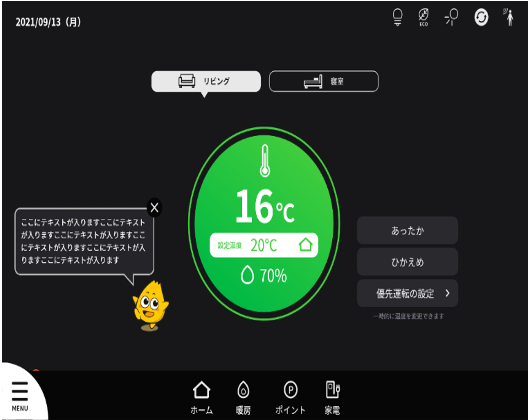

🔍 Nguồn ảnh: `eminel_gw_project/docs/old_eminel/app/screens/image016.png`
→ mô tả tại `00_feature_list.md`, dòng 21
→ nguyên văn: 「リビング/寝室切替・室温16℃/設定温度20℃/湿度70%・あったか/ひかえめ・優先運転の設定」

Đọc được gì từ màn hình này:
- Chuyển đổi giữa **phòng khách / phòng ngủ** → đây chính là chuyện "nhiều mạch sưởi"
- **Nhiệt độ phòng 16°C / nhiệt độ cài đặt 20°C** → hai con số khác nhau, đây là bản chất của "điều khiển theo nhiệt độ phòng"
- Hai nút **あったか (ấm) / ひかえめ (dè dặt)** → đây là preset của tính năng 優先運転

### Màn hình đặt lịch sưởi

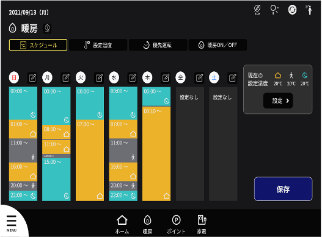

🔍 Nguồn ảnh: `eminel_gw_project/docs/old_eminel/app/screens/image003.png`
→ mô tả tại `00_feature_list.md`, dòng 26: 「暖房＞スケジュール：日〜土の時間帯別モード」

### Màn hình biểu đồ

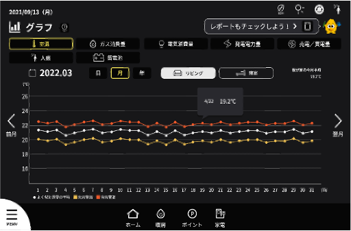

🔍 Nguồn ảnh: `eminel_gw_project/docs/old_eminel/app/screens/image006.png`
→ mô tả tại `00_feature_list.md`, dòng 31: 「室温・月・折れ線／ガス消費量・棒・タップ値表示」

### Màn hình điểm thưởng

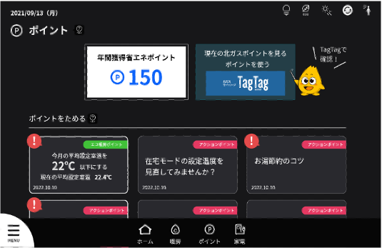

🔍 Nguồn ảnh: `eminel_gw_project/docs/old_eminel/app/screens/image022.png`
→ mô tả tại `00_feature_list.md`, dòng 36: 「年間獲得省エネポイント150P・TagTag・ポイントをためる」

⚠️ **Đừng dùng những ảnh này làm mẫu giao diện cho hệ mới.** Chúng chỉ để bạn cảm nhận sản phẩm cũ làm được gì. App mới sẽ được thiết kế lại hoàn toàn, chạy trên điện thoại chứ không phải máy tính bảng.

---

## 4.7 Cái gì kế thừa, cái gì bỏ

| Hệ cũ | Hệ mới |
|---|---|
| **優先運転** — đổi nhiệt độ tạm thời, **chỉ bắt đầu ngay lập tức** (kết thúc từ 10 phút đến 1 năm sau, 10–28°C) | ➡️ **予約運転** — thêm được **giờ bắt đầu**. Chữ 「優先運転」 *không còn xuất hiện* trong tài liệu mới |
| **宅内宅外判定** — app tự nhận biết đang ở trong hay ngoài nhà rồi đổi đường truyền | ➡️ **ローカル通信**, đã **lùi sang 2027** |
| App máy tính bảng, 30 chức năng | ➡️ Thiết kế lại cho điện thoại |
| Màn hình quản trị cũ | ➡️ **Không gộp** — xây mới trên nền ESTA |

🔍 Nguồn: `eminel_gw_project/docs/eminel/0_foundation/04_glossary.md`
→ mục 「機器・制御」, dòng 41–42
→ nguyên văn:
> 「優先運転 | **現行EMINELアプリの**暖房操作。…**eGW（新EMINEL）には存在せず、予約運転にリプレースされる**（2026-07-14確認。統合要件に「優先運転」の語は登場しない）」
> 「予約運転 | eGW新規（統合要件F-GW-05）。**現行の優先運転のリプレース＝優先運転＋予約設定**」

🔍 Về màn hình quản trị: `eminel_gw_project/docs/eminel/2_management/minutes/20260624_egw_camp_day2.md`
→ mục 「共有された前提（既定事項）」, dòng 31
→ nguyên văn: 「現行EMINELの管理画面とのマージはしない（全く別システム）」

### Thái độ khi kế thừa

Biên bản trại tập trung ghi rõ một nguyên tắc làm việc:

🔍 Nguồn: cùng file trên, dòng 32
→ nguyên văn: 「「踏襲」を足かせにしない。不要に見える機能は「いらないのでは」と問うてから入れる方針」

Dịch: *"Đừng để việc kế thừa trói tay. Chức năng nào trông có vẻ không cần thì hãy hỏi 'cái này có cần không' trước rồi mới đưa vào."*

Và một cảnh báo trực tiếp về batch:

🔍 Nguồn: `eminel_gw_project/docs/eminel/2_management/minutes/20260625_egw_camp_day3.md`
→ mục 「共有された前提（既定事項）」, dòng 35
→ nguyên văn: 「現行EMINELのバッチは「いけてない」実装が多い。そのまま踏襲すると不出来なやり方を再生産する懸念がある」

Dịch: *"Batch của hệ EMINEL hiện hành có nhiều chỗ implement dở. Kế thừa nguyên xi sẽ tái sản xuất cách làm tệ."*

⚠️ Đây là điều **rất đáng chú ý với người sắp làm batch**: tiền đề là **viết lại**, không phải chuyển đổi nguyên xi.

---

## Kiểm tra nhanh — Chương 4

1. Đọc tài liệu thấy chữ 「Cサーバ」 — đó là hệ thống nào?
2. Vì sao phải có logic tách gas nước nóng / gas sưởi? Nó ảnh hưởng tới cái gì?
3. Quy tắc "xuất CSV thành công rồi mới xoá" nhằm tránh chuyện gì?
4. Tính năng 優先運転 của hệ cũ trở thành gì ở hệ mới? Khác nhau chỗ nào?

<details>
<summary>Đáp án</summary>

1. **Server EMINEL hiện hành.** Tên cũ còn sót từ thời chưa hợp nhất, không phải hệ thống riêng. Và trong tài liệu E-GW mới, chữ 「コンシェルジュサーバー」 đôi khi lại chỉ `EMINEL-smart server` — phải đọc theo ngữ cảnh.
2. Vì **đồng hồ gas chỉ đo tổng**, không tách được phần đun nước và phần sưởi. Ảnh hưởng: **toàn bộ biểu đồ gas và report về sưởi** đều dựa trên con số suy luận này.
3. Tránh **mất dữ liệu vĩnh viễn** nếu bước xuất CSV lỗi sau khi đã xoá. Nguyên tắc chung: thao tác không đảo ngược được phải đứng sau cùng.
4. Thành **予約運転**. Khác biệt: bản cũ **chỉ bắt đầu ngay**, bản mới **chỉ định được giờ bắt đầu**. Chữ 「優先運転」 không xuất hiện trong **tài liệu yêu cầu tích hợp** (glossary xác nhận 2026-07-14) — nhưng ⚠️ bảng chức năng `10_feature_list.md` dòng 126 vẫn còn dòng 「優先運転設定」 0.25人月, vì bảng đó bám theo báo giá v0.3 cũ.

</details>

---
---

# Chương 5 — Người dùng thực sự trải qua những gì

## 5.1 Bản đồ bốn use case

📖 **Use case (viết tắt UC) là gì?**
Là **một tình huống sử dụng hoàn chỉnh** — mô tả từ lúc người dùng bắt đầu tới lúc đạt được mục đích, kèm theo các thành phần hệ thống nào tham gia ở bước nào.

| UC | Chủ đề | Slide |
|---|---|---|
| **UC-01** | Onboarding — lắp mới, thêm/xoá thiết bị, khởi tạo lại, luồng lỗi | 4–12 |
| **UC-04** | Hiển thị & thông báo — biểu đồ, report, tư vấn, lỗi, trông nom, Push | 15–32 |
| **UC-05** | Điều khiển sưởi/lạnh & DR | 35–42 |
| **UC-06** | Vận hành, bảo trì, quản trị | 45–56 |

🔍 Nguồn: `eminel_gw_project/docs/eminel/1_product/11_business_process/readme.md`
→ mục 「全体構成」, dòng 12–17

⚠️ Bảng thuật ngữ có nhắc `UC-01` đến `UC-07`, nhưng tài liệu luồng nghiệp vụ **chỉ có sơ đồ cho 4 use case trên**. Ba UC không có sơ đồ: **UC-02** (機器通信 — giao tiếp thiết bị), **UC-03** (データ収集送信 — thu thập & gửi dữ liệu), **UC-07** (外部連携 — liên kết hệ thống ngoài).

🔍 Nguồn: `eminel_gw_project/docs/eminel/0_foundation/04_glossary.md`, dòng 68
→ nguyên văn: 「01オンボーディング/02機器通信/03データ収集送信/04見える化通知/05冷暖房制御DR/06/07外部連携」

---

## 5.2 Onboarding: từ mở hộp đến thấy dữ liệu

📖 **Onboarding là gì?**
Toàn bộ quá trình từ lúc khách hàng nhận thiết bị đến lúc hệ thống chạy được. Đây là phần **dễ làm hỏng trải nghiệm nhất** — nếu người dùng không cài xong, mọi chức năng phía sau đều vô nghĩa.

### Ai làm việc này?

🔍 Nguồn: `eminel_gw_project/docs/eminel/1_product/11_business_process/readme.md`
→ mục 「01. 通常系 / EMINEL契約の有無 （1/3）」→「業務フロー概要（原文）」, dòng 27, 38
→ nguyên văn: 「新GWでは基本的にはユーザー側で設定を実施いただく想定（リリース序盤は作業者同伴）」「※暖房ユニット・マルチセンサーを取り付ける場合は作業者が必要」

**Người dùng tự làm** (giai đoạn đầu có nhân viên đi kèm). Nhưng lắp **bộ điều khiển sưởi** và **multi-sensor** thì **bắt buộc phải có thợ**.

### Phải chuẩn bị sẵn gì trong nhà

🔍 cùng file, dòng 32–37

1. MAC address + mật khẩu của **bộ điều khiển sưởi**
2. MAC address + mật khẩu của **multi-sensor môi trường**
3. MAC address + mật khẩu của **bộ pulse vô tuyến**
4. Giấy tờ ghi **ID và mật khẩu Bルート**
5. **Tài khoản TagTag** (đã đăng ký)

📖 **MAC address là gì?**
Số định danh duy nhất của mỗi thiết bị mạng, giống số khung xe máy. Không trùng nhau trên toàn thế giới.

### Luồng chính

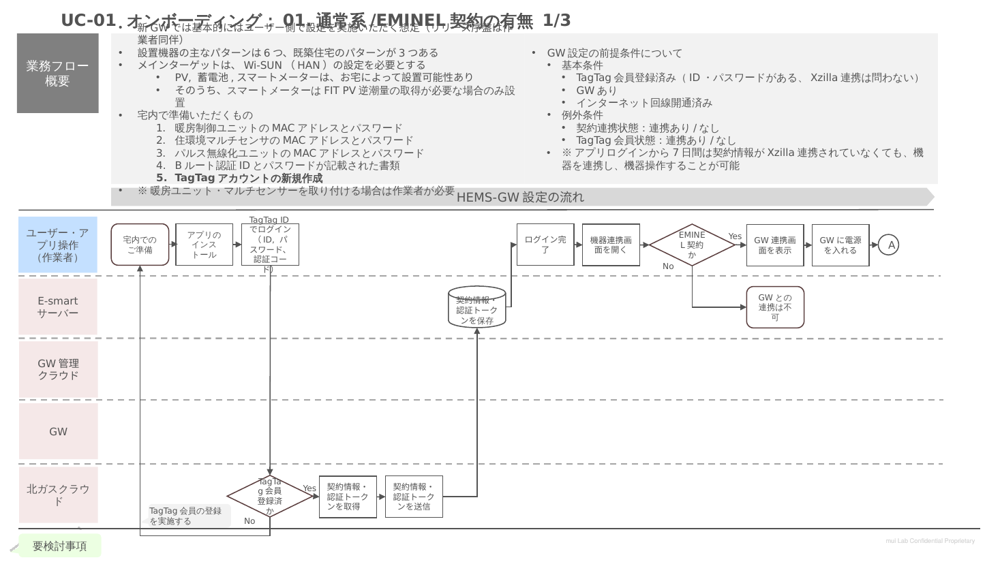

```
Cài app
   ↓
Đăng nhập bằng TagTag ID  ──chưa có tài khoản?──▶ chuyển sang trang đăng ký TagTag
   ↓
Đám mây 北ガス trả về: thông tin hợp đồng + token xác thực
   ↓
EMINEL-smart server lưu lại
   ↓
Mở màn hình liên kết thiết bị
   ↓
⚠️ KIỂM TRA: có hợp đồng EMINEL không?
   ├─ KHÔNG → "không liên kết được gateway" → DỪNG HẲN
   └─ CÓ ↓
Bật nguồn gateway
```

🔍 Nguồn: dòng 46–60

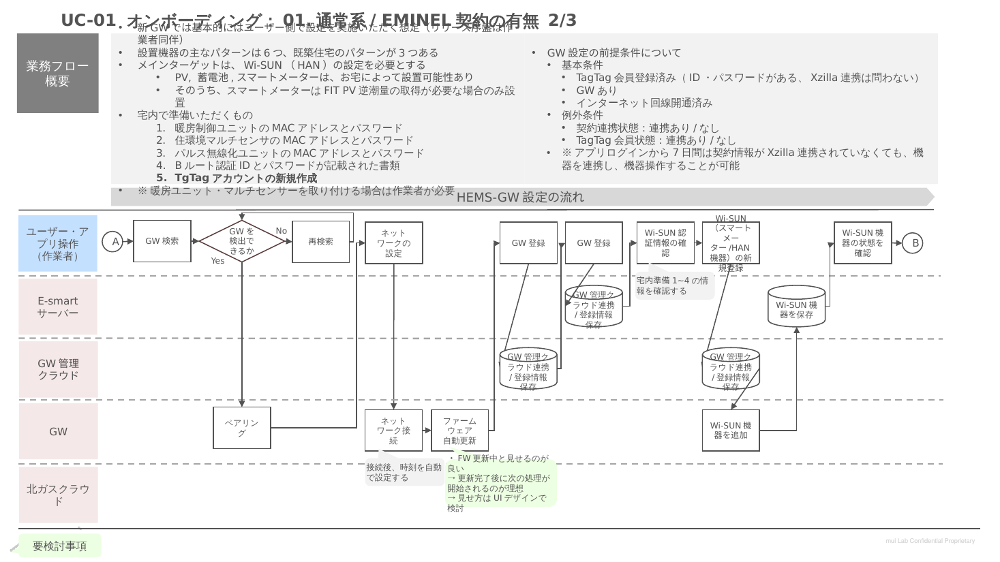

```
Tìm gateway (qua Bluetooth)  ──không thấy?──▶ tìm lại
   ↓
Ghép đôi (pairing)
   ↓
Cấu hình mạng Wi-Fi
   ↓
Gateway kết nối mạng → tự đặt giờ
   ↓
Gateway TỰ CẬP NHẬT FIRMWARE
   ↓
Đăng ký gateway → lưu ở CẢ HAI đám mây
   ↓
Đăng ký thiết bị Wi-SUN (đồng hồ điện, thiết bị HAN)
```

🔍 Nguồn: dòng 74–88

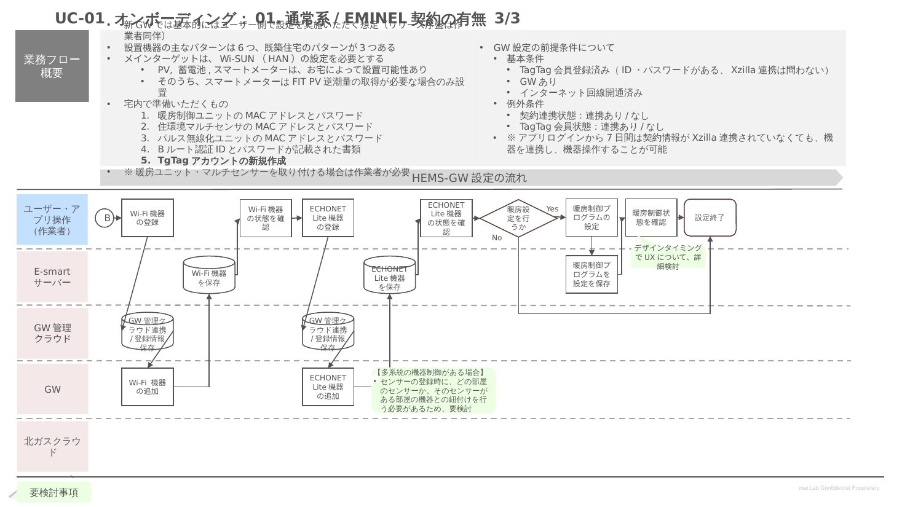

```
Đăng ký thiết bị Wi-Fi
   ↓
Đăng ký thiết bị ECHONET Lite
   ↓
Có đặt cấu hình sưởi không?
   ├─ Không → kết thúc
   └─ Có → cài chương trình điều khiển sưởi → kiểm tra trạng thái → xong
```

🔍 Nguồn: dòng 102–115

⚠️ **Thứ tự đăng ký thiết bị là cố định: Wi-SUN → Wi-Fi → ECHONET Lite.**

### Ba điểm phải nhớ

**① Ân hạn 7 ngày**

🔍 Nguồn: cùng file, dòng 42
→ nguyên văn: 「※アプリログインから7日間は契約情報がXzilla連携されていなくても、機器を連携し、機器操作することが可能」

Dịch: *"Trong 7 ngày kể từ khi đăng nhập app, dù thông tin hợp đồng chưa được liên kết với Xzilla, người dùng vẫn liên kết được thiết bị và thao tác điều khiển."*

💡 **Vì sao cần cái này?** Vì hệ thống hợp đồng của 北ガス cần thời gian để đồng bộ. Nếu bắt người dùng ngồi chờ, họ sẽ bỏ cuộc ngay tại chỗ. 7 ngày là khoảng ân hạn để trải nghiệm không bị gián đoạn.

**② Không có hợp đồng EMINEL thì chặn ngay tại chỗ** — không cho liên kết gateway.

**③ Thông tin gateway và thiết bị được lưu song song ở cả hai đám mây.**

### Điểm chưa quyết trong onboarding

🔴 Nhà nhiều mạch sưởi:

🔍 Nguồn: cùng file, dòng 107
→ nguyên văn: 「※要検討【多系統の機器制御がある場合】：センサー登録時にどの部屋のセンサーか、そのセンサーがある部屋の機器との紐付けを行う必要があるため要検討」

Dịch: *"Cần bàn thêm: khi có điều khiển nhiều mạch, lúc đăng ký cảm biến phải xác định cảm biến đó ở phòng nào và gắn với thiết bị nào trong phòng đó."*

🔴 Và một vấn đề nền tảng hơn, từ biên bản trại tập trung:

🔍 Nguồn: `eminel_gw_project/docs/eminel/2_management/minutes/20260625_egw_camp_day3.md`
→ mục 「GW認証（オンボーディングの順序）」, dòng 68–72
→ nguyên văn: 「masaoの違和感：「ログインしてからプロビジョニングすればいいのに、なぜログイン後にそれぞれEMS-SP番号を書き込むのか」順序が不自然」「方針：最初の方に詰める。レガシーのやり方をそのまま写さず、いけてる形にする」

Dịch: kiến trúc sư tổng thấy **thứ tự xác thực gateway của hệ cũ không tự nhiên**, và chủ trương **thiết kế lại chứ không copy**.

### ✅ Điểm này ĐÃ ĐƯỢC CHỐT — cách gắn GW với khách hàng

Băn khoăn ở trên nay có câu trả lời: **không dùng cách của hệ cũ nữa.**

🔍 Nguồn: Notion — QAデータベース dự án, phiếu **No. 8** 「GW-IDと顧客・契約情報の連携方法について」
→ 質問者 Bui Trong Dat (SYP), 起票 **2026-08-05 16:03** · trạng thái khi đọc (2026-08-20): **回答中**, cập nhật **2026-08-19 10:58**
→ ô `回答内容` chỉ ghi 「**コメントに記載**」 (*đã ghi trong comment*) — **nội dung thật nằm ở Comments**
→ ⚠️ ô `回答者` để trống; tên người trả lời chỉ có trong Comments

**Nguyên văn comment — masao takahashi (mui), 2026-08-19:**

> 「1. GW-IDとTagTag IDを紐付けます。ユーザーがTagTag IDでログインしたアプリからGWをペアリング・登録した時点で紐付き、EMINEL-smartサーバー側で管理します。
> 2. **EMS-SPとパスワードによる認証・紐付けは利用しません。**」

Dịch:
1. **Gắn `GW-ID` với `TagTag ID`.** Việc gắn xảy ra **đúng lúc** người dùng — từ app đã đăng nhập bằng TagTag ID — **ghép đôi (pairing) và đăng ký gateway**; và do **EMINEL-smartサーバー** quản lý.
2. **KHÔNG dùng cách xác thực / gắn bằng `EMS-SP番号` + mật khẩu.**

⇒ **Ba điều rút ra:**

| | Nội dung |
|---|---|
| **Khoá gắn kết** | `GW-ID` ↔ `TagTag ID` — không phải EMS-SP番号, không phải お客さま番号 |
| **Thời điểm gắn** | Ngay lúc pairing + đăng ký gateway từ app đã đăng nhập. Không có bước ghi số riêng như hệ cũ |
| **Ai giữ** | **EMINEL-smartサーバー** — và v1.2 gọi thẳng là **マスター** (bản gốc chuẩn), tức phần việc của SYP |

❗ **Điểm ② là một quyết định LOẠI BỎ, đáng nhớ riêng**: `EMS-SP番号` là cách hệ cũ gắn gateway với người ký hợp đồng (xem [Phụ lục A](#phụ-lục-a--từ-điển-thuật-ngữ)). Nay **bỏ hẳn**. Nghĩa là mọi thiết kế onboarding **không được** mang bước "ghi EMS-SP番号 + mật khẩu" từ hệ cũ sang — đúng như chủ trương 「レガシーのやり方をそのまま写さず」 (*không copy y nguyên cách của hệ cũ*) ở trên.

🔍 Bốn dòng trong tài liệu dự án mà chính masao dẫn ra làm căn cứ *(đã kiểm lại tại commit `1100487`, khớp cả bốn)*:

| Dòng | Nguyên văn | Nói gì |
|---|---|---|
| `00_integrated_requirements_v1.2.md` **124** | 「E-GW-顧客紐付け \| - \| **マスター**。GW IDとTagTag IDの紐付け」 | Bảng phân chia trách nhiệm: server EMINEL-smart là **bản gốc chuẩn** của việc gắn GW ↔ khách |
| cùng file **86** | 「GW管理クラウドはGW IDベースで管理し、顧客情報を持たない」 | GW管理クラウド **không giữ** thông tin khách |
| cùng file **531** | 「E-GWの新規認証：アプリからE-GWを検索・ペアリングし、GW管理クラウドに登録する」 | F-GW-10: app tìm → pairing → đăng ký lên GW管理クラウド |
| cùng file **117** | 「（EMINEL-smartサーバーは）登録通知を受領し、顧客との紐付けを管理」 | Server nhận thông báo đăng ký rồi quản lý việc gắn với khách |
| `11_business_process/readme.md` **83** | 「GW登録 → GW管理クラウド連携／登録情報保存（GW管理クラウド・E-smartサーバー**双方に保存**）」 | Luồng onboarding: thông tin đăng ký lưu ở **cả hai** nơi |

💡 **Ghép lại thành một mạch**: app (đã đăng nhập TagTag) tìm và pairing gateway → đăng ký lên **GW管理クラウド** (của mui) → GW管理クラウド gửi thông báo đăng ký sang **EMINEL-smartサーバー** (của SYP) → server gắn `GW-ID` ↔ `TagTag ID` và **giữ bản gốc chuẩn** của mối gắn đó. GW管理クラウド chỉ biết `GW-ID`, không biết khách là ai.

```
App (đăng nhập TagTag ID)
      │ ① tìm + pairing
      ▼
   E-GW ──② đăng ký──▶ GW管理クラウド        (mui — chỉ biết GW-ID)
                            │ ③ thông báo đăng ký
                            ▼
                    EMINEL-smartサーバー      (SYP — マスター)
                       gắn GW-ID ↔ TagTag ID
```

⚠️ Phiếu này còn **回答中**, chưa `完了` — nhưng nội dung comment đã đủ cụ thể và có dẫn chứng, khác hẳn kiểu trả lời treo. Vẫn nên mở lại kiểm trước khi trích vào tài liệu gửi ra ngoài.

---

## 5.3 Hiển thị: biểu đồ và report

### Biểu đồ

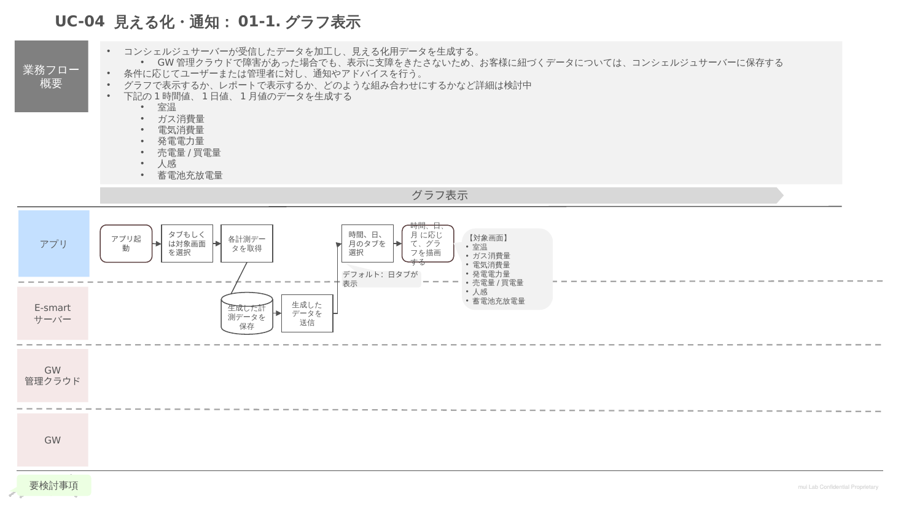

**7 loại dữ liệu**, mỗi loại có **3 mức thời gian** (giờ / ngày / tháng):

🔍 Nguồn: `eminel_gw_project/docs/eminel/1_product/11_business_process/readme.md`
→ mục 「01-1. グラフ表示（Slide 15）」, dòng 255
→ nguyên văn: 「室温 / ガス消費量 / 電気消費量 / 発電電力量 / 売電量・買電量 / 人感 / 蓄電池充放電量」

| # | Loại | Tiếng Việt |
|---|---|---|
| 1 | 室温 | Nhiệt độ phòng |
| 2 | ガス消費量 | Lượng gas tiêu thụ |
| 3 | 電気消費量 | Lượng điện tiêu thụ |
| 4 | 発電電力量 | Lượng điện phát ra (pin mặt trời, コレモ…) |
| 5 | 売電量・買電量 | Lượng điện bán ra / mua vào |
| 6 | 人感 | Cảm biến phát hiện người |
| 7 | 蓄電池充放電量 | Lượng sạc/xả của pin lưu trữ |

**Tab mặc định là "ngày"**.

🔍 cùng file, dòng 262
→ nguyên văn: 「時間・日・月のタブを選択（デフォルト：日タブが表示）」

### Report

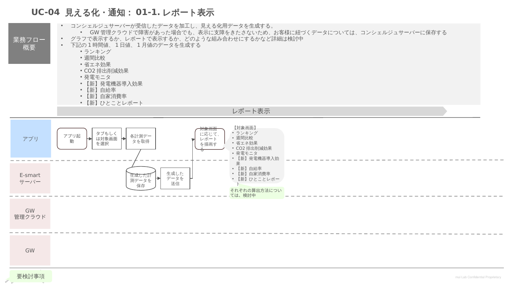

🔍 cùng file, dòng 277
→ nguyên văn: 「ランキング / 週間比較 / 省エネ効果 / CO2排出削減効果 / 発電モニタ / 【新】発電機器導入効果 / 【新】自給率 / 【新】自家消費率 / 【新】ひとことレポート」

| Report | Tiếng Việt | Mới? |
|---|---|---|
| ランキング | Xếp hạng so với hộ tương tự | |
| 週間比較 | So sánh theo tuần | |
| 省エネ効果 | Hiệu quả tiết kiệm | |
| CO2排出削減効果 | Hiệu quả giảm khí thải CO2 | |
| 発電モニタ | Theo dõi phát điện | |
| 発電機器導入効果 | Hiệu quả của việc lắp thiết bị phát điện | 🆕 |
| 自給率 | Tỷ lệ tự cấp năng lượng | 🆕 |
| 自家消費率 | Tỷ lệ tự tiêu thụ điện mình phát ra | 🆕 |
| ひとことレポート | Report một dòng (nhận xét ngắn) | 🆕 |

⚠️ **Cách tính của từng loại vẫn đang được bàn.**

🔍 cùng file, dòng 286
→ nguyên văn: 「※それぞれの算出方法については検討中」

### Dữ liệu report được sinh ra thế nào

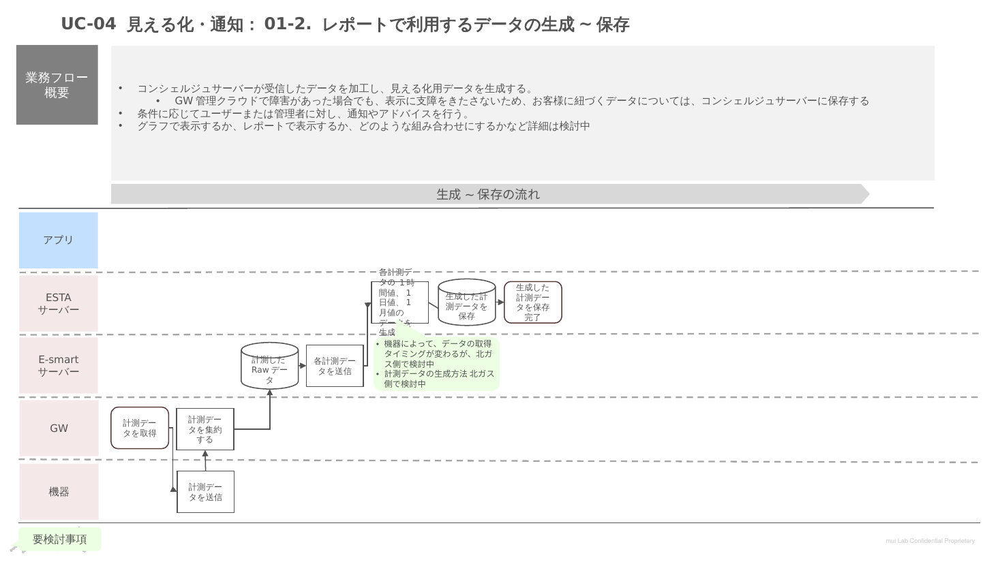

🔍 cùng file, mục 「01-2. レポートで利用するデータの生成〜保存（Slide 17）」, dòng 303–309

```
Thiết bị đo → gửi dữ liệu thô
   ↓
Server tổng hợp
   ↓
EMINEL-smart server sinh giá trị: 1 giờ / 1 ngày / 1 tháng
   ↓
Lưu lại
```

🔴 Hai điểm chưa quyết, ghi thẳng trong tài liệu:

🔍 cùng file, dòng 305–306
→ nguyên văn: 「※機器によってデータの取得タイミングが変わるが、北ガス側で検討中」「※計測データの生成方法は北ガス側で検討中」

---

## 5.4 Thông báo: bốn kênh không giống nhau

Đây là chỗ rất dễ làm sai vì bốn loại thông báo **hoạt động khác nhau hoàn toàn**.

🔍 Nguồn: `eminel_gw_project/docs/eminel/1_product/11_business_process/readme.md`
→ mục 「通知種類（Slide 32）」, dòng 657–662

| # | Loại | Push? | Xem ở đâu |
|---|---|---|---|
| 1 | **お知らせ** (thông báo chung) | ✅ | Màn hình danh sách thông báo |
| 2 | **省エネアドバイス** (tư vấn tiết kiệm) | ✅ | Màn hình danh sách tư vấn |
| 3 | **見守り** (trông nom) | ✅ | Lịch sử phát hiện người |
| 4 | **エラー** (lỗi) | ❌ **KHÔNG Push** | **Header của app khi mở lên** |

### Vì sao lỗi không dùng Push?

🔍 cùng file, mục 「02-4. 機器エラー（発生中のエラーの表示）（Slide 27）」, dòng 522–526
→ nguyên văn: 「Push通知は行わず、アプリを開いた際に確認ができるような表示とする」「現在発生中のエラーをアプリ画面のヘッダー部などにエラー発生中ということがわかるように表示する」「過去発生したエラーについては、確認できなくても良い（→改めて北ガス側で検討を実施）」

⚠️ **Đừng coi "không cần xem lỗi quá khứ" là đã chốt.** Phần ngoặc （→改めて北ガス側で検討を実施） cho biết yêu cầu này đang được 北ガス **xem xét lại**: slide 28 vẫn có flow màn hình エラー履歴, và bảng slide 32 (dòng 662) ghi rõ đang tái xét 要否 của màn hình lịch sử lỗi.

📌 **Diễn biến 2026-08-12 — nghiêng hẳn về phía "không làm".** Requirement `E01_system_error.md` bị cắt **−124 dòng** trong đợt 「要件fix」: bỏ hẳn cụm requirement 「機器エラーを一覧・履歴で確認できる」 cùng cơ chế **未読/既読** (chưa đọc/đã đọc), và bỏ cả cụm 「操作の抑止」 (*chặn thao tác nguy hiểm khi đang có lỗi*). Phần còn lại chỉ là một cụm 「エラー共通」 ba mục: hiện lỗi của GW/thiết bị/mạng/server ・ lúc nào cũng xem được lỗi **chưa xử lý xong** ・ xem chi tiết (nội dung · thiết bị · nơi liên hệ). ⚠️ Đây là **thay đổi phía requirement**, chưa phải câu trả lời chính thức của 北ガス — nơi chốt cuối cùng sẽ là spec `e04_システムエラー.md` (nằm trong kế hoạch 30 tài liệu ở [§7.5](#75-機能仕様-app--tầng-vừa-mở), hiện chưa viết).

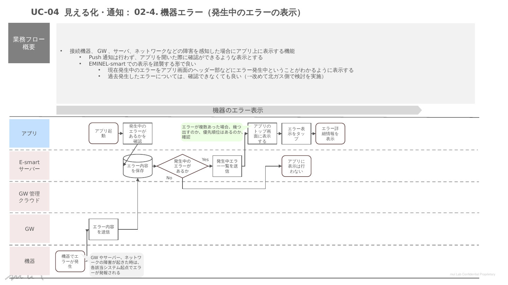

💡 **Lý do thiết kế**: lỗi thiết bị có thể kéo dài nhiều ngày và lặp lại liên tục. Nếu Push mỗi lần, người dùng sẽ tắt thông báo — rồi bỏ lỡ luôn cả những thông báo quan trọng khác.

### Tư vấn tiết kiệm — điều kiện kích hoạt từng loại

Ba nhóm:

| Nhóm | Cách kích hoạt |
|---|---|
| **リマインド系** (nhắc nhở) | Theo lịch cố định, mỗi tháng 1 lần |
| **設定見直し系** (rà lại cài đặt) | Theo **điều kiện** của từng người dùng |
| **その他** (khác) | Ngày kỷ niệm |

🔍 Nguồn: cùng file, mục 「02-2. 省エネアドバイス（リマインド系）」, dòng 345–347

Điều kiện cụ thể của từng loại — đây là **nghiệp vụ thật**, cần nhớ:

| Loại | Điều kiện bắn thông báo | Nguồn (dòng) |
|---|---|---|
| **在宅温度** (nhiệt độ khi ở nhà) | nhiệt độ cài đặt **>** nhiệt độ khuyến nghị | 396 |
| **就寝温度** (nhiệt độ khi ngủ) | **chưa** cài đặt | 419 |
| **外出温度** (nhiệt độ khi ra ngoài) | **chưa** cài đặt | 440 |
| **エコ温度** (nhiệt độ eco) | đang đặt **= 0°C** | 461 |
| **暖房OFF** (tắt sưởi) | số người đã tắt sưởi **> một nửa** tổng người dùng **VÀ** người này đang bật | 482–485 |
| **EMINEL記念日** (kỷ niệm) | đủ x năm kể từ ngày cài đặt → thông báo **+ tặng điểm** | 506 |

🔍 Nguồn: `eminel_gw_project/docs/eminel/1_product/11_business_process/readme.md`, các dòng ghi trong bảng

💡 **Điều kiện "tắt sưởi" rất thú vị**: hệ thống theo dõi **hành vi của toàn bộ cộng đồng người dùng**. Khi hơn nửa số người đã tắt sưởi (tức mùa xuân đến rồi), những người còn bật sẽ được nhắc. Đây là logic dựa trên dữ liệu tập thể, không phải dữ liệu cá nhân.

### Trông nom — phán đoán chạy ở đâu?


⚠️ **Phán đoán chạy ở GATEWAY, không phải server.**

🔍 Nguồn: cùng file, mục 「02-5. ただいま通知（Slide 29）」, dòng 588–596
→ nguyên văn:
> 「（機器）マルチセンサーで人感を検知」
> 「（GW）分岐：人感なし > 人感ありを検知したか」
> 「（GW）分岐：通知時間かどうか」
> 「E-smartサーバー：検知内容を保存 → 検知内容を送信」

Và khung giờ được phép thông báo cũng **lưu ở gateway**:

🔍 cùng file, dòng 583–584
→ nguyên văn: 「E-smartサーバー：通知時間を保存 → 通知時間を送信する」「（GW）通知時間を保存」

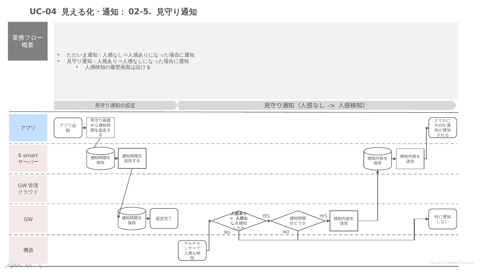

Hai chiều ngược nhau:

| Loại | Điều kiện |
|---|---|
| **ただいま通知** | Không có người → **CÓ** người |
| **見守り通知** | Có người → **KHÔNG** có người |

🔍 cùng file, dòng 606–607

💡 Vì sao đặt phán đoán ở gateway? Vì cảm biến báo liên tục. Nếu đẩy hết lên server rồi mới lọc, sẽ tốn băng thông và điện của gateway vô ích. Lọc tại chỗ, chỉ gửi lên khi thật sự có sự kiện.

---

## 5.5 Điều khiển sưởi — phần khó nhất

Đây là **trung tâm của cả dự án**. Trục chính của phạm vi bắt buộc cuối 2026 là **nhóm chức năng sưởi** (xem [mục 1.7](#17-dòng-thời-gian-từ-2022-đến-nay)).

**Mô hình hiện hành, gọn trong ba câu:**

1. Toàn bộ việc sưởi tự động gọi là **暖房自動制御**, gồm ba phần: lịch tuần (スケジュール運転) + đặt trước (予約運転) + chế độ tiết kiệm (省エネモード).
2. Chỉ có **một trục phân nhánh duy nhất**: nhà đó **có 室温制御 hay không** — tức có đo được nhiệt độ phòng để so với nhiệt độ mục tiêu hay không.
3. Có 室温制御 → cài bằng **nhiệt độ** và bật được 省エネモード. Không có → cài bằng **温度レベル** (mức nhiệt) và không bật được.

Mục này nói **cài đặt cái gì**; còn **ai chạy** thì đã kể ở [mục 3.2](#32-chiều-xuống-từ-nút-bấm-đến-máy-sưởi) — server lưu và giao cả kế hoạch xuống, **gateway tự chạy** (mất mạng vẫn sưởi), riêng nhà コレモ thì vòng lặp so nhiệt độ chạy trên スマリモ.

### Cây khái niệm

```
暖房自動制御 (điều khiển sưởi tự động)  ── bật/tắt được toàn bộ
│
├─ スケジュール運転 (chạy theo lịch) ── lịch tuần, 3 chế độ: 在宅 / 外出 / 就寝
│     │                                    (ở nhà / ra ngoài / đi ngủ)
│     └─ 室温制御の有無 (CÓ hay KHÔNG điều khiển theo nhiệt độ phòng)
│           ├─ CÓ  → mỗi chế độ đặt 温度 (nhiệt độ)      ◀━━ 省エネモード bám vào ĐÂY
│           └─ KHÔNG → mỗi chế độ đặt 温度レベル (mức nhiệt)
│
├─ 予約運転 (chạy theo đặt trước) 【新規】
│     └─ giờ bắt đầu + giờ kết thúc + nhiệt độ (hoặc 温度レベル nếu không có 室温制御)
│        ƯU TIÊN hơn lịch tuần
│
└─ 省エネモード (chế độ tiết kiệm) 【新規】── 3 loại, chỉ chạy ở chế độ 在宅
      │                              ──▶ hiệu chỉnh nhiệt độ mà 室温制御 đang điều khiển
      ├─ 不在時エコモード (eco khi vắng nhà) — bắt buộc có cảm biến người
      ├─ 外気温補正 (hiệu chỉnh theo nhiệt độ ngoài trời)
      └─ 就寝補正 (hiệu chỉnh trước giờ ngủ)
```

💡 **Vì sao 省エネモード đứng ngang hàng trong cây?** Vì tài liệu gốc liệt kê nó là 1 trong 3 thành phần. Nhưng nó **không phải "chế độ chạy" thứ ba** — nó là **lớp hiệu chỉnh** cộng thêm vào nhiệt độ mà 室温制御 đang điều khiển (mũi tên ◀━━).

🔍 Nguồn: `eminel_gw_project/docs/eminel/3_requirements/app/B02_heating_control.md`
→ khung cây: mục 「用語集」, dòng 30–36 · bảng định nghĩa: dòng 38–44
→ ba chế độ 在宅/外出/就寝 và hai nhánh 温度 / 温度レベル: mục 「スケジュール運転」, dòng 132 và 135–137

### Định nghĩa từng khái niệm

🔍 cùng file, bảng 用語集, dòng 38–44 — **năm** thuật ngữ dưới đây là nguyên văn của bảng đó

| Thuật ngữ | Định nghĩa |
|---|---|
| **暖房自動制御** | Tên gọi chung của toàn bộ việc vận hành sưởi tự động, đối tượng là hệ sưởi trung tâm. **Khác với việc bật/tắt máy sưởi bằng remote treo tường** |
| **スケジュール運転** | Đặt lịch theo thứ trong tuần và khung giờ, hệ thống chạy tự động theo đó. **Nội dung cài đặt khác nhau tuỳ có 室温制御 hay không.** ⚠️ Không phải cùng một thứ với 「スケジュール運転」 của E-Smart *(tài liệu gốc ghi rõ: 「※E-Smartのスケジュール運転とは違う機能」)* |
| **室温制御** | So **nhiệt độ phòng thực tế** với nhiệt độ (mục tiêu) đã đặt, rồi liên tục quyết định thao tác điều khiển. Tuỳ cấu hình thiết bị mà có nhà chạy lịch tuần **không kèm** 室温制御 |
| **予約運転** | Chạy tạm thời với giờ bắt đầu, giờ kết thúc, nhiệt độ chỉ định. **Là bản mở rộng của 優先運転 hệ cũ** — hệ cũ chỉ bắt đầu ngay được, nay chỉ định được cả giờ bắt đầu |
| **省エネモード** | Tên gọi chung của các hiệu chỉnh tự động **áp lên nhiệt độ điều khiển của 室温制御** |

⚠️ **温度レベル (mức nhiệt) — từ mới, nhưng KHÔNG nằm trong 用語集.** Nó chỉ xuất hiện đúng ba lần trong cả file B02: hai lần trong requirement (dòng 137 「室温制御なしの場合、モードごとに温度レベルを設定できる」 và dòng 166), một lần trong 要確認事項 — *danh sách "phải hỏi 北ガス" đặt cuối mỗi file requirement* — ở dòng 239: 「室温制御時の設定値イメージは床暖の温度レベルであっているか」 (*hình dung giá trị cài đặt là mức nhiệt kiểu sàn sưởi, đúng không?*).

Nghĩa là: **đơn vị đặt nhiệt dùng thay nhiệt độ cụ thể ở nhà không có 室温制御 — còn gồm những nấc nào thì tài liệu chưa nói, và chính người viết requirement cũng đang hỏi ngược lại 北ガス.**

⚠️ **Từ 設定値運転 không còn là khái niệm sống.** Bản trước dựng cây khái niệm theo trục *"lịch tuần chạy bằng 室温制御 hay bằng 設定値運転"*; bản hiện hành đổi sang trục **「室温制御の有無」** và đưa vào khái niệm mới 温度レベル. Trong cả repo, chữ 設定値運転 nay chỉ còn **đúng một chỗ**. Nhưng **khái niệm** đó thì bạn vẫn gặp ở hai nơi dưới tên khác — đừng tưởng nó còn hiệu lực:

| Gặp khái niệm ở đâu | Nó mang tên gì ở đó | Thực tế |
|---|---|---|
| `00_integrated_requirements_v1.2.md` (UC-05 01-2) | 「スケジュール運転」 | Tài liệu yêu cầu tích hợp **chưa** cập nhật theo cách gọi mới của B2 |
| Bảng 「統合要件v1.2との呼び方の対応」 trong chính B02, dòng 54–60 | 「設定値運転」 — **chỗ duy nhất còn chữ này trong repo** | Tàn dư của lần sửa 08-03: commit `9dc5e34` sửa mục 用語集 phía trên nhưng **bỏ quên bảng đối chiếu tên gọi** này |

**Bảng đối chiếu cũ ↔ mới** — nếu bạn từng đọc bản requirement trước 08-03:

| | Bản trước 2026-08-03 | Bản hiện hành |
|---|---|---|
| Trục phân nhánh của lịch tuần | 室温制御 **hay** 設定値運転 (hai "kiểu chạy") | **室温制御の有無** (có / không) |
| Nhánh không đo được nhiệt độ phòng | gọi là 設定値運転 | gọi là *lịch tuần không có 室温制御* |
| Đơn vị đặt nhiệt ở nhánh đó | 設定値 (giá trị đặt) | **温度レベル** (khái niệm MỚI, nấc chưa định nghĩa) |
| Section 「機器構成とできること」 | có, 5 quy tắc | **đã xoá** |

🔍 Nguồn cách gọi mới: cùng file, mục 「本章での語の扱い」, dòng 51
→ nguyên văn: 「別資料では室温制御ではないものを「タイマー運転」と呼んでいたが、紛らわしいため室温制御あり/なしのスケジュール運転と呼ぶ」

### ⚠️ Quan hệ MỘT CHIỀU giữa 省エネモード và 室温制御

Đây là điểm hay bị hiểu sai nhất:

```
Có 室温制御       →  có nhiệt độ điều khiển  →  có chỗ để hiệu chỉnh  →  CÀI ĐƯỢC 省エネモード
Không có 室温制御 →  không có gì để hiệu chỉnh                        →  KHÔNG CÀI ĐƯỢC
```

Nhưng **chiều ngược lại thì không đúng**:

🔍 Nguồn: `eminel_gw_project/docs/eminel/3_requirements/app/B02_heating_control.md`
→ mục 「用語集」, dòng 44
→ nguyên văn: 「省エネモードがOFFでも、室温制御自体は動く」

Tức là: **tắt chế độ tiết kiệm thì việc điều khiển theo nhiệt độ phòng vẫn chạy bình thường.**

### Cấu hình thiết bị quyết định cái gì

Requirement hiện hành chỉ còn **một trục duy nhất**: nhà đó có 室温制御 hay không. Trục này quyết định **nội dung cài đặt** ở hai chỗ:

🔍 cùng file, mục 「スケジュール運転」 requirement #4, dòng 135–137
→ nguyên văn: 「室温制御の有無でモードごとの制御設定項目が変わる / 室温制御ありの場合、モードごとに温度を設定できる / 室温制御なしの場合、モードごとに温度レベルを設定できる」

🔍 cùng file, mục 「予約運転」 requirement #6, dòng 164–166
→ nguyên văn: 「室温制御の有無で予約運転設定項目が変わる / 室温制御ありの場合、温度を設定できる / 室温制御なしの場合、温度レベルを設定できる」

| Nhà bạn có gì | Lịch tuần & đặt trước cài bằng | Cài được 省エネモード? |
|---|---|---|
| **Đọc được** nhiệt độ phòng (có スマリモ hoặc cảm biến) | **温度** — nhiệt độ cụ thể, kèm 室温制御 | ✅ |
| **Không đọc được** nhiệt độ phòng | **温度レベル** — mức nhiệt, không có 室温制御 | ❌ (không có nhiệt độ điều khiển để hiệu chỉnh) |

⚠️ **Cả bảng trên là SUY LUẬN, không phải trích.** B02 bản hiện hành chỉ nói *"nội dung cài đặt đổi theo có/không 室温制御"* — nó **không** còn nói nhà nào thì có 室温制御. Cả ánh xạ ở cột 1 (đọc được nhiệt độ phòng → có 室温制御) lẫn cột 3 (có 室温制御 → cài được 省エネモード) đều là quy tắc cũ đã bị xoá ngày 2026-08-03 cùng section 「機器構成とできること」; cột 3 nay chỉ còn suy được từ định nghĩa 省エネモード ở dòng 44. Chính B02 cũng đang hỏi ngược lại 北ガス — 要確認事項 dòng 238: 「室温制御が適さない機器構成の具体例」 (*cho ví dụ cụ thể cấu hình thiết bị nào thì không hợp với 室温制御*). **Dùng bảng này để hiểu, đừng dùng để chốt spec.**

⚠️ **Ba nhóm quy tắc từng có trong requirement, nay đã bị xoá** — nêu ra để bạn không hoang mang khi thấy tài liệu/slide cũ vẫn nói:

| Thứ bị xoá khỏi B2 | Trạng thái thực tế |
|---|---|
| Section 「機器構成とできること」 (5 quy tắc, gồm *"người dùng phải xem được nhà mình dùng được gì"*) | Không còn trong requirement app |
| Quy tắc *"nhà chỉ giao tiếp qua bộ điều khiển Wi-Fi thì không cung cấp điều khiển tự động"* | Không còn trong requirement app. **Nhưng hạn chế kỹ thuật thì vẫn còn** — lý do nằm ở biên bản trại tập trung `2_management/minutes/20260623_egw_camp_day1.md` mục 「暖房制御の系統問題」 dòng 209–212: *"đi qua bộ điều khiển Wi-Fi thì không bật được điều khiển sưởi tự động — vì máy của **Noritz** (ノーリツ, hãng thiết bị nước nóng/sưởi Nhật) hiện chỉ lấy dữ liệu 1 lần/ngày, gateway không chủ động điều khiển được"* |
| Requirement *"đặt được giờ đi ngủ (就寝時刻)"* | Không còn trong requirement app *(file phụ lục `Z_old_mapping.md` dòng 41 vẫn giữ dòng cũ — đó là bản đồ đối chiếu nháp cũ, không phải requirement)* — **và tài liệu yêu cầu tích hợp v1.2 vẫn ghi** 「就寝時刻はアプリから設定できる」 (`00_integrated_requirements_v1.2.md` dòng 491). Hai tài liệu đang lệch nhau |

⚠️ **Bị xoá khỏi requirement ≠ giờ làm được.** Ba dòng trên chỉ nói *requirement app không còn mô tả chúng*; ràng buộc kỹ thuật và yêu cầu gốc vẫn nguyên ở biên bản và tài liệu tích hợp. Gặp slide cũ nói ngược thì tra lại dòng `経緯` (*lịch sử sửa đổi*, nằm ở bảng đầu mỗi file requirement) và `git log` của file, đừng vội kết luận bên nào sai.

Lý do chung của đợt xoá này ghi ở dòng `経緯` của chính file *(dòng 8)*: 「先方レビューの結果をスライドから反映（2026-08-03）／合宿議事を出典とする記述を削除（2026-08-05）」 — tức phản ánh kết quả review của 北ガス, và **gỡ mọi mô tả lấy biên bản trại tập trung làm nguồn**.

### Hành vi khi tắt — chi tiết dễ bỏ sót

🔍 Nguồn: `eminel_gw_project/docs/eminel/3_requirements/app/B02_heating_control.md`
→ mục 「暖房自動制御のON/OFF」, dòng 112–116
→ nguyên văn:
> 「1. 暖房自動制御をON/OFFできる」
> 「2. OFFにすると、スケジュール運転・予約運転・省エネモードをすべて停止する / 設定済みの予約運転はキャンセルする / 再ONしても、キャンセルした予約運転は復活しない」
> 「3. OFFの実行前に確認を行い、取りやめることができる」

```
Tắt 暖房自動制御
   ├─ Dừng TOÀN BỘ: lịch tuần + đặt trước + chế độ tiết kiệm
   ├─ 予約運転 đã đặt bị HUỶ
   └─ Bật lại → KHÔNG khôi phục cái đã huỷ
        ⇒ vì hậu quả không đảo ngược được
        ⇒ BẮT BUỘC hỏi xác nhận trước khi tắt
```

💡 Đây là ví dụ điển hình của việc **requirement phải nói rõ trạng thái sau thao tác**, không chỉ nói "có nút tắt".

### Chi tiết kỹ thuật từ tài liệu yêu cầu gốc

Tài liệu gốc còn nói rõ hơn requirement app:

🔍 Nguồn: `eminel_gw_project/docs/eminel/3_requirements/00_integrated_requirements_v1.2.md`
→ mục 「8-1」→ F-GW-05 「基本制御」, dòng 482–487
→ nguyên văn:
> 「予約運転はスケジュール運転よりも優先される」
> 「外出・就寝モードは、補正は行わない」
> 「在宅モードでは、省エネモードの判定を行い、制御温度を決定する」
> 「暖房制御ユニットと無線LANリモコンの両方が設置されている場合は、暖房制御ユニットを優先して制御する」
> 「制御温度は2分に1回取得してセットする」

⚠️ **Chi tiết quan trọng ít người để ý**: chế độ tiết kiệm **chỉ hoạt động ở chế độ 在宅 (ở nhà)**. Chế độ 外出 (ra ngoài) và 就寝 (đi ngủ) **không hiệu chỉnh gì cả**.

Và câu thứ tư trong khối trích trên (chưa dịch ở đâu khác): nhà lắp **cả** 暖房制御ユニット (bộ điều khiển sưởi) **lẫn** bộ điều khiển Wi-Fi thì **ưu tiên điều khiển qua 暖房制御ユニット**.

Và quy tắc gộp khi nhiều chế độ tiết kiệm cùng bật:

🔍 cùng file, dòng 493
→ nguyên văn: 「省エネモードの合算ルール：複数の省エネモードが同時に有効な場合、温度補正値は合算せず最も補正幅のある設定を1つ適用する（想定補正値：−1℃）」

Dịch: *"Nhiều chế độ tiết kiệm cùng bật thì KHÔNG cộng dồn mức hiệu chỉnh — chỉ áp dụng một cái có mức hiệu chỉnh lớn nhất."*

💡 Vì sao? Nếu cộng dồn 3 chế độ mỗi cái −1°C thì thành −3°C, nhà lạnh cóng. Người dùng bật chế độ tiết kiệm để tiết kiệm, không phải để chịu rét.

### Con số của hệ cũ để so sánh

🔍 Nguồn: `eminel_gw_project/docs/eminel/3_requirements/app/B02_heating_control.md`
→ các bảng 「備考と出典」, dòng 144, 147, 173, 177

| Hạng mục | Hệ cũ |
|---|---|
| Nấc thời gian của lịch | **10 phút** |
| Số khung giờ tối đa mỗi ngày | **6** |
| Dải nhiệt độ | **10–28°C**, nấc 1°C |
| Preset あったか (ấm) | 2 giờ, **+2°C** |
| Preset ひかえめ (dè dặt) | 2 giờ, **−2°C** |

Hai preset này **đã được đưa thẳng vào requirement mới** làm ví dụ, không còn chỉ là con số hệ cũ:

🔍 cùng file, mục 「予約運転」 requirement #5, dòng 160–163
→ nguyên văn: 「あらかじめ用意されたプリセットで予約運転を簡易に開始できる / 例： / あったか: 現在〜2時間後 / 現在温度+2℃ / ひかえめ: 現在〜2時間後 / 現在温度-2℃」

🔴 Nấc thời gian ở hệ mới **vẫn nằm trong danh sách chưa quyết** của 北ガス — nhưng chỗ ghi nó **đã chuyển**: bản requirement 08-03 đã bỏ mục này khỏi 要確認事項 của B2, giờ chỉ còn ở danh sách TBD tổng.

🔍 Nguồn: `eminel_gw_project/docs/eminel/2_management/20_open_issues.md`
→ dòng 176
→ nguyên văn: 「スケジュール刻み、省エネアドバイスのパラメータ・統廃合（約15種→7種+エコ暖房ポイント）、灯油データソース、3系統以降の暖房対応可否、F-AD-11統計表示内容（完全TBD）、バッジ詳細、冷房のアプリ設定要否、グルーピング閾値」

Hạng mục **đầu tiên** trong danh sách — 「スケジュール刻み」 — chính là nấc thời gian của lịch sưởi. *(Đây là `20_open_issues.md`, danh sách vấn đề chưa quyết của cả dự án; bản rút gọn theo mức cấp bách nằm ở [Phụ lục C](#phụ-lục-c--danh-mục-tbd-đang-chặn-việc).)*

### Nhà nào chạy lịch tuần không kèm 室温制御

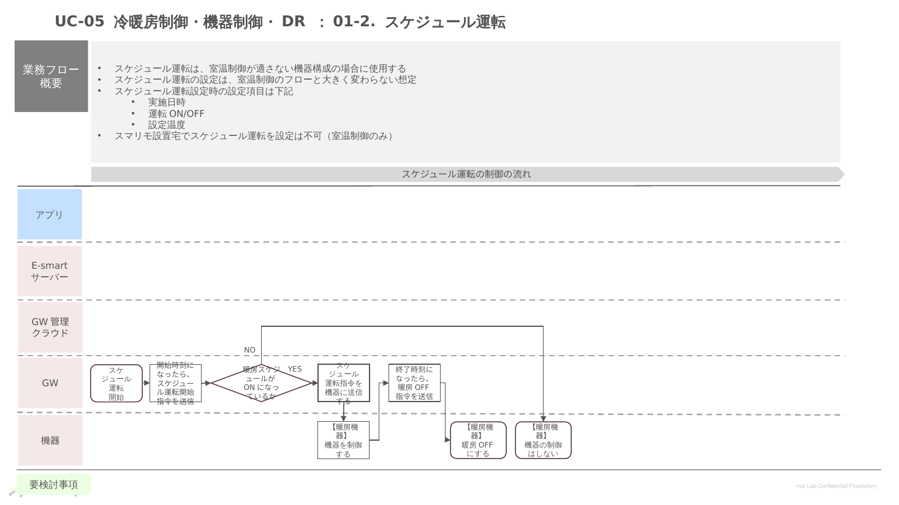

🔍 Nguồn: `eminel_gw_project/docs/eminel/1_product/11_business_process/readme.md`
→ mục 「01-2. スケジュール運転（Slide 38）」, dòng 758–761
→ nguyên văn:
> 「スケジュール運転は、室温制御が適さない機器構成の場合に使用する」
> 「スケジュール運転設定時の設定項目は下記：実施日時 / 運転ON/OFF / 設定温度」
> 「スマリモ設置宅でスケジュール運転を設定は不可（室温制御のみ）」

*Dịch: "Chạy theo lịch dùng cho cấu hình thiết bị không hợp với 室温制御" / "Các trường cài khi đặt lịch: ngày giờ thực hiện / bật-tắt vận hành / **nhiệt độ đặt**" / "Nhà lắp スマリモ không đặt được lịch kiểu này (chỉ 室温制御)".*

⚠️ **Chú ý trường thứ ba trong khối trích**: tài liệu nghiệp vụ này ghi 設定温度 (nhiệt độ đặt) vì nó viết **trước** đợt sửa 08-03. Theo B2 hiện hành, nhánh **không có** 室温制御 đặt bằng **温度レベル**, không phải nhiệt độ cụ thể.

⚠️ **Nhà có スマリモ (bộ điều khiển thông minh của 北ガス) thì luôn có 室温制御** — không rơi vào nhánh đặt bằng 温度レベル.

⚠️ Lưu ý cách gọi: tài liệu nghiệp vụ này (chưa cập nhật theo B2 bản 08-03) dùng chữ 「スケジュール運転」 **theo nghĩa hẹp** = chạy lịch không có 室温制御. Trong requirement app hiện hành, 「スケジュール運転」 là **tên gọi chung** cho cả hai nhánh có/không 室温制御.

⚠️ **Còn "rốt cuộc nhà nào" thì chưa ai chốt.** Chính B2 đang treo câu hỏi 「室温制御が適さない機器構成の具体例」 (*cho ví dụ cụ thể cấu hình thiết bị nào không hợp với 室温制御*) ở mục 要確認事項, dòng 238. Hiện chỉ chắc chắn được chiều ngược lại: nhà có スマリモ thì luôn có 室温制御.

### Quy tắc dùng từ trong chương này

Tài liệu requirement có một mục đặc biệt: **cấm dùng một số từ**.

🔍 Nguồn: `eminel_gw_project/docs/eminel/3_requirements/app/B02_heating_control.md`
→ mục 「本章での語の扱い」, dòng 46–52 *(câu trích ở dòng 50)*
→ nguyên văn: 「「暖房制御」「暖房機器制御」という語は使わない（総称か機器操作か紛れるため。統合要件等の機能名の引用を除く）」

Lý do: từ 「暖房制御」 lẫn lộn giữa *điều khiển tự động tổng thể* và *thao tác lên thiết bị*. Khi bạn viết ticket hay comment code, hãy theo quy ước này.

---

## 5.6 Điều khiển lạnh

Ngắn hơn nhiều, và **hoàn toàn nằm ngoài phạm vi 2026**.

🔍 Nguồn: `eminel_gw_project/docs/eminel/3_requirements/app/B03_cooling.md`
→ mục 「要件案：26年対応スコープ」, dòng 53–55
→ nguyên văn: 「## 要件案：26年対応スコープ」 / 「- なし」

### Cây khái niệm

```
冷房自動制御 (điều khiển lạnh tự động) ── đối tượng là ĐIỀU HOÀ
├─ 基本制御 ── trong khung giờ cho phép làm lạnh, vượt ngưỡng nhiệt độ phòng
│              → tự bật; xuống dưới ngưỡng → tự tắt
│              ⚠️ 基本制御 ở đây là khái niệm CỦA PHÍA LẠNH (định nghĩa trong B3).
│                 Đừng lẫn với tiểu mục cũng tên 「基本制御」 của F-GW-05 phía SƯỞI
│                 đã trích ở mục 5.5 — cùng chữ, khác chức năng.
└─ 省エネモード ── 2 loại (ít hơn sưởi một loại)
     ├─ 不在時エコモード (eco khi vắng nhà)
     └─ 外気温補正（実施検討中） (hiệu chỉnh theo nhiệt độ ngoài trời, cho mùa chuyển tiếp
                                — 実施検討中 = CÒN ĐANG CÂN NHẮC CÓ LÀM HAY KHÔNG)
```

🔍 cùng file, mục 「用語集」, dòng 21–37 *(cây khái niệm ở dòng 28, định nghĩa 基本制御 ở dòng 35, 省エネモード（冷房） ở dòng 37)*

⚠️ **Điều kiện của 基本制御 vừa được sửa ngày 2026-08-05** (commit `f2a3dab` — dòng `経緯` của B03 chưa cập nhật mốc này nên phải tra `git log`, đừng tin `経緯`): trước là *"trong chế độ 在宅 (ở nhà)"*, nay là **"trong 冷房スケジュール (khung giờ được phép làm lạnh)"** — nguyên văn 「冷房スケジュール中、室温が設定したしきい値を超えたら…」.

Cùng đợt đó, câu hỏi treo *"「在宅モード」 của phía lạnh lấy từ đâu"* đã được gỡ khỏi 要確認事項 — **gỡ vì đổi trục nên hết cần hỏi, không phải vì đã có câu trả lời**.

⚠️ Riêng ghi chú 「実施検討中」 của 外気温補正 **chỉ bị bỏ ở ô định nghĩa trong 用語集** (dòng 37) — nó vẫn còn ở cây khái niệm (`B03_cooling.md` dòng 28) và ở bảng 「備考と出典」 (dòng 104). Tức **外気温補正 vẫn đang ở diện cân nhắc**; đừng đọc việc mất chữ ở một ô thành "đã chốt làm".

### Khác biệt so với sưởi

| | **Sưởi (B2)** | **Lạnh (B3)** |
|---|---|---|
| Phạm vi 2026 | Gần như toàn bộ | **なし — không có gì** |
| Kế thừa hệ cũ | Có (5 chức năng) | **Không có gì** — hệ cũ không có điều khiển lạnh tự động |
| Thiết bị | Hệ sưởi trung tâm (nồi hơi gas) | **Điều hoà** |
| Cơ chế | Lịch tuần (có/không 室温制御) + đặt trước | Khung giờ cho phép × ngưỡng nhiệt độ |
| 省エネモード | 3 loại | 2 loại |

🔍 cùng file, bảng đầu, dòng 6
→ nguyên văn: 「ベース(現行機能) | ―（現行に冷房の自動制御体系なし。「冷房」は家電操作章の運転モード値1箇所のみ）」

### Hai phương án điều khiển, chỉ chọn một

🔍 Nguồn: `eminel_gw_project/docs/eminel/3_requirements/00_integrated_requirements_v1.2.md`
→ mục 「8-1」→ F-GW-06, dòng 511–514
→ nguyên văn:
> 「① 室温ベースの制御（リリース対象）：在宅モード中、室温がアプリで設定した一定の温度を超えた場合にエアコンを「自動モード」でONにする。設定温度を下回った場合はエアコンをOFFにする」
> 「② 室温・湿度ベースの細かい制御（リリース対象外・試験継続）」

⚠️ Khối trích trên lấy từ **v1.2** nên vẫn ghi 「在宅モード中」 — tài liệu tích hợp **chưa cập nhật** theo điều kiện mới của B3 (「冷房スケジュール中」, sửa 2026-08-05; xem cảnh báo ở đầu mục). Cùng một cơ chế, hai cách mô tả — khi làm thì theo B3.

| Phương án | Nội dung | Số phận |
|---|---|---|
| **①** | Chỉ theo nhiệt độ phòng: vượt ngưỡng → bật điều hoà chế độ tự động; xuống dưới → tắt | ✅ **Được chọn phát hành** |
| **②** | Theo cả nhiệt độ và độ ẩm, điều chỉnh chi tiết chế độ và nhiệt độ | ❌ Không phát hành, **tiếp tục thử nghiệm ngầm** |

---

## 5.7 DR — điều tiết nhu cầu điện

📖 **DR (Demand Response) là gì?**
Khi lưới điện quốc gia sắp quá tải (ví dụ chiều mùa hè ai cũng bật điều hoà), công ty điện muốn giảm bớt nhu cầu. Thay vì cắt điện, họ **trả tiền thưởng cho người tự nguyện giảm dùng điện** trong khung giờ đó.

💡 **Ví dụ đời thường**
Giống như quán ăn giờ cao điểm quá đông. Thay vì đuổi khách, quán giảm giá cho ai chịu ăn sớm hơn 1 tiếng. Ai đồng ý thì được lợi, quán bớt tắc.

Trong E-GW, hệ thống sẽ **tự động điều khiển thiết bị trong nhà** thay người dùng — hạ nhiệt độ sưởi, tắt tự phát điện, ép pin lưu trữ xả ra…

### Quy trình đầy đủ

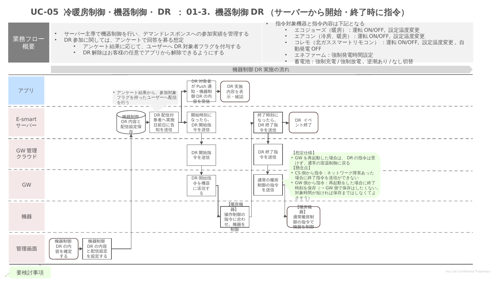

🔍 Nguồn: `eminel_gw_project/docs/eminel/1_product/11_business_process/readme.md`
→ mục 「01-3. 機器制御DR（サーバーから開始・終了時に指令）（Slide 40）」, dòng 827–837

```
Màn hình quản trị: chốt nội dung DR
   ↓
EMINEL-smart server: lưu nội dung + cấu hình phân phối
   ↓
Gửi thông báo trước cho người tham gia — TRƯỚC 1 NGÀY
   ↓
Đến giờ bắt đầu → server phát lệnh BẮT ĐẦU
   ↓
GW管理クラウド chuyển tiếp → gateway → thiết bị chạy theo DR
   ↓
App: người tham gia nhận Push, xem nội dung đang diễn ra
   ↓
Đến giờ kết thúc → server phát lệnh KẾT THÚC
   ↓
Gateway quay lại điều khiển sưởi thông thường
```

### Ai được tham gia?

🔍 cùng file, mục 「01-3. 機器制御DR（DRの募集〜申請〜抽出）（Slide 39）」, dòng 784–786
→ nguyên văn: 「DR参加に関しては、アンケートで回答を募る想定」「アンケート結果に応じて、ユーザーへDR対象者フラグを付与する」「DR解除はお客様の任意でアプリから解除できるようにする」

```
Khảo sát → người dùng trả lời → server gắn CỜ ĐỐI TƯỢNG cho ai đồng ý
```

Và người dùng **tự huỷ tham gia** bất cứ lúc nào từ app — server xoá cờ đó đi.

🔍 cùng file, mục 「01-2. 機器制御DR（DR解除）（Slide 42）」, dòng 877–881

### Thiết bị nào bị điều khiển, và bị làm gì

🔍 cùng file, dòng 787–792

| Thiết bị | Lệnh có thể ra |
|---|---|
| **エコジョーズ** (nồi hơi gas — sưởi) | Bật/tắt, đổi nhiệt độ cài đặt |
| **エアコン** (điều hoà — cả lạnh và ấm) | Bật/tắt, đổi nhiệt độ cài đặt |
| **コレモ** | Bật/tắt, đổi nhiệt độ, **tắt tự phát điện** |
| **エネファーム** | Đặt thời gian **ép phát điện** |
| **蓄電池** (pin lưu trữ) | **Ép sạc / ép xả**, đổi chế độ cho phép bán điện ngược lên lưới |

### 🔴 Hai phương án kết thúc DR — chưa chốt

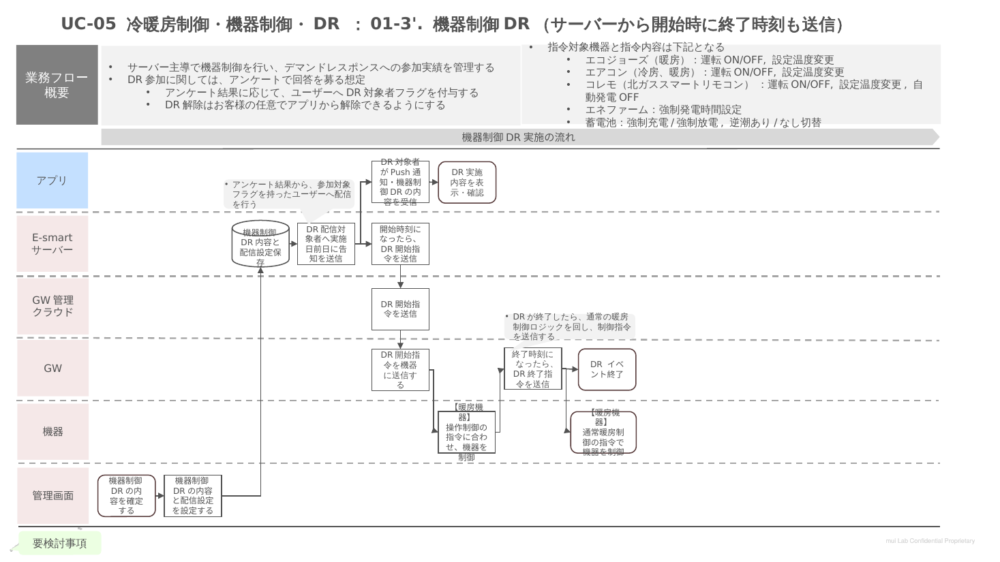

| | **Cách A** (Slide 40) | **Cách B** (Slide 41) |
|---|---|---|
| Cách kết thúc | Server phát lệnh kết thúc đúng giờ | Gửi kèm giờ kết thúc **ngay lúc bắt đầu**, gateway tự kết thúc |
| Rủi ro | Mất mạng → **không gửi được lệnh kết thúc**, thiết bị kẹt ở chế độ DR | Gateway **phải lưu trạng thái** — điều phía phát triển muốn tránh |

🔍 Nguồn: `eminel_gw_project/docs/eminel/1_product/11_business_process/readme.md`
→ mục 「01-3. 機器制御DR」→ ghi chú cuối, dòng 839
→ nguyên văn: 「※【懸念点】CS側から指令＝ネットワーク障害があった場合に終了指令を送信できない／GW側から指令＝再起動をした場合に終了時刻を保存（GW側で保存はしたくない。対象時間が短ければ保存まではしなくてよさそう）」

Và một quy tắc phụ:

🔍 cùng file, dòng 838
→ nguyên văn: 「※【想定仕様】GWを再起動した場合は、DRの指令は受けず、通常の室温制御に戻る」

Dịch: **khởi động lại gateway → bỏ DR, quay về điều khiển sưởi thông thường.**

⚠️ **Vì sao câu hỏi này gấp dù DR đã lùi sang 2027**: quyết định *"gateway có phải lưu trạng thái hay không"* là **quyết định kiến trúc firmware của năm 2026**. Chốt muộn thì phải sửa firmware đã ổn định.

### Phạm vi của DR

🔍 Nguồn: `eminel_gw_project/docs/eminel/3_requirements/app/B05_dr.md`
→ mục 「要件案：26年対応スコープ」, dòng 32–34
→ nguyên văn: 「## 要件案：26年対応スコープ」 / 「- なし」

**DR nằm hoàn toàn ngoài phạm vi 2026.** Requirement được viết đầy đủ, spec màn hình quản trị F cũng có, nhưng code thuộc 2027.

Ngoài ra, có một thay đổi phương châm quan trọng:

🔍 Nguồn: `eminel_gw_project/docs/eminel/2_management/minutes/20260623_egw_camp_day1.md`
→ mục 「共有された前提（既定事項）」, dòng 34
→ nguyên văn: 「DRはサーバー／管理画面で設定 → muiプラットフォーム → GWへ指示。ユーザー操作不要」

**DR chuyển sang server chủ động** — người dùng không cần thao tác gì.

---

## 5.8 Vận hành và quản trị

Phần này dành cho **người vận hành của 北ガス**, không phải người dùng cuối.

### Dashboard

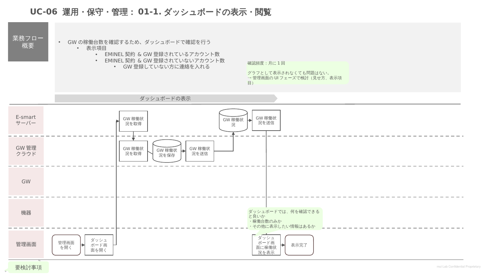

🔍 Nguồn: `eminel_gw_project/docs/eminel/1_product/11_business_process/readme.md`
→ mục 「01-1. ダッシュボードの表示・閲覧（Slide 45）」, dòng 893–895, 905
→ nguyên văn:
> 「GWの稼働台数を確認するため、ダッシュボードで確認を行う」
> 「表示項目：EMINEL契約 & GW登録されているアカウント数／EMINEL契約 & GW登録されていないアカウント数」
> 「GW登録していない方に連絡を入れる」
> 「※確認頻度：月に1回」

💡 **Mục đích nghiệp vụ rất cụ thể**: tìm ra những khách **đã ký hợp đồng EMINEL nhưng chưa đăng ký gateway** — rồi **gọi điện nhắc họ**. Không phải dashboard để ngắm, mà là **danh sách việc phải làm**.

⚠️ Tần suất xem chỉ **mỗi tháng 1 lần** — nên không cần đầu tư nhiều vào tính realtime của màn hình này.

### Vô hiệu hoá gateway

🔍 cùng file, mục 「01-3. GWの無効化（Slide 47）」, dòng 938–941
→ nguyên văn: 「ユーザーがEMINEL契約を解約を実施する」「解約はユーザーから北ガスへwebか電話で連絡をする」「解約後、手動での無効化を可能とする」

```
Khách huỷ hợp đồng (qua web hoặc điện thoại với 北ガス)
   ↓
Người vận hành tìm khách trên màn hình quản trị
   ↓
Bấm vô hiệu hoá
   ↓
GW管理クラウド lưu trạng thái → gateway bị vô hiệu
```

🔴 **Nhưng "bị vô hiệu" thì mất những gì thì chưa định nghĩa:**

🔍 Nguồn: `eminel_gw_project/docs/eminel/4_spec/admin/C_egw_management.md`
→ mục 「詳細」→ C-B-06, dòng 38
→ nguyên văn: 「🔴ユーザー利用可否設定は次の通りとする<br>有効：機能制限なし<br>無効：T.B.D」

Và bối cảnh vì sao cần tính năng này:

🔍 cùng file, mục 「明確な未決事項」, dòng 18
→ nguyên văn: 「GWプラン解約時はGWを回収するが、回収までラグでユーザーが暖房制御等を利用不可にしたいという北ガス要望あり」

Dịch: *"Khi huỷ gói gateway thì thu hồi thiết bị, nhưng có độ trễ tới lúc thu hồi — 北ガス muốn chặn người dùng dùng điều khiển sưởi ngay."*

### Xử lý khi khách gọi hỏi

🔍 Nguồn: `eminel_gw_project/docs/eminel/1_product/11_business_process/readme.md`
→ mục 「02-1. 機器エラー検知（問い合わせ対応・前半）（Slide 48）」, dòng 966–974

```
Phát hiện lỗi (khách gọi, hoặc thông báo lỗi, hoặc kiểm tra định kỳ)
   ↓
Mở màn hình quản trị → xem thông tin khách + thiết bị + lịch sử lỗi
   ↓
Xác định nguyên nhân
   ├─ Không cần khởi động lại → nhân viên CS báo lại cho khách
   └─ Cần khởi động lại → mở màn hình khởi động lại
         → chọn ID → bấm nút → gateway khởi động lại → báo khách
```

### Danh sách khách bị mất dữ liệu

🔍 cùng file, mục 「02-2. データ欠損ユーザーの表示（Slide 50）」, dòng 1005–1006, 1017
→ nguyên văn: 「24h以上連続で機器データが欠損していた場合に項目を表示する」「お客様の問い合わせいただいた際の状況の確認に使用する」「検索条件：規定ID / 機器種別 / 欠損日時」

⚠️ Đây chính là gốc gác của cờ **「24時間連続欠損」** trong spec màn hình quản lý gateway. Vấn đề mất dữ liệu không mới — hệ cũ đã có hẳn tài liệu riêng về xử lý dữ liệu thiếu và dữ liệu về trễ.

🔍 Nguồn: `eminel_gw_project/docs/old_eminel/01_overview.md`
→ mục 「02_データ生成・アプリ通信」, dòng 61
→ nguyên văn: 「別紙：…欠測&遅配対応」

### Tải file xuống gateway

🔍 Nguồn: `eminel_gw_project/docs/eminel/1_product/11_business_process/readme.md`
→ mục 「05-1. GWファイルアップロード（Slide 55）」, dòng 1131, 1135–1143

Bốn loại file có thể đẩy xuống gateway: **tham số điều khiển sưởi**, **firmware**, **file cấu hình thiết bị**, **bảng thuộc tính yêu cầu**.

```
Màn hình quản trị: chọn khách + chọn loại file + upload
   ↓
EMINEL-smart server lưu → gửi sang GW管理クラウド
   ↓
GW管理クラウド → gateway đặt file vào chỗ
```

💡 Đây là cách 北ガス **tinh chỉnh logic điều khiển sưởi mà không cần cập nhật firmware** — chỉ thay file tham số.

---

## Kiểm tra nhanh — Chương 5

1. Trong onboarding, thứ tự đăng ký thiết bị là gì? Vì sao có ân hạn 7 ngày?
2. Bốn loại thông báo, loại nào **không** dùng Push? Vì sao?
3. Chế độ tiết kiệm hoạt động ở chế độ nào của lịch tuần? Nhiều chế độ tiết kiệm cùng bật thì tính thế nào?
4. Nhà lắp スマリモ: vòng lặp điều khiển chạy ở đâu, và nhà đó cài lịch tuần bằng nhiệt độ hay bằng 温度レベル?
5. Hai phương án kết thúc DR khác nhau chỗ nào? Vì sao phải chốt sớm dù DR đã lùi sang 2027?

<details>
<summary>Đáp án</summary>

1. **Wi-SUN → Wi-Fi → ECHONET Lite.** Ân hạn 7 ngày vì hệ thống hợp đồng Xzilla cần thời gian đồng bộ — nếu bắt người dùng chờ, họ sẽ bỏ cuộc ngay lúc cài đặt. *(dòng 42)*
2. **Lỗi.** Chỉ hiện ở header app khi mở lên. Vì lỗi thiết bị kéo dài và lặp lại — Push mỗi lần thì người dùng sẽ tắt thông báo và bỏ lỡ cả những thứ quan trọng khác. *(dòng 522–526)*
3. Chỉ ở chế độ **在宅 (ở nhà)**. Chế độ 外出 và 就寝 **không hiệu chỉnh gì**. Nhiều chế độ cùng bật thì **không cộng dồn** — chỉ áp dụng cái có mức hiệu chỉnh lớn nhất. *(`00_integrated_requirements_v1.2.md` dòng 484, 493)*
4. Vòng lặp chạy ở **スマリモ**, gateway chỉ gửi xuống nhiệt độ cài đặt + nhiệt độ đo được. Nhà đó **luôn có 室温制御** nên cài bằng **nhiệt độ cụ thể**, không rơi vào nhánh 温度レベル. *(`11_business_process/readme.md` dòng 742–743, 761)*
5. **Cách A**: server phát lệnh kết thúc đúng giờ, rủi ro mất mạng thì không dừng được. **Cách B**: gửi kèm giờ kết thúc từ đầu, nhưng gateway phải lưu trạng thái. Phải chốt sớm vì *"gateway có lưu trạng thái hay không"* là **quyết định kiến trúc firmware năm 2026**. *(dòng 839)*

</details>

---
---

# Chương 6 — Làm cái gì, khi nào

## 6.1 Bốn nhóm mã chức năng

Toàn dự án dùng một hệ mã thống nhất. Nhìn tiền tố là biết thuộc thành phần nào:

| Tiền tố | Mục trong v1.2 | Thành phần | Số lượng | 担当 | Nội dung |
|---|---|---|---|---|---|
| **F-GW** | 7-1 | Firmware gateway | 01–16 | mui Lab | Thu dữ liệu · điều khiển sưởi/lạnh/phát điện · cài đặt & bảo trì · giao tiếp nội bộ |
| **F-MC** | 7-2 | GW管理クラウド | 01–08 | mui Lab | Sổ gateway · danh sách thiết bị · MQTT · lưu dữ liệu thô · API + Webhook · cập nhật firmware |
| **F-ES** | 7-3 | EMINEL-smart server | 01–15 | **SYP** | Hiển thị · thông báo · DR · liên kết ngoài · quản người dùng · giao tiếp app |
| **F-AD** | 7-4 | Màn hình quản trị | 01–11 | **SYP** | Khách · thiết bị · lỗi · thông báo · khảo sát · Push · DR · tải dữ liệu · phân quyền · thống kê |

🔍 Nguồn (cột 番号・thành phần・nội dung): `eminel_gw_project/docs/eminel/3_requirements/00_integrated_requirements_v1.2.md`
→ mục 「7-1」dòng 370–387 · 「7-2」dòng 391–400 · 「7-3」dòng 404–420 · 「7-4」dòng 424–436

🔍 Nguồn (cột **担当**): Notion — QAデータベース, trang 「SYP開発範囲の確認」 (No. 10), 回答者 swan (mui, 2026-08-13), trạng thái **完了** — chi tiết và nguyên văn ở [§1.6 bảng ②](#16-phạm-vi-cái-gì-làm-cái-gì-không)

⚠️ **Mobile app không có tiền tố trong hệ bốn mã này.** Nó dùng mã **F-AP** ở bảng chức năng `10_feature_list.md`, và requirement app được viết ở một bộ tài liệu riêng 23 section — xem [§7.3](#73-requirement-app-23-section). App **do SYP làm**, dù không nằm trong 7-1〜7-4.

💡 **Vì sao cột 担当 đáng nhớ ngay từ đây**: nhìn tiền tố là biết **có phải việc của mình không**. Gặp `F-GW-xx` hay `F-MC-xx` trong một câu requirement — đó là phần mui Lab làm, bạn đọc để biết **giao diện tiếp giáp** (dữ liệu vào/ra) chứ không phải để hiện thực hoá.

📖 **Mẹo nhớ**
- **GW** = Gateway
- **MC** = **M**anagement **C**loud (đám mây quản lý)
- **ES** = **E**minel **S**mart
- **AD** = **AD**min (quản trị)

### Vài mã bạn sẽ nghe suốt

| Mã | Nội dung | Vì sao hay được nhắc |
|---|---|---|
| **F-GW-05** | Điều khiển sưởi | Chức năng trung tâm của phạm vi 2026 |
| **F-GW-16** | Giao tiếp nội bộ trong nhà | Nguồn cơn tranh cãi về giá, đã lùi 2027 |
| **F-ES-15** | Realtime monitor | mui coi là **thêm mới** ở giai đoạn requirement (một mục trong tranh cãi giá CTR-03) — ⚠️ nhưng bảng chức năng dòng 86 lại để 種別 *trống* (= kế thừa) và 今=当=1; hai nguồn đang vênh nhau |
| **F-AD-11** | Thống kê | 🔴 Nội dung hiển thị **hoàn toàn chưa quyết** |
| **F-ES-05** | Thông báo trông nom | 🔴 Có làm hay không **chưa quyết** |

---

## 6.2 Cách đọc bảng chức năng

File [`10_feature_list.md`](../eminel_gw_project/docs/eminel/1_product/10_feature_list.md) là bảng tính công việc và tiền của cả dự án. Ba cột phải biết đọc:

🔍 Nguồn: `eminel_gw_project/docs/eminel/1_product/10_feature_list.md`
→ mục 「凡例」, dòng 8–11
→ nguyên văn:
> 「凡例（種別） | 新規 ／ 拡張 ／ 削除 ／ 無印=既存踏襲」
> 「凡例（負担） | KG=北ガス請求分 ／ mui=mui負担分」
> 「凡例（劣後） | ✅=劣後可能（後回し可、2027上期送り候補） ／ 空欄=今期必須」
> 「工数 | 単位=人月。「今」=今回見積(v0.3)、「当」=当初見積(2025/11)」

| Cột | Giá trị | Nghĩa |
|---|---|---|
| **種別** | 新規 / 拡張 / 削除 / *(trống)* | Mới / mở rộng / bỏ / **trống = kế thừa nguyên từ hệ cũ** |
| **負担** | KG / mui | **Ai trả tiền.** KG = 北ガス trả, mui = mui tự chịu |
| **劣後** | ✅ / *(trống)* | ✅ = được lùi sang 2027, **trống = bắt buộc trong 2026** |
| **今 / 当** | số | Người-tháng theo báo giá **hiện tại** / **ban đầu** |

📖 **人月 (người-tháng) là gì?**
Đơn vị đo khối lượng công việc. **1 người-tháng = một người làm trong một tháng**. "4 người-tháng" nghĩa là 1 người làm 4 tháng, hoặc 2 người làm 2 tháng.

💡 **Mẹo đọc nhanh**: so sánh cột 「今」 và 「当」 để biết chức năng nào **phát sinh thêm** so với lúc ký hợp đồng. Ví dụ 冷房制御 có 今=1, 当=0 → tức là lúc ký hợp đồng không tính, giờ mới thêm vào.

---

## 6.3 Quyết định phạm vi cuối 2026

Đây là **quyết định quan trọng nhất về mặt kế hoạch**, chốt ngày 2026-06-10:

🔍 Nguồn: `eminel_gw_project/docs/eminel/2_management/22_decisions.md`
→ bảng 「意思決定ログ」, dòng 30–31
→ nguyên văn:
> 「2026-06-10 | 全体スケジュール大枠を確定：〜10月末開発完了→〜12月末テスト→1月〜フィールド試験、劣後機能は2027/4月以降開発」
> 「2026-06-10 | 第一段階（12月末）スコープ＝暖房関連を必須と確定 | 暖房機能/暖房制御/照明アドバイス/ポイント連携/グルーピング・レポートを必須、複合制御・DR・ダッシュボード・バッジ等は劣後」

```
~10/2026: xong phát triển  →  ~12/2026: xong test  →  2027/1~: thử nghiệm thực địa
Chức năng 劣後 → dời hẳn sang sau 04/2027
```

> ### 📌 Phạm vi bắt buộc cuối 12/2026: trục chính = **SƯỞI**
>
> *Kèm một số mục không-sưởi vẫn bắt buộc theo nguyên văn dòng 31: 照明アドバイス※, liên kết điểm thưởng, gom nhóm & report. ※nghi là lỗi gõ của 省エネアドバイス — xem [Phụ lục B.2](#b2-điểm-thưởng-và-tư-vấn-tiết-kiệm).*

Cắt được **13 người-tháng**:

🔍 Nguồn: `eminel_gw_project/docs/eminel/1_product/10_feature_list.md`
→ mục 「サマリ（劣後可能工数）」, dòng 16–23

| Khối | Người-tháng cắt được |
|---|---|
| Firmware gateway | 3.0 |
| EMINEL-Smart server | 4.5 |
| Màn hình quản trị | 2.25 |
| Mobile app | 2.75 |
| System test | 0.5 |
| **Tổng** | **13.0** |

---

## 6.4 Danh sách bị lùi sang 2027

Ba chủ đề chung:

🔍 Nguồn: cùng file, dòng 25
→ nguyên văn: 「劣後候補の共通テーマ：**DR・機器制御系／ローカル通信／ポイント・バッジ・統計ダッシュボード**（暖房に関係しない機能群）」

Tức là: **mọi thứ không liên quan đến sưởi** *(theo cách `10_feature_list` tự mô tả — nhưng nhớ nuance ở [6.3](#63-quyết-định-phạm-vi-cuối-2026): vài mục không-sưởi như 照明アドバイス※, điểm thưởng, gom nhóm & report vẫn 必須 theo 22_decisions)*.

| Khối | Chức năng bị lùi | Dòng |
|---|---|---|
| **Firmware** | エコキュート · điều khiển phức hợp エコジョーズ+エアコン · thực thi DR · giao tiếp nội bộ (4 phần) | 46, 56, 58, 60–63 |
| **Server** | Quản huy hiệu · quản DR · quản điểm · liên kết PointInfinity | 90, 92, 93, 95 |
| **Màn hình quản trị** | Xem trạng thái điều khiển · huy hiệu · DR · dashboard thống kê | 110, 115, 116, 117 |
| **App** | Điểm & tư vấn tiết kiệm · màn hình DR · app demo · giao tiếp nội bộ | 130, 133, 137, 138 |
| **Test** | E2E đường nội bộ · test liên kết PointInfinity | 147, 149 |

🔍 Nguồn: `eminel_gw_project/docs/eminel/1_product/10_feature_list.md`, cột 「劣後」 các dòng ghi trên

### ⚠️ Nghịch lý cần hiểu đúng

**DR bị lùi sang 2027, nhưng requirement B5 và spec màn hình F vẫn đang được viết ngay bây giờ.**

Không mâu thuẫn:

```
Viết requirement  →  thuộc năm 2026  (vì tháng 9 phải fix xong toàn bộ design + spec)
Viết code         →  thuộc năm 2027
```

🔍 Nguồn mốc tháng 9: `eminel_gw_project/docs/eminel/2_management/minutes/20260624_egw_camp_day2.md`
→ bảng 「大枠スケジュール（デッドライン逆算「まずいメソッド」）」, dòng 148
→ nguyên văn: 「2026/9 | デザイン・仕様がすべてフィックス」

⚠️ **Đừng thấy tài liệu DR dày mà tưởng DR nằm trong phạm vi năm nay.**

### ❌ Và một mâu thuẫn thật sự

Ba tài liệu nói ba kiểu về cùng một nhóm chức năng:

| Chức năng | `22_decisions.md` (10/06) | `10_feature_list.md` | Requirement app (07/2026) |
|---|---|---|---|
| Điểm thưởng | **必須** (bắt buộc) | ✅ 劣後 | **26年スコープ** |
| **Huy hiệu** | **劣後** | ✅ 劣後 | ⚠️ **26年スコープ** |
| Tư vấn tiết kiệm (app) | 必須※ | ✅ 劣後 | **26年スコープ** |

*※nguyên văn dòng 31 ghi 「**照明**アドバイス」 (tư vấn CHIẾU SÁNG), không phải 省エネアドバイス — nhiều khả năng là lỗi gõ của tài liệu gốc, nhưng bảng này đánh đồng hai chữ đó nên phải ghi chú lại. Xem [Phụ lục B.2](#b2-điểm-thưởng-và-tư-vấn-tiết-kiệm).*

🔍 Dẫn chứng ba phía:
- `docs/eminel/2_management/22_decisions.md` dòng 31: 「ポイント連携…を必須、…バッジ等は劣後」
- `docs/eminel/1_product/10_feature_list.md` dòng 90, 93, 95, 130: cột 劣後 = ✅
- `docs/eminel/3_requirements/app/A04_badge_rank.md` dòng 35–71: toàn bộ nằm trong 「要件案：26年対応スコープ」, mục 「それ以降スコープ」 (dòng 73–75) ghi 「- なし」

**Huy hiệu (A4) là ca rõ nhất**: bị lùi trong **cả hai** tài liệu quản lý, nhưng requirement lại viết toàn bộ vào phạm vi 2026. File này tách khỏi A3 ngày **2026-07-27**, và **đã được rà lại sau buổi review với khách ngày 2026-08-07** (phản ánh vào repo 08-12):

🔍 Nguồn: `eminel_gw_project/docs/eminel/3_requirements/app/A04_badge_rank.md`
→ bảng đầu file, dòng 8
→ nguyên văn: 「経緯 | [A3 ポイント][a3]からバッジ・ランクを分離して新設（2026-07-27）／先方レビューの結果をスライドから反映（2026-08-07）」

⇒ Đây mới là điểm đáng chú ý: **file đã được sờ vào sau khi khách review, nội dung bị sửa khá mạnh** — ランク nay lên theo **số huy hiệu** thay vì số điểm *(dòng 24, 41)*, huy hiệu gắn với 省エネアドバイス *(dòng 32, 58)*, và câu 要確認事項 「バッジの内容・要否」 (*nội dung huy hiệu và có làm hay không*) **đã bị gỡ hẳn** *(dòng 99–107 nay đều ghi 「なし」)* — **nhưng phạm vi vẫn nguyên là 2026**. Tức không thể coi đây là "quên sửa cho xong".

🔸 **Giả thuyết — CHƯA kiểm chứng**: nhiều khả năng slide phạm vi (quản lý) và requirement (kỹ thuật) đang **chưa đồng bộ với nhau**, chứ không phải sót khi tách file như suy đoán trước đây. **Vẫn phải hỏi lại**, không được tự kết luận. Xem [Phụ lục B](#phụ-lục-b--bảng-mâu-thuẫn-giữa-các-tài-liệu) và `qa_kitagas.md` câu 1.

**Diễn biến (2026-08-03 → 08-13)**: câu hỏi này đã được đăng lên QAデータベース Notion — phiếu **No. 5** 「バッジ・ランクは2026年度対応スコープでしょうか」 (起票 08-03 17:33) — và masao takahashi (mui) trả lời 「今の所、2026年スコープ外です」 (*hiện tại nằm ngoài scope 2026*). Phiếu đã **完了**, chốt **2026-08-13 12:28** (kiểm 08-20).

⚠️ **Đóng phiếu rồi vẫn phải giữ hai điều dè dặt** — không được đọc thành "chốt xong, khỏi lo":
- Chữ 「**今の所**」 (*hiện tại thì*) nằm trong nguyên văn. Nó là mốc thời điểm, không phải kết luận vĩnh viễn — cùng loại với 「基本的には」 ở phiếu No. 2.
- Đây là trả lời **của mui**, **không phải xác nhận của 北ガス** — mà người quyết phạm vi là 北ガス. Chưa rõ câu này đã qua khách hay chưa.

**Diễn biến (2026-08-12)**: A04 **đã được sửa** — nhưng chỉ sửa nội dung, **không đụng phạm vi**, và câu 要確認事項 về huy hiệu thì bị gỡ. Nghĩa là hai nguồn nay **càng lệch nhau hơn** chứ không tự khép lại: phía QA nói *ngoài phạm vi 2026*, phía requirement vừa rà xong vẫn để *trong phạm vi 2026*. ⇒ Bảng ước lượng vẫn phải coi đây là **điểm treo**, và câu hỏi cần được hỏi lại cho dứt điểm thay vì chờ nó tự hết.

---

## 6.5 Tiền và hợp đồng

| | |
|---|---|
| Báo giá ban đầu (ký 2025-11-12) | **68,1 triệu yên** |
| Báo giá hiện tại (v0.3) | **89,12 triệu yên** |
| Phần vượt | **~35,6 triệu yên** |

🔍 Nguồn: `eminel_gw_project/docs/eminel/2_management/20_open_issues.md`
→ mục 「CTR-03 見積もり増額の認識齟齬（説明責任）」, dòng 207–209
→ nguyên văn: 「当初6,810万→8,912万（超過分は約3,560万）。北ガス徳田さんは「ほぼ全て当初見積に入っていた」認識」「相違点：冷房制御は見積範囲内認識／ローカル通信復活・リアルタイムモニタ・バッジ管理・統計ダッシュボードは要件定義で新規追加」

### Vì sao có tranh cãi

Phía 北ガス cho rằng *"gần như tất cả đã nằm trong báo giá ban đầu"*. Phía mui liệt kê **bốn thứ ngang hàng** được thêm vào ở giai đoạn định nghĩa yêu cầu (nguồn không xếp cái nào là "chính"):

1. **Giao tiếp nội bộ trong nhà sống lại**
2. **Realtime monitor**
3. **Quản huy hiệu**
4. **Dashboard thống kê**

*(riêng 冷房制御 thì hai bên cùng nhận thức là nằm trong phạm vi báo giá)*

⚠️ Vấn đề này **vẫn đang mở** (🔵 đang chạy). Đây là lý do vì sao mọi thay đổi phạm vi phải được ghi lại cẩn thận — và cũng là lý do repo có riêng một file nhật ký quyết định.

### Hợp đồng

🔍 Nguồn: cùng file, mục 「CTR-01 開発フェーズ契約の詳細未決」, dòng 193–195
→ nguyên văn: 「①GW開発委託 ②アプリ開発委託 ③保守委託。契約期間（2026/6〜2027/6末）」「親契約＝業務提携契約書＋個別契約3本／まとめて締結・2期建て」

🔴 **Lưu ý trạng thái: cấu trúc dưới đây CHƯA được ký.** Tiêu đề CTR-01 là 「開発フェーズ契約の**詳細未決**」, kèm ghi chú 【6月更新・**北ガス未合意**／ドラフト段階】, 締結未達 — người mới đừng tưởng hợp đồng phát triển đã ký xong.

Cấu trúc **dự kiến**: **một hợp đồng mẹ (hợp tác kinh doanh) + ba hợp đồng con** (phát triển gateway / phát triển app / bảo trì), chia **hai kỳ**:

| Kỳ | Thời gian | Nội dung |
|---|---|---|
| Kỳ 1 | → 2027/3 | Bao gồm cả thử nghiệm thực địa (1–2/2027) và sửa lỗi (3/2027) |
| Kỳ 2 | 2027/4 → | Các chức năng đã bị lùi |

---

## Kiểm tra nhanh — Chương 6

1. Mã `F-MC-05` thuộc thành phần nào? Đoán xem nó làm gì.
2. Trong bảng chức năng, một dòng có cột 種別 để trống nghĩa là gì?
3. Phạm vi bắt buộc cuối 2026 là gì? Cắt được bao nhiêu người-tháng?
4. Requirement B5 (DR) được viết đầy đủ — vậy DR có nằm trong công việc năm nay không?

<details>
<summary>Đáp án</summary>

1. **`GW管理クラウド`** (MC = Management Cloud). Nó là 「GW管理API提供」 — cung cấp API cho `EMINEL-smart server` gọi sang lấy dữ liệu và ra lệnh điều khiển (chính là IF-02). *(`00_integrated_requirements_v1.2.md` dòng 397)*
2. **Kế thừa nguyên từ hệ cũ** — không phải mới, không phải mở rộng. *(`10_feature_list.md` dòng 8)*
3. **Trục chính là nhóm sưởi** — kèm 照明アドバイス※, liên kết điểm thưởng, gom nhóm & report cũng bắt buộc. Cắt được **13 người-tháng**. *(`22_decisions.md` dòng 31, `10_feature_list.md` dòng 23)*
4. **Không.** DR đã lùi sang sau 04/2027. Requirement được viết trong 2026 vì **tháng 9/2026 là hạn fix toàn bộ design + spec** *(lịch tính ngược trại tập trung, day2 dòng 148)*, còn code thì thuộc 2027.

</details>

---
---

# Chương 7 — Bộ tài liệu của dự án

Chương này giải thích **chính cái repo bạn đang mở** — `eminel_gw_project`.

## 7.1 Bản đồ sáu tầng

Thư mục `docs/eminel/` được đánh số **theo vòng đời sản phẩm**, từ trừu tượng đến cụ thể:

```
docs/eminel/
├── 0_foundation/     Nền tảng dự án        (ít thay đổi)
├── 1_product/        Làm cái gì, làm sao   (thay đổi vừa)
├── 2_management/     Trung tâm điều hành   (thay đổi NHIỀU NHẤT)
├── 3_requirements/   Yêu cầu — định nghĩa WHAT
├── 4_spec/           Đặc tả — định nghĩa HOW
└── 5_design/         Thiết kế giao diện
```

🔍 Nguồn: `eminel_gw_project/README.md`
→ mục 「ディレクトリ構成」, dòng 12–65

📖 **What và How khác nhau thế nào?**

| | **What** (yêu cầu) | **How** (đặc tả) |
|---|---|---|
| Trả lời | *"Người dùng làm được gì?"* | *"Hệ thống làm điều đó bằng cách nào?"* |
| Ví dụ | "Đặt được lịch sưởi theo thứ trong tuần" | "Màn hình có 7 tab, mỗi tab tối đa 6 khung giờ, nấc 10 phút" |
| Nằm ở | `3_requirements/` | `4_spec/` |

💡 Tách hai thứ này ra giúp: đổi cách làm mà không phải viết lại yêu cầu, và thảo luận với khách hàng ở mức "cần gì" trước khi bàn "làm thế nào".

### Ý nghĩa cách đánh số

| Tầng | Tần suất cập nhật | Bạn đọc khi nào |
|---|---|---|
| `0_foundation` | Thấp | Ngày đầu tiên, đọc một lần |
| `1_product` | Vừa | Khi cần biết bức tranh chức năng và tiền |
| `2_management` | **Cao nhất** | **Hằng tuần** — đây là nơi biết chuyện gì đang xảy ra |
| `3_requirements` | Đang viết | Khi làm một chức năng cụ thể |
| `4_spec` | Đang viết | Khi code màn hình quản trị (`admin/`) **hoặc app** (`app/` — mở từ 2026-08-12, xem [§7.5](#75-機能仕様-app--tầng-vừa-mở)) |
| `5_design` | Bản nháp | Khi cần hình dung giao diện |

⚠️ **Sáu tầng trên là các tầng NẰM TRONG repo tài liệu.** Sau chúng còn một tầng nữa: **設計書** (*tài liệu thiết kế chi tiết*) — thứ **SYP phải giao nộp**, và **không nộp bằng markdown trong repo**: màn hình nộp **Excel**, API nộp **markdown**. Xem [§7.7](#77-設計書--định-dạng-file-của-bản-giao-nộp).

---

## 7.2 Ba hệ thống, ba thư mục

Ngay dưới `docs/` có **ba** thư mục, tương ứng **ba hệ thống khác nhau**:

| Thư mục | Hệ thống | Vai trò của thư mục |
|---|---|---|
| `docs/eminel/` | **E-GW** — dự án này | Nơi **sản xuất** tài liệu mới |
| `docs/old_eminel/` | **EMINEL hiện hành** | Nơi **khảo sát** hệ thống sắp bị thay |
| `docs/eminel-smart/` | **ESTA** | Nơi **khảo sát** nền tảng sẽ chạy lên |

🔍 Nguồn: `eminel_gw_project/README.md`
→ mục 「ディレクトリ構成」, dòng 66–78

⚠️ **Người mới hay nhầm `eminel/` với `old_eminel/`** vì tên chức năng trùng nhau (cả hai đều có màn hình quản trị, DR, tư vấn tiết kiệm…). Khác biệt:

| | `eminel/` | `old_eminel/` |
|---|---|---|
| Nội dung | Tài liệu team **tự viết**, sẽ giao cho khách | Ghi chú **tóm tắt** tài liệu nhận từ khách |
| Bản gốc | Chính repo này + OneDrive/Notion | Repo ngoài `legacy_eminel_docs` |
| Quy mô | 6 tầng, ~50 file | 3 file + 22 ảnh |
| Được sửa? | Có, thường xuyên | Hầu như không |

### Quy tắc vàng khi làm việc

🔍 Nguồn: `eminel_gw_project/CLAUDE.md`
→ mục 「⚠️ 行動ルール」, dòng 19
→ nguyên văn: 「**eminel か ESTA か分からないまま動かない**：機能・仕様の話が出たら、それが **eminel（eGW＝本プロジェクト）** の話か **Eminel smart（ESTA＝既存アプリ）** の話か、最初に確定する」

Dịch: *"Không được bắt tay làm khi chưa xác định đang nói về eGW hay ESTA. Hễ có chuyện về chức năng hay đặc tả, phải xác định trước đó là chuyện của bên nào."*

⚠️ **Áp dụng cho bạn**: khi nhận một ticket, câu hỏi đầu tiên phải là *"cái này thuộc E-GW hay ESTA?"*

---

## 7.3 Requirement app: 23 section

### Cấu trúc chuẩn của một file

Học một lần là đọc được cả 23 file:

```
┌─ Bảng đầu file
│   状態          → tiến độ NỘI BỘ của bản nháp
│                   ドラフト済（レビュー待ち） / レビュー中 / (fix済 — bậc cuối,
│                   hiện CHƯA file nào đạt). Thực tế từ 2026-08-12: CẢ 23/23 file
│                   đều là レビュー中 — bậc ドラフト済 hiện KHÔNG còn file nào
│   ベース(現行機能) → tương ứng chức năng số mấy của app hiện hành
│   踏襲元        → kế thừa từ đâu (統合要件 / 現行 / ESTA)
│   経緯          → lịch sử sửa đổi ⚠️ có file chưa cập nhật kịp (B03) — mốc chắc chắn nằm ở git log
│
├─ 参照        → bảng ký hiệu viết tắt, dùng suốt file
├─ 用語集      → CÂY KHÁI NIỆM + định nghĩa + "từ nào cấm dùng"
├─ 要件概要    → một câu giá trị mang lại, rồi gạch đầu dòng
│
├─ 要件案：26年対応スコープ    ← LÀM TRONG 2026
├─ 要件案：それ以降スコープ    ← ĐỂ SAU
│
├─ 関連項目    → ranh giới với section khác
├─ 検討事項    → khác biệt với hệ cũ, xung đột, điểm lo ngại
├─ 要確認事項  → CÁI PHẢI HỎI 北ガス (ghi rõ hỏi ai)
└─ 要件・仕様・デザインの判断に迷うポイント
                 → chỗ người viết còn phân vân + cách đặt tạm
                   ⚠️ KHÔNG phải file nào cũng có: B02 không có, B03/B06/A04 có
                   ⚠️ Có mục nhưng ruột rỗng: sau đợt 08-12, A04 và B06 chỉ còn
                      ghi 「なし」 — mở ra thấy trống là ĐÚNG, không phải mất nội dung
```

🔍 Nguồn ví dụ: `eminel_gw_project/docs/eminel/3_requirements/app/B02_heating_control.md`
→ toàn bộ file, dòng 1–269

⚠️ Tiểu mục 「現行からの変更点（候補）」 *(khác biệt so với hệ cũ)* từng nằm trong 検討事項 đã bị **bỏ khỏi toàn bộ bộ tài liệu ngày 2026-07-23** — vài file còn sót lại tiêu đề rỗng. Đừng đi tìm nội dung ở đó *(nguồn: `app/README.md` dòng 5)*.

### Hai kỷ luật của bộ tài liệu này

**① Mọi câu requirement đều có nguồn.** Ngay dưới mỗi nhóm requirement là một khối gập lại `<details><summary>備考と出典</summary>` chứa bảng ghi chú + nguồn cho từng dòng.

**② Tag 【新規】 nghĩa là không có trong app hiện hành** (đối chiếu tài liệu thiết kế bản thương mại V1.0.4).

🔍 Nguồn: cùng file, dòng 76
→ nguyên văn: 「【新規】＝現行EMINELアプリ（機能設計書V1.0.4）に無いもの」

### Bản đồ 23 section

🔍 Nguồn: `eminel_gw_project/docs/eminel/3_requirements/app/README.md`
→ mục 「セクション一覧」, dòng 24–74

⚠️ **Bảng index vừa đổi cách quản lý trạng thái (2026-08-05).** Trước đây nó có cột 「状態」 tự khai; nay ba cột 「内容・スコープ」「ステータス」「劣後」 đều **lấy nguyên giá trị từ slide 「要件一覧」 gửi 北ガス**, còn tiến độ review của từng file md thì chuyển sang `tasks/app_requirements_plan.md` — file **không được commit**, bạn không mở được *(xem [mục 0.7 ②](#07-giới-hạn-của-tài-liệu-này))*.

🔍 cùng file, ghi chú đầu mục 「セクション一覧」, dòng 26
→ nguyên văn: 「内容・スコープ／ステータス／劣後＝対顧客スライド「要件一覧」の値（2026-08-05反映）。mdのレビュー状態は `tasks/app_requirements_plan.md` の進捗表で管理（本表には持たない）」

Cột **ステータス** dưới đây là giá trị đối khách; cột **劣後** ✅ = **được phép lùi sang 2027**, 一部 = lùi một phần:

| Nhóm | Mã | Tên | ステータス (đối khách) | 劣後 |
|---|---|---|---|---|
| **A** ユーザー系 | A1 | Tài khoản · đăng nhập | 未掲載 | |
| | A2 | Cài đặt | 未掲載 | |
| | A3 | Điểm thưởng | ドラフト作成中 | ✅ |
| | A4 | Huy hiệu · xếp hạng | ドラフト作成 | ✅ |
| **B** 機器制御系 | B1 | Cài đặt ban đầu · liên kết thiết bị | ドラフト作成 | |
| | **B2** | **Điều khiển sưởi tự động** | レビュー中 | |
| | B3 | Điều khiển lạnh tự động | ドラフト作成 | ✅ |
| | B4 | Thao tác thiết bị gia dụng | レビュー前 | 一部 |
| | B5 | DR | レビュー前 | 一部 |
| | B6 | マイホーム発電制御 — điều khiển phát điện tại nhà | ドラフト作成 | |
| **C** エネルギー系 | C1 | Biểu đồ | **レビュー済** | |
| | C2 | Report | **レビュー済** | |
| | C3 | Trạng thái năng lượng hiện tại | **レビュー済** | |
| | C4 | Trạng thái cảm biến hiện tại | **レビュー済** | |
| | C5 | Tư vấn tiết kiệm | **レビュー済** | |
| **D** お知らせ系 | D1 | Thông báo | レビュー前 | |
| | D2 | Khảo sát | レビュー前 | |
| | D3 | Push | レビュー前 | |
| | D4 | Trông nom | レビュー前 | |
| **E** その他 | E1 | Hiển thị lỗi hệ thống | 未掲載 | |
| | E2 | Thu thập & gửi log app | 未掲載 | |
| | E3 | Trợ giúp | 未掲載 | |
| | E4 | Phi chức năng | 未掲載 | |

📖 **Sáu giá trị ステータス nghĩa là gì**

| Giá trị | Nghĩa |
|---|---|
| **未掲載** | **Chưa đưa lên slide đối khách** — không có nghĩa là chưa viết; các file này đều đã có nội dung |
| **ドラフト作成中** | Đang viết bản nháp |
| **ドラフト作成** | Nháp đã viết xong |
| **レビュー前** | Chờ 北ガス xem |
| **レビュー中** | **北ガス đang xem, chưa xong** — hiện chỉ B2 (điều khiển sưởi) ở mức này |
| **レビュー済** | **北ガス đã xem xong** — mức cao nhất hiện có |

⚠️ **Hai thang trạng thái song song, đừng lẫn.** Mỗi file md vẫn giữ dòng `状態` riêng ở bảng đầu file *(vd `B05_dr.md` dòng 5 ghi 「レビュー中」 trong khi index ghi 「レビュー前」)*. Chúng **không mâu thuẫn** — một cái là tiến độ nội bộ của tài liệu, một cái là trạng thái trong mắt khách hàng. Đáng chú ý: **chữ 「レビュー中」 có mặt ở CẢ HAI thang** nhưng nghĩa khác nhau — ở cột đối khách nghĩa là *北ガス đang review*, ở dòng `状態` nghĩa là *người viết đã đưa bản nháp vào vòng review nội bộ*. Thấy chữ giống nhau đừng vội kết luận hai bên đã khớp.

*Chi tiết + cách chọn thang khi báo cáo tiến độ: [Phụ lục B.4](#b4-trạng-thái-tài-liệu-app--ba-thang-đo-song-song-đừng-lẫn) — bảng ba thang, ví dụ B5 và D3, và quy tắc: báo cho mui/北ガス thì dùng ステータス, tự tra file thì xem `状態`.*

> **Nhóm C là nhóm duy nhất đã qua review của khách** (C1–C5 đều レビュー済). Không section nào đạt mức 「fix済」 — nghĩa là **chưa có gì được đóng băng**.
>
> **Hai section B3 (lạnh) và B5 (DR) không làm gì trong 2026**: mục 「26年対応スコープ」 (*phạm vi làm trong 2026*) của chúng ghi 「- なし」 = không có gì, toàn bộ nội dung dồn xuống 「それ以降スコープ」 (*phạm vi làm sau đó*).
> **Ngược lại, 21 section còn lại không hoãn gì cả**: mục 「それ以降スコープ」 của chúng mới là chỗ ghi 「- なし」.

⚠️ Mục 「ローカル通信（2027/4〜）」 của B2 — *"mất internet vẫn tắt được sưởi từ trong nhà"* — **đã bị xoá khỏi requirement ngày 2026-08-05** cùng đợt gỡ các mô tả lấy biên bản trại tập trung làm nguồn. Yêu cầu gốc vẫn nằm ở biên bản `2_management/minutes/20260624_egw_camp_day2.md` mục 「ローカル通信（アプリ⇔GW）」 dòng 92–98 — 「ただしアプリからのローカル通信の口を全く作らないのはなし。最低限オフライン対応は要る」 *(vẫn phải chừa cửa giao tiếp nội bộ, tối thiểu là đối ứng offline)* — nhưng **không còn là requirement app**.

### B6 マイホーム発電制御 — section ngắn nhất, và là ví dụ sạch nhất về "requirement bị đảo"

Section này tách khỏi B4 ngày 2026-07-30, nội dung viết đầu tháng 8, rồi **bị viết lại toàn bộ ngày 2026-08-12**. Chỉ 94 dòng (ngắn ngang C4 センサー情報; ngắn nhất bộ tài liệu hiện là E1 システムエラー = 80 dòng). Nên đọc vì nó cho thấy một câu requirement có thể **đảo nghĩa hoàn toàn** sau một buổi review với khách.

**Chức năng — đúng một câu:**

🔍 Nguồn: `eminel_gw_project/docs/eminel/3_requirements/app/B06_myhome_generation.md`
→ mục 「要件概要」, dòng 31
→ nguyên văn: 「PVの発電量に応じて、マイホーム発電（コレモ・エネファーム）の発電を自動で制御できる」

*(マイホーム発電 = "phát điện tại nhà" — chỉ máy phát bằng gas コレモ/エネファーム, **không** tính PV. PV chỉ là thứ bị đo để lấy cớ dừng.)*

```
Người dùng cài NGƯỠNG trong app  (2 con số: ngưỡng DỪNG · ngưỡng CHẠY LẠI)
        ↓
Điện mặt trời (PV) phát vượt ngưỡng DỪNG
        ↓  (E-GW theo dõi — phía gateway)
Máy phát gas コレモ / エネファーム TỰ ĐỘNG dừng
        ↓
PV tụt xuống dưới ngưỡng CHẠY LẠI → TỰ ĐỘNG chạy lại
```

🔍 cùng file, mục 「要件案：26年対応スコープ」 → 「発電制御の閾値設定」, dòng 41–43
→ nguyên văn: 「マイホーム発電を停止するPV発電量の閾値を設定できる」「マイホーム発電を再開するPV発電量の閾値を設定できる」「設定した閾値を確認できる」

📖 **Vì sao lại dừng máy phát điện?** Nhà đã có điện mặt trời dư thì chạy thêm máy phát bằng gas (コレモ/エネファーム) là **đốt gas để tạo thứ đang thừa** — vừa tốn tiền vừa lãng phí.

📌 **Phần việc của app chỉ là CÀI NGƯỠNG.** Việc canh ngưỡng và ra lệnh dừng/chạy nằm ở gateway. Bản thân app **không** có nút tự tay dừng máy phát trong section này, và **không** có Push báo "máy phát vừa bị dừng" — cả hai đều được chốt là ngoài phạm vi.

**Ba ranh giới cần nhớ** *(mục 「関連項目」, dòng 51–54; đối chiếu B04 dòng 110)*:

| Việc | Thuộc section nào |
|---|---|
| Bật/tắt phát điện **thủ công** | B4 家電操作 (thao tác thiết bị gia dụng) |
| **Ép dừng** phát điện do lệnh DR | B5 DR |
| **Cài ngưỡng + tự động dừng/chạy lại theo PV** | B6 — chính là section này |

⚠️ **Câu hỏi lớn của section này đã được ĐÓNG ngày 2026-08-07 — và đóng theo hướng ngược với bản requirement cũ.**

Trước 08-12, requirement viết rằng app **chỉ gợi ý** người dùng tự tắt máy phát, kèm một câu 要確認事項 hỏi khách: 「F-GW-07の閾値到達時の挙動は、案内…どまりの想定で良いか」 (*hành vi khi chạm ngưỡng chỉ dừng ở mức thông báo, đúng không?*) — vì mô tả chức năng gateway `F-GW-07` trong 統合要件 lại ghi 「ON/OFFの制御ができる」, đọc được thành gateway tự tắt. Câu hỏi đó nay **không còn**, thay bằng một dòng lịch sử:

🔍 cùng file, bảng đầu file, dòng 8
→ nguyên văn: 「先方確認（2026-08-07）でアプリ側の要件は発電制御の閾値設定と確定。手動での制御・Push通知は対象外」

Dịch: *"Xác nhận với phía khách ngày 2026-08-07: yêu cầu phía app được chốt là **cài ngưỡng điều khiển phát điện**. Điều khiển bằng tay và thông báo Push **nằm ngoài phạm vi**."*

💡 **Bài học đọc tài liệu**: cùng một section, trong 5 ngày, đi từ *"chỉ gợi ý, người dùng tự tắt"* sang *"tự động dừng, app chỉ cài ngưỡng"*. Nếu bạn trích requirement app mà không kiểm dòng `経緯`, bạn sẽ báo cáo đúng cái đã bị bỏ. Đây chính là lý do có cảnh báo ở [§0.7 ④](#07-giới-hạn-của-tài-liệu-này).

🔴 **Ba chỗ vẫn chưa quyết** *(mục 「要確認事項」, dòng 74–79 — thay cho câu hỏi cũ đã đóng)*:

| Chưa quyết | Hỏi ai | Vì sao vướng |
|---|---|---|
| **エネファーム có nằm trong đối tượng điều khiển không** (`GW-04`) | 北ガス | Nếu CÓ: vướng ràng buộc lớp ECHONET Lite, phải làm thêm cả phần kiểm chứng kỹ thuật. Nếu KHÔNG: section này chỉ còn điều khiển コレモ |
| Ngưỡng dùng **chung** cho コレモ và エネファーム, hay **tách theo từng máy** | 先方 (phía khách) | Quyết định này đổi cả màn hình cài đặt lẫn cấu trúc dữ liệu |
| **Dải giá trị · giá trị mặc định · đơn vị** của ngưỡng (`GW-07`) | 先方 | Đang nằm trong cụm TBD của toàn bộ logic điều khiển |

⚠️ Lưu ý mã số: `F-GW-07` là **mã chức năng** gateway (điều khiển phát điện tự dùng theo giám sát PV), còn `GW-04`/`GW-07` là **mã vấn đề đang mở** — hai hệ mã khác nhau, đừng lẫn. Cả hai vấn đề nằm ở [mục 8.3](#83-những-gì-đang-mở).

📌 Bảng 「備考と出典」 (ghi chú + nguồn) của B06 **đã bị xoá sạch** trong đợt 08-12 — section này hiện là section hiếm hoi **không có dòng truy nguồn nào** cho requirement. Muốn truy về gốc phải đi vòng qua 統合要件 `F-GW-07`.

### ⚠️ Cấu trúc vẫn đang chuyển động

Chỉ trong tháng 7/2026 đã có **bốn** lần thay đổi:

🔍 Nguồn: `eminel_gw_project/docs/eminel/3_requirements/app/README.md`
→ mục 「廃止したセクション」, dòng 82–87 *(hai thay đổi đầu)*; hai thay đổi sau ghi ở dòng 経緯 của chính file mới: `A04_badge_rank.md` dòng 8, `B06_myhome_generation.md` dòng 8

| Ngày | Thay đổi | Lý do |
|---|---|---|
| 2026-07-15 | **Bỏ section「ホーム」** | *"Là màn hình chứ không phải chức năng"*. Nội dung phân về các section chủ; việc gom lên màn hình Home để pha thiết kế lo |
| 2026-07-22/23 | **Tái đánh số toàn bộ nhóm C** | Tách "hiển thị trạng thái hiện tại" thành C3 (năng lượng) và C4 (cảm biến) |
| 2026-07-27 | **Tách A4 khỏi A3** | Huy hiệu/xếp hạng thành section riêng |
| 2026-07-30 | **Tách B6 khỏi B4** | Điều khiển phát điện マイホーム発電 thành section riêng (bật/tắt phát điện thủ công vẫn ở B4) |

🔍 nguyên văn (dòng 86): 「**ホーム**:画面であって機能ではないため廃止(2026-07-15)」

Và sang tháng 8, **nội dung** cũng bị sửa mạnh chứ không chỉ cấu trúc — **20 file bị đụng trong bốn đợt liên tiếp** *(đếm bằng `git diff --name-only 9dc5e34^..1100487 -- docs/eminel/3_requirements/app` = 19 file requirement + `README.md`)*:

| Ngày | Thay đổi | Nguồn |
|---|---|---|
| 2026-08-03 | **Phản ánh kết quả review của 北ガス từ slide đối khách** — chỉ đụng **B2**: bỏ 設定値運転, đổi sang trục 室温制御の有無 (*nhà có điều khiển theo nhiệt độ phòng hay không* — [§5.5](#55-điều-khiển-sưởi--phần-khó-nhất)), xoá section 機器構成とできること (*cấu hình thiết bị thì dùng được gì*) | `git show 9dc5e34` |
| 2026-08-05 | • **Xoá mọi mô tả lấy biên bản trại tập trung (合宿議事) làm nguồn** — kéo theo mục 「ローカル通信（2027/4〜）」 của B2 và nhiều câu 要確認事項 biến mất<br>• **B3** đổi điều kiện 基本制御 sang 冷房スケジュール中 (*trong khung giờ được phép làm lạnh* — [§5.6](#56-điều-khiển-lạnh))<br>• **B6** マイホーム発電制御 được viết đầy đủ<br>• **Index** chuyển sang ba cột 内容・スコープ／ステータス／劣後 lấy từ slide đối khách | dòng `経緯`; `README.md` dòng 26 |
| 2026-08-06 | **E2 アプリログ và E3 ヘルプ**: dòng `状態` đổi từ 「ドラフト済（レビュー待ち）」 sang 「レビュー中」, cắt bớt 検討事項・関連項目 | `git show 460c671` |
| **2026-08-12** *(= commit `1100487` mà guide này đối chiếu; đợt requirement là `57cd7be` 「要件fix」)* | **Đợt lớn nhất từ trước tới nay — 10 file cùng lúc** (A1–A4 · B1 · B4 · B6 · E1 · E4 · README), phản ánh kết quả **北ガス review slide đối khách ngày 08-07**:<br>• **B6 đảo kết luận**: từ "chỉ gợi ý người dùng tự tắt" sang **tự động điều khiển, app chỉ cài ngưỡng**<br>• **E1 bị cắt −124 dòng**: bỏ hẳn cụm 一覧・履歴・未読/既読 và cụm 操作の抑止<br>• **B1 đổi danh sách thiết bị**: gỡ マルチセンサー, thêm 人感センサー và 「Web API連携機器（給湯器リモコン）」, chốt **chỉ đăng ký được 1 E-GW**, đổi 初期化 → 登録解除<br>• **A4**: ランク nay lên theo **số huy hiệu** (trước là số điểm), huy hiệu gắn với 省エネアドバイス<br>• **A2 bỏ hẳn システム情報**; A1/A2/A3/A4/B1 **đóng hàng loạt câu 検討事項・要確認事項 về 「なし」**<br>• E1 và E4 lên `状態 = レビュー中` → **cả 23/23 file cùng bậc** | `git show 57cd7be` |

⚠️ **Đừng hardcode mã section vào ticket hay tên branch** — và **đừng trích requirement app mà không kiểm lại ngày sửa**: một câu bạn đọc tuần trước có thể đã bị xoá.

📌 **Không section nào đạt 「fix済」.** Mức cao nhất hiện có là 「レビュー済」 (nhóm C).

---

## 7.4 Spec màn hình quản trị

### Mười chức năng và nguồn kế thừa

🔍 Nguồn: `eminel_gw_project/docs/eminel/5_design/README.md`
→ mục 「デザインの根拠」, dòng 21 · 「状態」dòng 25

| Mã | Chức năng | Nguồn kế thừa từ ESTA |
|---|---|---|
| A | Đăng nhập & quản lý tài khoản quản trị | ← メンバー管理 |
| B | Quản lý người dùng E-GW | ← ユーザー管理 |
| **C** | **Quản lý E-GW** | ⚠️ **Không có — E-GW mới hoàn toàn** |
| **D** | **Dashboard** | ⚠️ **Không có — E-GW mới hoàn toàn** |
| E | Quản lý thông báo | ← 配信管理 |
| F | Quản lý DR | ← 自動デマンドレスポンス |
| G | Quản lý tư vấn tiết kiệm | ← 配信管理 |
| H | Huy hiệu | ← ESTA |
| I | Tải dữ liệu | ← ESTA |
| J | Khảo sát | ← 配信管理 |

🔍 nguyên văn (dòng 25): 「全10機能をDRAFT作成済み（C E-GW管理・D ダッシュボードはFigma流用元なしのE-GW新規）」

⚠️ **Chỉ C và D không có gì để bám** — không có Figma nguồn, không có code nguồn. Hai màn hình phải thiết kế từ số không, cũng là hai màn hình tốn công nhất.

### Cấu trúc file spec

```
Notion 正本 (link)  ← BẢN CHÍNH nằm ở Notion, file local chỉ là bản sao làm việc
状況: DRAFT
開発: E-GW新規 / E-Smart流用あり
要件ID: F-AD-xx        ← nối ngược về tài liệu yêu cầu
🔴 = thay đổi so với ESTA, hoặc mới của E-GW

├─ 概要
├─ 明確な未決事項   ← bảng: vấn đề / đã biết gì / trạng thái
└─ 詳細            ← bảng mã: C-B-12 = [chức năng C][nhóm B][mục 12]
```

🔍 Nguồn ví dụ: `eminel_gw_project/docs/eminel/4_spec/admin/C_egw_management.md`
→ header, dòng 3–5

### Nghiệp vụ đáng chú ý trong spec

**① Người dùng ↔ gateway = 1:1** *(đã chốt)*

🔍 Nguồn: `eminel_gw_project/docs/eminel/4_spec/admin/B_user_management.md`
→ mục 「明確な未決事項」#1, dòng 18
→ nguyên văn: 「・ユーザとGWは1:1の関係<br>• 引っ越した場合は新規契約扱い。<br>• 1契約の中に複数ユーザー(家族アカウント等)が存在するのかはわからない」

Chuyển nhà → tính là **hợp đồng mới**. Còn *"một hợp đồng có nhiều tài khoản trong nhà hay không"* thì **vẫn chưa biết**.

**② Cho phép xác thực lại**

🔍 Nguồn: `eminel_gw_project/docs/eminel/4_spec/admin/C_egw_management.md`
→ C-B-08, dòng 40
→ nguyên văn: 「🔴再認証可否設定は次の挙動とする<br>・可能：初回認証済みのE-GWであってもモバイルアプリで連携可能<br>・不可：初回認証済みのE-GWはモバイルアプリで連携不可」

Dùng khi **chuyển gateway của người dùng cũ sang người dùng mới**.

🔍 cùng file, mục 「明確な未決事項」#4, dòng 22
→ nguyên văn: 「別のユーザーが利用していたGWを他ユーザーに転用する場合に利用すると想像」

**③ 🔴 Phân loại lỗi 重篤 / 軽微 — điều kiện chưa có**

🔍 cùng file, C-B-12, dòng 44
→ nguyên văn: 「🔴エラー種別は次の条件で振り分ける<br>[重篤]<br>・次の条件のいずれかを満たす場合<br>　・T.B.D<br><br>[軽微]<br>重篤以外のエラー発生時(T.B.D)」

Chỉ có gợi ý từ hệ cũ, theo mã hãng + mã lỗi:

🔍 cùng file, mục 「明確な未決事項」#3, dòng 20
→ nguyên văn: 「現行は次みたい<br>[重篤]<br>#メーカーコード：000078 エラーコード：0109, 0209, 0309 …」

⚠️ **Một chỗ chưa quyết, hai màn hình đứng chờ** — vì dashboard tham chiếu thẳng sang quy tắc này:

🔍 Nguồn: `eminel_gw_project/docs/eminel/4_spec/admin/D_dashboard.md`
→ D-C-08, dòng 37

### ⏳ Đã hỏi rồi — và mui trả lời là "còn lâu"

Đây là chỗ **quan trọng nhất phải biết** về mục này: câu hỏi **đã được gửi từ 2026-08-03**, nhưng đến nay vẫn chưa có điều kiện phân loại, và phía mui nói rõ là sẽ còn lâu.

🔍 Nguồn: Notion — QAデータベース dự án, phiếu **No. 6** 「エラー種別（重篤／軽微）の判定条件についてご教示ください」
→ 質問者 Bui Trong Dat (SYP), 起票 **2026-08-03 17:33**
→ nguyên văn (回答内容): 「**要仕様検討中**」 (*còn đang phải xem xét đặc tả*)
→ trạng thái khi đọc (2026-08-20): **回答中** — cập nhật gần nhất **2026-08-19 10:43**
→ ⚠️ ô **回答者 để trống**; tên người trả lời **chỉ có trong phần Comments**

**Comment quyết định — masao takahashi (mui), 2026-08-19:**

> 「まだ、エラー内容を洗い出せていないですので、結構後になるかと思います。」
> *"Bên chúng tôi còn chưa liệt kê ra được các nội dung lỗi, nên tôi nghĩ việc này sẽ khá muộn."*

⇒ **Ba điều rút ra:**

1. **Điểm nghẽn không nằm ở 北ガス mà ở chính mui** — họ chưa lập được danh mục lỗi. Trước khi có danh mục thì không thể bàn điều kiện phân loại.
2. **Đừng lên kế hoạch dựa vào chỗ này.** 「結構後になる」 (*sẽ khá muộn*) là lời cảnh báo về lịch. Màn hình **C (quản lý E-GW)** thuộc phạm vi 2026 mà bị chặn ở đây — cần bàn phương án làm trước phần không phụ thuộc phân loại lỗi.
3. **Câu trả lời thực chất nằm ở Comments, không phải ở ô `回答内容`.** Ô đó chỉ ghi 「要仕様検討中」 — đọc riêng nó thì không biết "còn lâu". Xem [Phụ lục E.2](#e2-bước-2--đi-theo-thứ-tự) bẫy ⑤.
→ nguyên văn: 「🔴機器エラーの種別および判定はC-B-12に従う」

**④ Dashboard hiển thị 5 con số**

🔍 cùng file, D-B-02, dòng 28
→ nguyên văn: 「稼働情報には次の情報を含める<br>・稼働総数<br>・正常稼働台数<br>・エラー中台数<br>・無効中台数<br>・暖房制御ON台数」

Tổng số hoạt động · số chạy bình thường · số đang lỗi · số bị vô hiệu · **số đang bật điều khiển sưởi**.

**⑤ Màn hình người dùng gộp hai nguồn dữ liệu**

🔍 Nguồn: `eminel_gw_project/docs/eminel/4_spec/admin/B_user_management.md`
→ B-B-01, dòng 35

| Từ app E-GW | Từ Xzilla |
|---|---|
| Thuộc tính người dùng · liên kết thiết bị · lịch sử điểm · huy hiệu/xếp hạng | Thông tin cơ bản · hợp đồng gas · hợp đồng điện · hợp đồng bảo trì · thiết bị sở hữu |

**⑥ Xếp hạng của ESTA — 6 bậc**

🔍 cùng file, dòng 50
→ nguyên văn: 「E-Smartでは次のランクが存在している<br>・レギュラー<br>・ブロンズ<br>・シルバー<br>・ゴールド<br>・プラチナ<br>・ダイヤモンド」

Regular → Bronze → Silver → Gold → Platinum → Diamond.

---

## 7.5 機能仕様 app — tầng vừa mở

Ngày **2026-08-12**, thư mục `docs/eminel/4_spec/app/` xuất hiện lần đầu (commit `1100487`, tên commit 「機能仕様着手」 = *bắt tay vào làm đặc tả chức năng*). Đây là tầng tài liệu **mới nhất** của dự án, và người mới vào từ nay phải biết nó tồn tại — vì **một chức năng của app nay có tài liệu ở hai tầng**, đọc requirement thôi là thiếu.

### Tầng này trả lời câu gì

🔍 Nguồn: `eminel_gw_project/docs/eminel/4_spec/app/README.md`
→ đầu file, mục 「位置づけ」, dòng 3
→ nguyên văn: 「要件定義（3_requirements/app/＝What）を受けて、**画面に何が出るか・操作すると何が起こるか**を定義する。デザインラフを描くための入力」

```
3_requirements/app/   →   4_spec/app/          →   デザインラフ (bản vẽ giao diện)
   "cần làm được gì"      "màn hình hiện cái gì,     "trông như thế nào"
                           bấm vào thì xảy ra gì"
```

⚠️ **Không phải quan hệ 1:1.** Một tài liệu spec có thể gom nhiều section requirement, và một section requirement có thể bị xẻ ra nhiều tài liệu spec — ví dụ requirement `A2 設定` bị tách thành hai spec (`a04 お客さま情報` và `a05 通知設定`), còn spec `a05` lại gom thêm cả `D3 PUSH通知`. Muốn tra ánh xạ thì xem cột 「対応要件セクション」 của bảng索引.

### Cách đặt tên — 5 ký hiệu tab

Tên file là `<ký hiệu tab><số thứ tự>_<tên>.md`, trong đó số `01` luôn là **màn hình chủ của tab** (trang hub), từ `02` trở đi là các chức năng nằm dưới.

| Ký hiệu | Tab trong app | Ứng với nhóm requirement |
|---|---|---|
| `a` | マイページ (trang cá nhân) | A ユーザー系 |
| `b` | コントロール — *tên tạm* | B 機器制御系 |
| `c` | エネルギー — *tên tạm* | C エネルギー系 |
| `d` | お知らせ (thông báo) | D お知らせ系 |
| `e` | Ngoài tab · xuyên suốt | E その他・横断 |

⚠️ **Ký hiệu thường trùng nhóm requirement nhưng KHÔNG phải lúc nào cũng trùng** — ví dụ requirement nhóm B bị chia sang cả tab `a` lẫn `b`. Vì thế tài liệu quy ước cách gọi khi trao đổi: nói **「仕様b02」** (spec b02) và **「要件B02」** (requirement B02) — có tiền tố, không nói trống.

📖 **Hai tên tab 「コントロール」 và 「エネルギー」 hiện là tên tạm**, chưa chốt với khách. Có hẳn một tài liệu riêng đang bàn cách xếp tab điều khiển: `Z_コントロールタブ構成検討.md` (tiền tố `Z_` = tài liệu đứng ngoài hệ đánh số tab; bên requirement cũng có một file kiểu này là `Z_old_mapping.md`).

### Kế hoạch 30 tài liệu — mới viết được 2

🔍 cùng file, mục 「一覧」, dòng 86–145 (5 bảng con: `a` dòng 90 · `b` 102 · `c` 118 · `d` 127 · `e` 135)
→ nguyên văn (dòng 145): 「計30本（ハブ4・機能21・タブ外/共通5）」

| Tab | Số tài liệu dự kiến | Đã có |
|---|---|---|
| `a` マイページ | 7 | — |
| `b` コントロール | 11 | — |
| `c` エネルギー | 4 | **2** — `c02_グラフ` · `c03_レポート` |
| `d` お知らせ | 3 | — |
| `e` ngoài tab | 5 | — |
| **Tổng** | **30** | **2** |

Hai bản đã viết đều đang ở bậc 「ドラフト済（レビュー待ち）」, và `c02 グラフ` được ghi chú là 「型作りの1本目」 (*bản đầu tiên, làm khuôn mẫu cho các bản sau*) — tức ai viết bản thứ ba sẽ phải bắt chước nó. 28 bản còn lại đều là 「未着手」 (chưa bắt đầu).

**Hai section requirement KHÔNG có spec**: `E2 アプリログ収集・送信` và `E4 非機能` — lý do ghi thẳng trong tài liệu: chúng **không có màn hình cho người dùng thao tác** *(dòng 88 và bảng dòng 147–151)*.

⚠️ **Một con số của tài liệu nguồn đang sai.** Câu mở đầu mục 「一覧」 (dòng 88) ghi 「要件**24**セクション…残る**22**セクション」, trong khi bảng index requirement chỉ có **23** section (A1–A4 · B1–B6 · C1–C5 · D1–D4 · E1–E4) — trừ 2 section không làm spec thì phải là **21**. Lệch 1. Đây là lỗi của nguồn (chưa hỏi lại được) — đừng bê con số 24/22 đi báo cáo.

### Thang trạng thái — thang thứ BA, đừng lẫn với hai thang kia

🔍 cùng file, mục 「位置づけ」, dòng 5
→ nguyên văn: 「状態遷移：`未着手 → ドラフト作成中 → ドラフト済（レビュー待ち）→ レビュー中 → fix済`」

Cộng với hai thang đã có ở [§7.3](#73-requirement-app-23-section) (dòng `状態` nội bộ của file requirement, và cột ステータス đối khách trong bảng index), **dự án nay có ba thang trạng thái dùng chung nhiều chữ giống nhau**. Bảng đối chiếu đầy đủ: [Phụ lục B.4](#b4-trạng-thái-tài-liệu-app--ba-thang-đo-song-song-đừng-lẫn).

### Bốn kỷ luật viết mà người mới hay phạm

1. **Cấm chép lại requirement vào mục 表示 (hiển thị).** Spec phải viết tới mức *phán định được*: thứ tự sắp xếp (vd "giảm dần theo ngày phát"), mỗi hạng mục hiển thị một dòng, các biến thể giá trị và quy tắc ghi có điều kiện, cách làm tròn · số chữ số · cách hiện khi thiếu dữ liệu.
2. **Mỗi màn hình phải tính đủ trạng thái**: lúc 0 bản ghi hiện gì, và mỗi loại lỗi (nạp · thao tác · gửi) thì hiện gì, gỡ ra sao. Lý do: tài liệu này **sẽ thành đầu vào trực tiếp của spec kiểm thử kết hợp**.
3. **検討事項 (bàn nội bộ) và 確認事項 (hỏi khách) loại trừ nhau** — một điểm chỉ được nằm ở một chỗ: bàn nội bộ xong thì chuyển sang 確認事項, chốt xong thì dồn về `2_management/22_decisions.md` và **xoá khỏi cả hai**. Ngoài ra 検討事項 **phải kèm phương án đề xuất**, không được để trống cho người đọc tự điền.
4. **Câu 要確認事項 ở requirement mà thực chất thuộc mức spec thì bị CHUYỂN HẲN sang `確認事項` của spec** — không để lại bản sao bên requirement. ⚠️ Đây là lý do khiến nhiều mục 要確認事項 bên requirement 「biến mất」 mà không thấy dấu vết: hãy tìm sang tầng spec trước khi kết luận là bị bỏ quên.

### Quy tắc ưu tiên nguồn — 要件 thắng 現行

🔍 cùng file, mục 「要件と現行の優先関係」, dòng 71–76

- **要件 là chuẩn.** Tài liệu hệ hiện hành chỉ dùng để lấp những chi tiết requirement không nói (lấy thẳng giá trị cũ vào, không phải hỏi lại từng cái).
- **要件 và 現行 chọi nhau thì 要件 thắng** — và **không được lập việc đó thành điểm tranh luận** (không ghi vào 検討事項 lẫn 確認事項).
- Trong chính requirement, nếu câu tổng và mục con chọi nhau thì **lấy mục con cụ thể hơn**.

⚠️ **Điểm quan trọng nhất với người mới**: nguồn xếp **ưu tiên số 2** không nằm trong repo — đó là **các comment trong file PowerPoint đối khách** (`EMINEL-Gateway_要件.pptx`, bản chính trên OneDrive). Tài liệu ghi rõ: 「要件mdに落ちていない検討事項・確認事項・決着の方向」 (*có những điểm bàn, điểm hỏi và cả hướng đã ngã ngũ mà file requirement không chép lại*) và bắt buộc **phải mở comment của slide tương ứng**. Nghĩa là đọc hết repo vẫn có thể thiếu — khớp với cảnh báo ở [§0.7 ①](#07-giới-hạn-của-tài-liệu-này). Tài liệu cũng dặn: **pptx chỉ đọc, không sửa**.

### Nguyên tắc xếp tab

Xếp một chức năng vào tab nào là dựa trên **nội dung nó là thông tin gì**, chứ không dựa trên "nó được gửi tới" hay "nó có trạng thái chưa đọc/đã đọc". Lý do ghi kèm rất thực tế: nếu cứ cái gì nhận được cũng dồn vào tab お知らせ thì `d01` biến thành nơi phân loại toàn bộ hệ thống. Việc "làm người dùng để ý" được giao cho Push (`e05`) và phần hiện số chưa đọc ở đầu mỗi tab.

Một hệ quả đáng nhớ: **spec dùng chung không được nhân bản** — `e04 システムエラー表示` là spec chung cho mọi màn hình, các tài liệu khác chỉ trỏ tới, không chép lại.

---

## 7.6 Bản thiết kế nháp

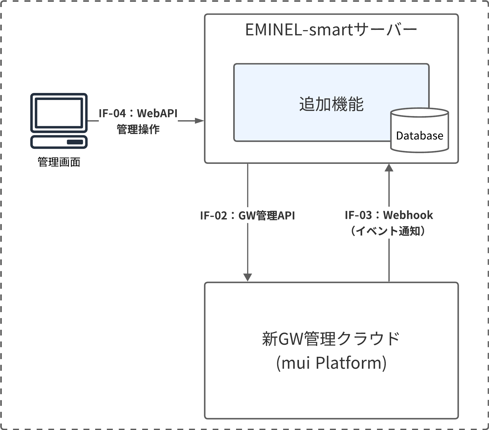

🔍 Nguồn ảnh: `eminel_gw_project/docs/eminel/3_requirements/images/8-4_admin_system.png`

Thư mục `docs/eminel/5_design/admin/` chứa bản nháp giao diện bằng **HTML/CSS thuần** — không cần build, **mở thẳng bằng trình duyệt**.

🔍 Nguồn: `eminel_gw_project/docs/eminel/5_design/README.md`
→ mục 「見方」, dòng 8–13

| Điểm | Nội dung |
|---|---|
| **Điểm bắt đầu** | `admin/index.html` — hub dẫn tới toàn bộ màn hình của 10 chức năng |
| **Thanh bên trái** | Chuyển giữa E-Smart / E-GW *(bản nháp này chỉ làm E-GW, phần E-Smart hiển thị mờ)* |
| **Chữ đỏ / nhãn đỏ 「変更/新規」** | Khác với màn hình ESTA, hoặc mới của E-GW |
| ⚠️ **T.B.D được "tạm FIX"** | Để vẽ ra hình được — **thấy trên màn hình KHÔNG có nghĩa là đã chốt** |

🔍 nguyên văn (dòng 12): 「**T.B.D・未決事項は現状で暫定FIXとして反映**（例：DR制御機器・制御内容、属性フィルタ条件、ポイント/バッジ仕様）」

Nguồn gốc thiết kế:

🔍 cùng file, dòng 19–21
→ nguyên văn: 「デザイントークン（配色 `#1c478c` 等・余白・フォント Roboto） | E-Smart管理画面 Figma（LIXIL対応）から抽出」

Sau khi chốt layout sẽ **chuyển ngược vào Figma** làm tài sản bàn giao.

✅ **Hướng "chung với E-Smart" đã được chốt qua QA Notion** (phiếu **No. 3**, **完了** 2026-08-13): masao takahashi (mui) trả lời — màn hình quản trị **chung source code, deploy cũng chung** với E-Smart (cùng người vận hành dùng), khớp với cách bản nháp này thể hiện (một web, chuyển E-Smart / E-GW bằng thanh bên). Nguyên văn + các trả lời QA khác: xem bảng ở [9.4](#94-vai-trò-và-môi-trường-của-syp).

💡 **Cách dùng thực tế cho bạn**: khi đọc spec chữ thấy khó hình dung, mở màn hình tương ứng trong trình duyệt xem. Nhưng luôn nhớ **bản nháp không phải bản chốt**.

---

## Kiểm tra nhanh — Chương 7

1. Thư mục `3_requirements/` và `4_spec/` khác nhau ở chỗ nào?
2. Bạn nhận ticket "sửa màn hình danh sách người dùng" — câu hỏi đầu tiên phải hỏi là gì?
3. Trong 10 chức năng màn hình quản trị, hai chức năng nào phải thiết kế từ số không?
4. Nhìn thấy một trường dữ liệu trong bản thiết kế nháp HTML — có kết luận được là nó đã chốt không?

<details>
<summary>Đáp án</summary>

1. `3_requirements` định nghĩa **What** — người dùng làm được gì. `4_spec` định nghĩa **How** — hệ thống làm điều đó bằng cách nào.
2. **"Cái này thuộc E-GW hay ESTA?"** Đây là quy tắc bắt buộc ghi trong `CLAUDE.md` dòng 19 — không được bắt tay làm khi chưa xác định.
3. **C (quản lý E-GW) và D (dashboard)** — không có Figma nguồn, không có code nguồn từ ESTA.
4. **Không.** Các mục T.B.D được "tạm FIX" để vẽ được ra hình. Muốn biết đã chốt chưa phải xem mục 「明確な未決事項」 trong file spec tương ứng.

</details>

---

## 7.7 設計書 — định dạng file của bản giao nộp

Sau tầng 「機能仕様」 ([§7.5](#75-機能仕様-app--tầng-vừa-mở)) là tầng **設計書** (*sekkeisho — tài liệu thiết kế*): mô tả cụ thể để code được. Đây là **thứ SYP phải giao nộp**, nên định dạng file không phải chuyện hình thức.

**Định dạng đã chốt — hai loại, khác nhau:**

| Loại tài liệu thiết kế | Định dạng nộp |
|---|---|
| **画面** (*gamen* — màn hình) | **Excel** |
| **API** | **markdown** |

🔍 Nguồn: Notion — QAデータベース dự án, phiếu **No. 9** 「設計書の最終成果物のファイル形式について」
→ 質問者 Nguyen Van Tung (SYP), 起票 2026-08-10 17:06 · phiếu **chốt 2026-08-13 12:34** (更新日時)
→ nguyên văn (回答内容): 「画面：excel / API：markdown」
→ trạng thái khi đọc (2026-08-20): **完了** (đã đóng)
→ ⚠️ ô **回答者 để trống** — Notion không ghi ai trả lời, nên **đừng gán tên ai** khi trích lại

💡 **Vì sao hai định dạng khác nhau**: tài liệu màn hình có nhiều bảng, nhiều thuộc tính từng phần tử, và người vận hành phía khách quen đọc Excel — đúng như bộ `batch_decision.xlsx` của đợt review batch. Còn tài liệu API thì phần lớn là danh sách endpoint, tham số, mẫu JSON — những thứ **diff được bằng git** và dán được vào code, nên markdown tiện hơn. *(🔸 đây là suy luận về lý do, câu trả lời gốc không nêu lý do.)*

⚠️ **Đừng suy rộng ra tầng khác.** Câu trả lời này nói về **設計書**, không nói gì về `3_requirements` hay `4_spec` — hai tầng đó đang là **markdown trong repo git**, giữ nguyên như vậy.

---
---

# Chương 8 — Đã làm được đến đâu

## 8.1 Cỗ máy quản lý bốn tài liệu

Thư mục `2_management/` là **nơi bạn phải ghé thường xuyên nhất**. Bốn file phối hợp với nhau theo quy tắc chặt chẽ:

🔍 Nguồn: `eminel_gw_project/docs/eminel/2_management/README.md`
→ mục 「対象ファイル」, dòng 11–16

| File | Trả lời câu hỏi | **Cấm** viết gì |
|---|---|---|
| **20_open_issues.md** | Cái gì **chưa quyết** | Câu hành động → đẩy sang 21 |
| **21_todo.md** | **Ai làm gì** để quyết được | Giải thích bối cảnh → đẩy về 20 |
| **22_decisions.md** | **Đã quyết gì, khi nào** | Tranh luận chưa xong → về 20 |
| **23_meeting_notes.md** | **Ai nói gì, khi nào** | — |

### Xương sống là mã vấn đề

🔍 cùng file, mục 「1. 背骨は I-xx（論点ID）」, dòng 22–24
→ nguyên văn: 「すべての論点・行動・決定は **`I-xx`（論点ID）を共通キー**で結ぶ」「新しい未決が出たら、**まず20に `I-xx` を採番**してから21の行動を起こす」

Mã có dạng **[nhóm]-[số]**, năm nhóm:

| Nhóm | Phạm vi |
|---|---|
| **SVC** | Toàn sản phẩm, xuyên suốt (yêu cầu app, phương án tích hợp, lịch, phi chức năng) |
| **GW** | Gateway, firmware, liên kết thiết bị, phần cứng, chứng nhận |
| **CLD** | Server, màn hình quản trị, app, interface, codebase |
| **OPS** | Vận hành, quy trình phát hành *(hiện đang trống)* |
| **CTR** | Hợp đồng, sở hữu trí tuệ, tiền |

🔍 cùng file, mục 「6. 20 のカテゴリ分類」, dòng 63–70

### ⚠️ Quy tắc quan trọng nhất

🔍 cùng file, mục 「4. 状態の管理」, dòng 47–49
→ nguyên văn: 「**行動完了 ≠ 論点決着**：行動を全て `[x]` にしても、北ガス回答待ちなどで論点が決着しないことがある。20の状態と21のチェックは別レイヤーとして扱う」

> **Đánh dấu `[x]` xong hành động ≠ vấn đề đã được quyết.**
> Trạng thái vấn đề **chỉ nằm ở file 20**. Làm xong hết việc mà bên khách chưa trả lời thì vấn đề vẫn mở.

💡 Đây là phân biệt rất tinh nhưng cực kỳ thực tế: bạn có thể hoàn thành 100% việc của mình mà vấn đề vẫn treo, vì bóng đang ở sân người khác.

### Và một quy tắc nghiêm về nhật ký quyết định

🔍 Nguồn: `eminel_gw_project/docs/eminel/2_management/22_decisions.md`
→ mục 「採否基準」, dòng 9
→ nguyên văn: 「**北ガス正式合意・確定済み**のみここに記録。mui提示・社内整理・ドラフト段階は [20_open_issues.md] の状態更新どまりとする」

**Chỉ ghi vào `22_decisions.md` khi 北ガス chính thức đồng ý.** Bản nháp của mui, thống nhất nội bộ, đề xuất đã gửi — tất cả đều **không** được tính là quyết định.

---

## 8.2 Những gì đã chốt

🔍 Nguồn: `eminel_gw_project/docs/eminel/2_management/22_decisions.md`
→ bảng, dòng 11–31

| Ngày | Quyết định |
|---|---|
| 2025-08-20 | Đi theo cấu trúc ESTA. **Loại giao tiếp nội bộ** khỏi báo giá (trần ngân sách 50 triệu yên) |
| 2025-11-12 | **Ký hợp đồng** — 68,1 triệu yên |
| 2026-02-05~10 | Dùng phần cứng **Aqara M300** *(điều kiện: không nối vào server/app phía Trung Quốc)* |
| 2026-03-13~18 | **Giao tiếp nội bộ sống lại** do 北ガス yêu cầu giữ như hệ cũ |
| 2026-03-27 | ✅ **Nghiệm thu xong** giai đoạn yêu cầu + thiết kế cơ bản |
| 2026-05-22 | Biên bản họp: Notion → PDF/Word → Google Drive → **gửi 北ガス trong ngày** |
| 2026-05-26 | **Chốt cơ cấu tổ chức** — kiến trúc tổng: masao; Stream 1,2: kihara; Stream 3,4: masao/oi. 📖 *Stream = cách chia việc theo báo giá: 1=firmware GW, 2=đám mây quản lý GW, 3=server+admin+app (phần SYP implement) — theo heading của `10_feature_list.md` (dòng 29, 67, 80/103/119); riêng "4=bảo trì ESTA" là suy từ ngữ cảnh CLD-02, không có heading riêng. Khái niệm này đang bị bỏ, xem [9.3③](#93-năm-tiền-đề-mới-từ-trại-tập-trung)* |
| 2026-06-03 | **Loại điều khiển phức hợp エコジョーズ+エアコン** khỏi giai đoạn 1 |
| 2026-06-03 | **Giao tiếp nội bộ → lùi sang 2027/4–6** |
| **2026-06-10** | ✅ **Chốt lịch tổng thể** và **phạm vi bắt buộc = mọi thứ liên quan sưởi** |

⚠️ Chú ý điều kiện của quyết định dùng Aqara M300:

🔍 cùng file, dòng 19
→ nguyên văn: 「価格低減。mui製品として扱える前提（中国側サーバー/アプリに繋がない）」

**Không được nối vào server và app phía Trung Quốc** — đây là điều kiện để coi thiết bị là sản phẩm của mui.

---

## 8.3 Những gì đang mở

Hiện có **22 vấn đề** đang mở, chia theo 5 nhóm:

🔍 Nguồn: `eminel_gw_project/docs/eminel/2_management/20_open_issues.md`
→ mục 「一覧」, dòng 15–59

### Nhóm SVC — toàn sản phẩm

| Mã | Vấn đề | Trạng thái | Bóng ở |
|---|---|---|---|
| SVC-01 | App gộp hay tách | 🔵 | 北ガス *(mui đã đưa vật liệu, chờ trả lời)* |
| SVC-02 | Lịch năm nay có kịp không | 🔵 | mui / 北ガス |
| SVC-03 | **Yêu cầu phi chức năng chưa có** | 🔴 | 北ガス / mui |

### Nhóm GW — gateway

| Mã | Vấn đề | Trạng thái |
|---|---|---|
| **GW-01** | **Spec chi tiết logic sưởi chưa được đưa** | 🔴 |
| GW-02 | Giao tiếp nội bộ *(đã lùi 2027; còn lại: chọn HTTPS hay BLE)* | 🔵 |
| GW-03 | Chuẩn kết nối của cảm biến nhiệt độ/độ ẩm | 🟡 |
| GW-04 | Có điều khiển エネファーム hay không | 🔴 |
| GW-05 | Đàm phán liên kết với Rinnai | 🟡 |
| GW-06 | Lịch mua thiết bị thật | 🔵 |
| GW-07 | Các ngưỡng của logic điều khiển | 🔵 |
| GW-08 | Chứng nhận JC-STAR | 🔵 |
| GW-09 | Lấy spec phần cứng M300 từ Aqara | 🟡 |

### Nhóm CLD — đám mây & app

| Mã | Vấn đề | Trạng thái |
|---|---|---|
| **CLD-01** | **Spec API gateway ↔ đám mây quản lý chưa có** | 🔴 |
| **CLD-02** | **Xung đột release tháng 11 giữa Stream 3 và 4, chiến lược branch** | 🔴 |
| CLD-03 | Có phải sửa phía ESTA không | 🟡 |
| CLD-04 | Phương thức liên kết TagTag *(phương án 1 hay 2, chênh 1–3 người-tháng)* | 🔴 |
| **CLD-05** | **Thông báo trông nom có làm không** *(chênh 0–1 người-tháng)* | 🔴 |
| CLD-06 | Các hạng mục còn để tạm | 🔵 |
| CLD-07 | ~10 chỗ 「要確認」 trong spec interface | 🔵 |

### Nhóm CTR — hợp đồng

| Mã | Vấn đề | Trạng thái |
|---|---|---|
| CTR-01 | Chi tiết 3 hợp đồng phát triển | 🔵 |
| CTR-02 | Ghi rõ sở hữu trí tuệ vào hợp đồng | 🔴 |
| CTR-03 | Bất đồng nhận thức về việc tăng giá | 🔵 |

### Nhóm OPS — vận hành

🔍 cùng file, dòng 51
→ nguyên văn: 「現時点で論点なし。機能と直接関係ない運用方法・リリース手順などの未決が今後出たらここに採番する（OPS-01〜）」

**Hiện chưa có vấn đề nào.** Đây là chỗ dành cho các vấn đề về quy trình vận hành, thủ tục phát hành — chưa phát sinh.

⚠️ **Điều này đáng chú ý**: dự án sắp bước vào giai đoạn tích hợp và thử nghiệm thực địa, mà **chưa có bất kỳ vấn đề vận hành nào được đặt ra**. Có thể là chưa ai nghĩ tới, chứ không phải không có.

---

## 8.4 Ba vấn đề chặn SYP

Nếu bạn ở phía SYP, ba vấn đề dưới đây **trực tiếp ảnh hưởng tới việc bạn có việc để làm hay không**.

### 🔴 CLD-01 — Chưa có spec API gateway ↔ đám mây quản lý

🔍 Nguồn: `eminel_gw_project/docs/eminel/2_management/20_open_issues.md`
→ dòng 149–151
→ nguyên văn: 「API仕様が決まらないとSYPへ管理画面・モバイルアプリの開発依頼ができない」「**【6/18-19更新】前提資料が一部解消**：現行EMINELソース一式を入手。内訳＝`conciergesv`（E-smartサーバー追加分）／`eminelsv`（**GW管理クラウド実装分**）／`eminel_sv_lib`（共通ライブラリ）」

| | |
|---|---|
| **Vấn đề** | Không có spec API thì **không đặt hàng được** việc màn hình quản trị và app cho SYP |
| **Tin tốt** | Đã lấy được **toàn bộ source hệ cũ** (18–19/06): `conciergesv`, `eminelsv` *(ghi chú 内訳 của CLD-01 chú thích là 「GW管理クラウド実装分」 — ⚠️ xem ghi chú lệch bên dưới)*, `eminel_sv_lib` |
| **Còn thiếu** | **Source của app** vẫn chưa có — đang hỏi 北ガス xem có không |
| **Trạng thái** | 🔴 vẫn giữ nguyên — nguyên liệu đã đủ, nhưng **spec chưa được viết** |

❌ **Mâu thuẫn ghi nhận 2026-08-04 về `eminelsv`**: ghi chú 内訳 ở CLD-01 (trích trên) chú thích `eminelsv`＝「GW管理クラウド実装分」, nhưng trong QA trên Notion (trang 「旧EMINEL調査範囲（conciergesv/eminelsv）とhemssv対象外の確認」, swan (mui) — cập nhật 2026-08-04, còn 回答中) cách hiểu **`eminelsv`＝màn hình quản trị vận hành, còn giao tiếp GW là `hemssv`** được xác nhận ở mức 「おおよそその認識でOK」 — và bộ source đã nhận **không có `hemssv`** (swan: HEMS-SV(m2-cloud) thuộc phạm vi mui, spec chia sẻ riêng). Hai cách chú thích chưa khớp nhau — 🔸 chưa rõ bên nào chính xác, khi nhận spec HEMS-SV cần đối chiếu lại. Chi tiết: [4.2](#42-bẫy-tên-gọi-lớn-nhất). *(Nếu QA chốt 回答済 mà ghi chú CLD-01 trên repo vẫn giữ nguyên → đưa thành một mục mới của Phụ lục B.)*

### 🔴 CLD-02 — Xung đột release tháng 11

🔍 cùng file, dòng 155–158
→ nguyên văn: 「同一コードベース・同一チームで新機能と既存改修を11月に両立する戦略が未整理」「ブランチ戦略：b案（11月一括統合・マージ人員未確保）か c案（dev/本番分離）」「c案はTagTag・PI・XzillaのdevアカウントをAqara/北ガスが用意できるかに依存。用意不可ならb確定」

```
Stream 3 = phát triển mới cho E-GW  ┐
                                     ├─ CÙNG codebase, CÙNG người, CÙNG release tháng 11
Stream 4 = bảo trì ESTA hiện hành   ┘
```

⚠️ Tiền đề 「同一コードベース」 (cùng codebase) ở đây **đã bị vượt qua**: QA phiếu No. 2 (**完了** 08-13) chốt hướng làm server E-GW thành **hệ độc lập** với E-Smart (xem [9.4](#94-vai-trò-và-môi-trường-của-syp)). 🔸 Chưa kiểm lại repo có cập nhật điểm này chưa — lần kiểm cuối 2026-08-04 thì **chưa**.

Hai phương án branch:

| Phương án | Nội dung | Rủi ro |
|---|---|---|
| **b** | Gộp một lần vào tháng 11 | **Chưa có người** để làm việc gộp |
| **c** | Tách môi trường dev / production | Phụ thuộc việc 北ガス và Aqara **có cấp được tài khoản dev** cho TagTag, PointInfinity, Xzilla không. **Không cấp được → buộc phải chọn b** |

### 🔴 GW-01 — Spec logic sưởi chưa được đưa

🔍 cùng file, dòng 94–97
→ nguyên văn: 「現行GWソース入手不可でフルスクラッチ」「muiの工数・品質見通しが立たず、遅延がGW以外（cloud）に連鎖」「**【6/17更新】北ガスQAで定義整理**：暖房スケジュール制御＝省エネモード・複数系統対応（GW要件定義で決めた機能）／暖房遠隔制御＝モバイルからの遠隔操作、と切り分け言語化。ただし**2系統・複合制御条件の詳細仕様の提示は依然未**」

⚠️ Câu đáng chú ý: *"chậm trễ ở gateway sẽ lan sang cả phần đám mây"* — vấn đề này không chỉ chặn firmware.

---

## Kiểm tra nhanh — Chương 8

1. Bạn hoàn thành hết mọi việc trong `21_todo.md` liên quan tới vấn đề GW-03. Vấn đề đó đã đóng chưa?
2. mui gửi một đề xuất cho 北ガス và họ chưa trả lời — ghi vào file nào?
3. Vấn đề CLD-01 hiện thiếu cái gì, và đã có sẵn cái gì?
4. Nhóm vấn đề OPS hiện đang trống — có ý nghĩa gì?

<details>
<summary>Đáp án</summary>

1. **Chưa chắc.** Trạng thái vấn đề chỉ nằm ở file 20. `[x]` chỉ nói hành động xong, còn vấn đề có thể vẫn mở vì đang chờ 北ガス trả lời. *(`2_management/README.md` dòng 49)*
2. Ghi vào **`20_open_issues.md`** — cập nhật trạng thái vấn đề. **Không** được ghi vào `22_decisions.md`, vì file đó chỉ nhận những gì 北ガス **đã chính thức đồng ý**. *(`22_decisions.md` dòng 9)*
3. **Thiếu**: spec API chưa được viết, và chưa có source của app. **Đã có**: toàn bộ source hệ cũ gồm `conciergesv`, `eminelsv`, `eminel_sv_lib` (lấy được ngày 18–19/06). ⚠️ "Toàn bộ" là theo cách ghi 「一式」 của CLD-01 — bộ này **không có `hemssv`** (xem mâu thuẫn ghi ở 8.4).
4. Nghĩa là **chưa ai đặt ra vấn đề vận hành nào** — dù dự án sắp bước vào tích hợp và thử nghiệm thực địa. Nhiều khả năng là chưa nghĩ tới, chứ không phải không có vấn đề.

</details>

---
---

# Chương 9 — Giờ phải làm gì tiếp

## 9.1 Lịch tính ngược từ deadline

Tại trại tập trung, nhóm dùng phương pháp **tính ngược từ hạn chót**: mỗi tháng đặt câu hỏi *"không xong cái gì thì hỏng?"*

🔍 Nguồn: `eminel_gw_project/docs/eminel/2_management/minutes/20260624_egw_camp_day2.md`
→ mục 「大枠スケジュール（デッドライン逆算「まずいメソッド」）」, dòng 144–153

| Thời điểm | Không xong là hỏng | Vật phẩm bắt buộc |
|---|---|---|
| 2026/7 | Không có spec từ Aqara. Bắt đầu thẩm định chứng nhận | Spec Aqara |
| **2026/8** | **Aqara cloud + mui cloud chạy được trên M300. App HEMS chạy trên M300** | M300 kiểm chứng (nhiều máy), Aqara cloud, app HEMS |
| **2026/9** | **Toàn bộ design + spec FIX. mui cloud xong. Ra mắt nền tảng AI năng lượng** | mui cloud, ECHONET emulator, spec chức năng |
| 2026/10 | Ghép lần đầu. Các chức năng phụ xong. Server EMINEL xong | Server EMINEL, app beta |
| 2026/11 | Thiết kế chi tiết + phát triển. Bắt đầu system test | App beta + màn hình quản trị ghép lại |
| 2026/12 | Chuẩn bị bàn giao source, tài liệu, gateway | Vật phẩm bàn giao |
| 2027/1–2 | Thử nghiệm thực địa (kiêm kiểm thử chấp nhận) | — |
| 2027/2/28 | Hạn của chương trình trợ cấp デコ活 | — |

📖 **Ba cái tên lạ trong bảng** *(người mới hay vấp)*:
- **App HEMS** — app quản lý năng lượng gia đình (*Home Energy Management System*) của mui chạy trên phần cứng M300; là nền chung, **không phải** app EMINEL cho 北ガス.
- **Nền tảng AI năng lượng (エネマネAI)** — dự án **riêng** của mui (Aoki Yusuke phụ trách), *không thuộc* dự án E-GW; nhưng Aqara cloud + mui cloud là **nền móng chung của cả hai**, nên deadline ra mắt tháng 9 của nó kéo căng luôn lịch dự án này. *(Nguồn: day2 dòng 155–156: 「エネマネAI（青木Yusuke担当）のローンチが9月に必須アイテム化。AqaraクラウドとmuiクラウドがエネマネAIの土台になる」)*
- **ECHONET emulator** — công cụ giả lập thiết bị ECHONET Lite để test không cần máy thật.

### Đường găng

🔍 cùng file, dòng 158
→ nguyên văn: 「クリティカルパスは muiクラウド＋HEMSアプリ＋GW（クラウド/アプリ）。クライアント系・ユーザーが見える仕様は併行で決める」

📖 **Đường găng (critical path) là gì?**
Chuỗi công việc mà **nếu chậm một khâu là chậm cả dự án**. Các việc ngoài đường găng có thể chậm chút mà không ảnh hưởng tổng thể.

**Đường găng ở đây**: mui cloud + app HEMS + gateway. Phần giao diện người dùng chạy song song.

### ⚠️ Lịch này không được cho khách xem

🔍 cùng file, dòng 159
→ nguyên văn: 「このスケジュールは社内の最新認識。お客さん向け（ST開始10月中等の表記）とはマイルストーンがずれており、お客さんには見せられない」

Mốc nội bộ **lệch** với mốc đã báo 北ガス. Cẩn thận khi trích dẫn lịch trong tài liệu gửi ra ngoài.

### Yếu tố bên ngoài: chương trình trợ cấp

🔍 cùng file, mục 「デコ活（補助金・条件付き採択）」, dòng 67–71
→ nguyên văn: 「E-GWがデコ活の対象プロジェクト。**条件付き採択**の状態」「事業期間は2027/2/28まで。早く着手するほど満額に近い／遅れるほど減額される構造と推測」「含意：デコ活によってスケジュール・スコープが左右される懸念」

📖 **デコ活 là gì?**
Chương trình trợ cấp của Bộ Môi trường Nhật Bản cho các dự án góp phần giảm phát thải carbon. E-GW đang ở trạng thái **được duyệt có điều kiện** — phải nộp bổ sung mới được cấp tiền chính thức.

⚠️ **Hàm ý**: lịch và phạm vi có thể bị chi phối bởi yêu cầu của chương trình trợ cấp. Có thể sẽ có yêu cầu kiểu *"viết thêm điều kiện này vào được không"* bay tới bất ngờ.

---

## 9.2 Hôm nay đang đứng ở đâu

Bản cập nhật này đối chiếu repo ngày **2026-08-12** (commit `1100487`).

```
    7/2026        [8/2026] ←── ĐANG Ở ĐÂY        9/2026            10/2026
      │               │                             │                  │
  spec Aqara     Aqara cloud + mui cloud      ⚠️ HẠN CHỐT CỨNG      ghép lần đầu
                 chạy trên M300               TOÀN BỘ DESIGN
                 app HEMS chạy                + SPEC
```

### Nghĩa là gì với bạn

| | |
|---|---|
| **Còn chưa đầy 2 tháng** *(tính từ 2026-08-12)* | Tới hạn đóng băng toàn bộ spec và design — chính là những tài liệu mô tả ở [Chương 7](#chương-7--bộ-tài-liệu-của-dự-án) |
| **Tất cả requirement app** | Cao nhất mới tới *レビュー済* (5 section nhóm C); còn lại rải từ *未掲載* (6) → *ドラフト作成中* (1) → *ドラフト作成* (4) → *レビュー前* (6) → *レビュー中* (1, chính là B2 điều khiển sưởi) — **chưa file nào fix** |
| **Tất cả spec màn hình quản trị** | Vẫn ở trạng thái *DRAFT* |
| **Việc cấp bách nhất** | Chốt các T.B.D — xem [Phụ lục C](#phụ-lục-c--danh-mục-tbd-đang-chặn-việc) |

⚠️ **Đây là lý do bảng câu hỏi trong `qa_kitagas.md` (8 câu chính + 4 dự phòng) cần được gửi sớm.** Mỗi tuần trôi qua mà chưa có câu trả lời là một tuần bị ăn vào quỹ thời gian 2 tháng còn lại.

---

## 9.3 Năm tiền đề mới từ trại tập trung

Trại tập trung 3 ngày (23–25/06/2026) sinh ra nhiều tiền đề mới. Vấn đề: **tài liệu tầng dưới chưa cập nhật theo**. Đây là phần dễ hiểu sai nhất nếu chỉ đọc `docs/`.

### ① Bản 2026 là bản KIỂM CHỨNG, không lên store

🔍 Nguồn: `eminel_gw_project/docs/eminel/2_management/minutes/20260623_egw_camp_day1.md`
→ mục 「共有された前提（既定事項）」, dòng 27
→ nguyên văn: 「26年対応は検証用、ストアに出さない。検証外は27年対応へ」

⚠️ Nghĩa là mức độ hoàn thiện yêu cầu cho bản 2026 **khác với một bản thương mại**. Nhưng nó vẫn phải chạy thật ở ~10 nhà trong mùa đông Hokkaido.

### ② Không chuyển đổi người dùng EMINEL hiện hành

🔍 cùng file, dòng 28
→ nguyên văn: 「現行エミネルは移行しない」

Hệ cũ **cứ chạy tiếp**. Không có chuyện migrate 30.000 khách sang hệ mới trong năm nay.

💡 Điều này gỡ bỏ một khối lượng công việc khổng lồ (di trú dữ liệu), nhưng cũng có nghĩa **hai hệ thống sẽ chạy song song** một thời gian.

### ③ Khái niệm "Stream" đang bị bỏ

🔍 cùng file, mục 「前提・スコープ」, dòng 72
→ nguyên văn: 「「ストリーム」は古い概念で、今回は捨てる方向（劣後の可能性）」

⚠️ **Nhưng bảng chức năng vẫn ghi Stream 1–4.** Cách chia việc thực tế đã chuyển sang **chia ngang theo chức năng**:

🔍 Nguồn: `eminel_gw_project/docs/eminel/2_management/minutes/20260624_egw_camp_day2.md`
→ mục 「担当割り・チケット化」, dòng 166–170
→ nguyên văn: 「担当の方向（横断開発）」「masao／oi：管理画面・アプリから入り、バックエンドも横断」「swan：細かい機器管理等」「kihara：ゲートウェイアプリ＋バックエンド寄りの細かいところ」

### ④ 「muiプラットフォーム」 = tên mới của GW管理クラウド

Cùng một thứ, hai tên, tuỳ tài liệu. Tài liệu chính thức dùng `GW管理クラウド`, biên bản họp dùng `muiプラットフォーム`.

### ⑤ Sưởi / hẹn giờ / đặt trước / lạnh / DR đều CHẠY Ở GATEWAY

🔍 Nguồn: `eminel_gw_project/docs/eminel/2_management/minutes/20260623_egw_camp_day1.md`
→ dòng 33
→ nguyên văn: 「暖房スケジュール・タイマー・予約・冷房・DRはGWで実行。サーバーは設定・指示を渡すだけ」

**Server chỉ đưa cấu hình và lệnh xuống.** Đây là câu tóm tắt gọn nhất về ranh giới trách nhiệm — củng cố lại những gì đã thấy ở [Chương 3](#chương-3--câu-chuyện-của-một-điểm-dữ-liệu).

### Thêm: hai biến thể của M300

🔍 Nguồn: `eminel_gw_project/docs/eminel/2_management/minutes/20260625_egw_camp_day3.md`
→ mục 「共有された前提（既定事項）」, dòng 28
→ nguyên văn: 「GW（M300）は EMINEL向けM300 と ネイティブのM300（mui製品としての通常M300）の2系統が存在する」

Có **hai dòng M300**: bản cho EMINEL và bản M300 thông thường của mui. Cùng vỏ máy, khác mục đích.

---

## 9.4 Vai trò và môi trường của SYP

Phần này dành riêng cho người ở phía SYP.

### Đánh giá hiện tại

🔍 Nguồn: `eminel_gw_project/docs/eminel/2_management/minutes/20260625_egw_camp_day3.md`
→ mục 「今後のアクション」→「mui社内」, dòng 52
→ nguyên văn: 「SYP：当初想定より関与が薄そう → バッチ・外部連携系（仕様が固まる部分）を振る方向。やる必要があるかはmui側であたりを付ける」

Dịch: *"SYP tham gia mỏng hơn dự kiến ban đầu → hướng giao mảng batch và liên kết hệ thống ngoài (phần spec đã cố định). Việc có cần làm hay không thì phía mui sẽ ước lượng trước."*

### ⚠️ Bốn câu trả lời của mui về phạm vi SYP (QAデータベース Notion)

Bốn câu trả lời của mui mới hơn biên bản 6/25 phía trên. 質問者 đều là Bui Trong Dat (SYP), 起票 2026-08-03; nội dung trả lời đều đã đọc được ngày 2026-08-04. Hai người trả lời đều thuộc **mui** — chú ý **masao takahashi (mui)** là người khác với 高橋 phía 北ガス ở [1.3](#13-bốn-bên-và-ai-làm-gì-cho-ai).

**Cột trạng thái là phần dễ lạc hậu nhất của bảng này** — hồi 08-04 cả bốn phiếu đều còn `回答中`; mở lại ngày **2026-08-20** thì **cả bốn đều đã 完了**. Tức bốn câu trả lời dưới đây **đều là kết luận đã đóng**, không còn là định hướng tạm:

| No. | Trang QA | Trả lời (nguyên văn 回答内容) | Người trả lời | ステータス |
|---|---|---|---|---|
| **1** | 「担当範囲（サーバー／管理画面）とアプリ対象外の確認」 | 「モバイルアプリは開発対象です。」 | masao takahashi (mui) | ✅ **完了** *(chốt 08-13 12:27; kiểm 08-20)* |
| **2** | 「旧Eminel基盤継承＋EMINEL-smartサーバーは独立デプロイの確認」 | 「基本的には独立したシステムとして開発してもらう方向でお願いします。ただし既存システムを使い続けたほうがいい機能があれば教えてほしいです」 | swan (mui) | ✅ **完了** *(chốt 08-13 12:28; kiểm 08-20)* |
| **3** | 「管理画面は独立か共通か（切替モード追加）の確認」 | 「管理画面はE-Smartと共通のソースコード、デプロイも同一（同じ操作者が使う想定）」 | masao takahashi (mui) | ✅ **完了** *(chốt 08-13 12:28; kiểm 08-20)* |
| **4** | 「旧EMINEL調査範囲（conciergesv/eminelsv）とhemssv対象外の確認」 | 「おおよそその認識でOKです。HEMS-SV(m2-cloud)はmui側開発範囲で、GWとの通信はHEMS-SVを通して行っていただくことになります。ConciergeSV,EminelSVは密に関係しますが、SYPさん開発範囲ではないです。HEMS-SVの仕様等は別途共有します」 | swan (mui) | ✅ **完了** *(chốt 08-13 12:28; kiểm 08-20)* |

*(Cột `No.` là số phiếu trong QAデータベース, dùng làm định danh khi trích.)*

📌 **Nhịp làm việc của mui trên QAデータベース** — tính đến 2026-08-20 đã mở lại **11 phiếu**. Xếp theo ngày chốt thì thấy rất rõ mui làm việc theo đợt:

| Phiếu | 起票 | Chốt / cập nhật gần nhất | Trạng thái |
|---|---|---|---|
| No. 1 担当範囲…とアプリ対象外 | 08-03 **17:30** | 08-13 **12:27** | ✅ 完了 |
| No. 2 独立デプロイ | 08-03 **17:31** | 08-13 **12:28** | ✅ 完了 |
| No. 3 管理画面は独立か共通か | 08-03 **17:32** | 08-13 **12:28** | ✅ 完了 |
| No. 4 旧EMINEL調査範囲…hemssv対象外 | 08-03 **17:32** | 08-13 **12:28** | ✅ 完了 |
| No. 5 バッジ・ランク…スコープ | 08-03 **17:33** | 08-13 **12:28** | ✅ 完了 |
| No. 10 SYP開発範囲 | 08-12 16:17 | 08-13 **12:28** | ✅ 完了 |
| No. 7 モバイルアプリ構成の変更 *(ngoài phạm vi guide)* | 08-03 19:22 | 08-13 **12:34** | ✅ 完了 |
| No. 9 設計書のファイル形式 → [§7.7](#77-設計書--định-dạng-file-của-bản-giao-nộp) | 08-10 17:06 | 08-13 **12:34** | ✅ 完了 |
| **No. 8** GW-IDと顧客情報の連携 → [§5.2](#52-onboarding-từ-mở-hộp-đến-thấy-dữ-liệu) | 08-05 16:03 | **08-19 10:58** | 🟡 回答中 |
| **No. 6** エラー種別判定条件 → [§7.4](#74-spec-màn-hình-quản-trị) | 08-03 17:33 | **08-19 10:43** | 🟡 回答中 |
| **No. 12** 2027年劣後機能 | 08-12 17:41 | **08-12 17:46** | 🔶 確認中 |

⇒ **Ba kiểu ứng xử khác nhau, và mỗi kiểu đòi một hành động khác nhau:**

| Kiểu | Phiếu | Việc phải làm |
|---|---|---|
| **Đóng cả loạt ngày 08-13** — 8 phiếu, gói trong 7 phút (12:27→12:34), sau khi để nguyên **10 ngày** | No. 1 · 2 · 3 · 4 · 5 · 7 · 9 · 10 | Xong. Với phiếu mới thì **chờ đợt dọn tiếp** là được |
| **Ngoài đợt nhưng đang được xử lý thật** — cập nhật 08-19, có comment có nội dung | No. 6 · No. 8 | Theo dõi; **đọc Comments** vì câu trả lời nằm ở đó |
| **Lập trước đợt 08-13 mà bị để lại** — không ai chạm từ 08-12 | No. 12 | **Phải thúc**, chờ là vô ích ([Phụ lục C #13](#phụ-lục-c--danh-mục-tbd-đang-chặn-việc)) |

💡 **Bài học khi đọc tài liệu này về sau**: thấy một phiếu vừa đổi trạng thái thì **mở luôn các phiếu cùng chủ đề** — khả năng cao chúng cũng vừa được xử lý cùng lượt. Và nhớ hai điều: **`完了` cũng nghĩa là đã trả lời** (grep riêng `回答済` sẽ sót), **phải đọc cả `Comments`** — xem 5 cái bẫy ở [Phụ lục E.2](#e2-bước-2--đi-theo-thứ-tự).

### ✅ Câu trả lời chốt phạm vi SYP (2026-08-13)

Bốn câu trả lời 08-03/04 ở trên hồi đó **đều còn 回答中**, nên chưa được coi là phân công cuối cùng. Điều đó **đã thay đổi**: SYP hỏi lại một lần nữa, gửi kèm bảng phân công tự lập theo 統合要件定義書 + bảng báo giá, và mui **xác nhận là đúng**.

🔍 Nguồn: Notion — QAデータベース dự án, trang 「SYP開発範囲の確認」 (No. 10)
→ 質問者 Nguyen Van Tung (SYP, 起票 2026-08-12) · 回答者 **swan (mui)** · phiếu **chốt 2026-08-13** (更新日時 12:28)
→ nguyên văn (回答内容): 「認識に相違ないです。」
→ trạng thái khi đọc (2026-08-20): **完了** (đã đóng — tương đương 回答済)

| Khối chức năng | 担当 |
|---|---|
| 7-1. E-GW機能（ファームウェア） · 7-2. GW管理クラウド機能 | mui Lab |
| **7-3. EMINEL-smartサーバー機能 · 7-4. 管理画面機能 · モバイルアプリ** | **SYP** |

⇒ Đây là **căn cứ mạnh nhất hiện có** về phạm vi SYP: đúng ba khối, trạng thái đã đóng. Bảng đầy đủ kèm cảnh báo cách đọc: [§1.6 bảng ②](#16-phạm-vi-cái-gì-làm-cái-gì-không). Ánh xạ sang bốn nhóm mã F-GW/F-MC/F-ES/F-AD: [§6.1](#61-bốn-nhóm-mã-chức-năng).

Điều rút ra cho vai trò SYP (quan sát từ 4 câu trả lời 08-03/04, nay đã có QA No. 10 chốt lại):

1. **App là đối tượng phát triển, và SYP là bên làm** — không còn hiểu "app ngoài phạm vi" nữa (chi tiết: [1.6](#16-phạm-vi-cái-gì-làm-cái-gì-không)).
2. **Server E-GW: về cơ bản (基本的には) phát triển theo hướng hệ độc lập** với EMINEL-smart server đang chạy — phiếu No. 2 đã **完了** nên đây là **hướng đã chốt**, không còn là định hướng tạm. Nhưng phải đọc kỹ ba tầng dưới đây, vì đóng phiếu **không thêm chữ nào** vào câu trả lời:
   - ✅ **Đã chốt**: làm server E-GW thành **một hệ độc lập** với E-Smart hiện hành.
   - ⚠️ **Chữ 「基本的には」 (*về cơ bản là*) vẫn nằm trong nguyên văn** — nó là một chữ nhượng bộ, đóng phiếu không xoá nó. **Không được đọc thành "độc lập tuyệt đối".**
   - ❌ **Chưa nói**: độc lập **đến mức nào** (có chung library/source hay không). Trước đây chỗ này là *"chờ mui trả lời thêm"*; nay phiếu **đã đóng mà vẫn không nói** ⇒ muốn biết thì phải **mở phiếu QA mới**, chờ tiếp là chờ vô ích.
3. **Màn hình quản trị: ngược hẳn với server — chung source code, chung cả deploy với E-Smart**, lý do là **cùng một lớp người vận hành sử dụng**. Phiếu No. 3 đã **完了** ⇒ đã chốt, và **không kèm chữ nhượng bộ nào** (khác điểm 2). Câu trả lời này **đè lên** ghi chú camp 6/25 bên dưới (「環境変数／ビルド設定で切り替え」 — tức hai bản deploy tách nhau chuyển bằng biến môi trường): cách hiểu đó **sai** với 管理画面.
   💡 **Hệ quả thực tế**: bạn **thêm màn hình E-GW vào chính repo `syp-eminelstandard-web-admin`**, không dựng repo mới, không dựng deploy riêng.
4. **Phạm vi điều tra hệ cũ của SYP = `conciergesv` + `eminelsv`** (khảo sát API・batch để di trú); `hemssv` không thuộc phạm vi — GW giao tiếp qua **HEMS-SV (m2-cloud)** do mui làm, spec sẽ chia sẻ riêng (chi tiết: [4.2](#42-bẫy-tên-gọi-lớn-nhất), ghi chú lệch `eminelsv`: [8.4](#84-ba-vấn-đề-chặn-syp)).

⇒ So với đánh giá 「関与が薄そう」 (*tham gia mỏng hơn dự kiến*, camp 6/25) ở đầu mục, bức tranh việc cho SYP **rộng hơn hẳn**: server E-GW độc lập + phần E-GW trong màn hình quản trị chung + app. Đánh giá 6/25 nay chỉ còn giá trị lịch sử — **QA No. 10 (完了, 08-13) đã vượt qua nó**, và đó cũng là câu trả lời trọn vẹn cho "danh sách phạm vi SYP đảm nhận" mà câu hỏi 1 hồi 08-03 nêu ra nhưng không được đáp.

⚠️ **Cái vẫn CHƯA chốt** là *mức độ* độc lập của server (chung library/source hay không — điểm 2 ở trên), chứ không còn là *ai làm cái gì*.

### ⚠️ Một câu hỏi mui đặt cho SYP đã rơi mất

Đây là chi tiết dễ bỏ qua nhất của cả mục, và nó là **việc chưa làm**, không phải kiến thức.

Câu trả lời của phiếu No. 2 có **hai vế**. Vế đầu là trả lời. **Vế sau `ただし` là mui hỏi ngược lại SYP:**

> 「**ただし**既存システムを使い続けたほうがいい機能があれば教えてほしいです」
> *"**Nhưng** nếu có chức năng nào nên tiếp tục dùng của hệ hiện hữu thì cho chúng tôi biết."*

**Điều đã xảy ra**: SYP **không trả lời** vế này. Phiếu vẫn được mui **đóng (完了) ngày 08-13** — ô `回答内容` khi kiểm lại ngày 08-20 vẫn đúng nguyên văn cũ, không có nội dung nào thêm. Nghĩa là **mui đóng phiếu mà không nhận được câu trả lời**.

**Hệ quả cho người đọc**: câu hỏi này **không mất đi về mặt công việc** — nó chỉ mất **kênh** để trả lời. Danh sách "chức năng nên dùng tiếp" là một quyết định kỹ thuật thật, ảnh hưởng tới việc dựng lại bao nhiêu thứ từ đầu. Không nêu ra là **mất trắng một quyết định**. Muốn nêu thì phải mở **phiếu QA mới** hoặc nêu khi trình thiết kế, không thể trả lời vào phiếu đã đóng.

💡 **Bài học rút ra chung**: khi đọc câu trả lời của mui, phải soi xem trong đó **có câu hỏi ngược lại mình không** (dấu hiệu: 「ただし…」「…があれば教えてほしい」「…を確認してほしい」). Một phiếu QA **đóng** không có nghĩa là **xong việc** — nó có thể đóng lại trong khi phần việc của mình còn nguyên.

### Vì sao spec màn hình quản trị được ưu tiên viết

🔍 cùng file, dòng 48
→ nguyên văn: 「oi：管理画面の仕様書き起こしを継続。仕様さえ決まればSYPでほぼ実装できる見込み」

Dịch: *"Spec quyết xong là SYP implement được gần hết."*

⇒ Đây là lý do việc viết spec đang được đẩy nhanh: nó là **nút cổ chai giải phóng công việc cho bên ngoài**.

### ⚠️ Phân công quan trọng: kiểm thử do mui, hiện thực do SYP

🔍 Nguồn: `eminel_gw_project/docs/eminel/2_management/21_todo.md`
→ mục 「mui / 社内で進めること（★）」, dòng 43
→ nguyên văn: 「★ テスト仕様の作成（テスト=mui、実装=SYPの分担前提） → CLD-01」

🔍 Xác nhận thêm: `eminel_gw_project/docs/eminel/2_management/23_meeting_notes.md`
→ dòng 21 (họp 2026-05-26)
→ nguyên văn: 「テスト=mui/実装=SYP分担」

> **Đặc tả kiểm thử do phía mui viết. SYP làm phần hiện thực.**

💡 **Hàm ý thực tế với bạn**: bạn sẽ nhận **đặc tả kiểm thử từ mui** chứ không phải tự thiết kế ca kiểm thử. Nhưng lưu ý — mục này trong danh sách việc **vẫn đang là `[ ]` chưa làm**, và nó gắn với vấn đề `CLD-01`. Tức là đặc tả kiểm thử cũng đang chờ spec API giống như mọi thứ khác.

### Khối lượng batch

🔍 cùng file `minutes/20260625_egw_camp_day3.md`, mục 「今後のアクション」, dòng 51
→ nguyên văn: 「バッチ群（約46本＋外部連携・DR・通信基盤等）をNotionに機能単位でタスク化（後述）。「いけてない」バッチを作り直す前提」

**~46 batch** đang được chia nhỏ thành task trên Notion, với tiền đề là **viết lại**, không copy.

### ⚠️ Ràng buộc môi trường — biết trước để đỡ bất ngờ

🔍 cùng file, mục 「共有された前提（既定事項）」, dòng 29–31
→ nguyên văn: 「Dev は SYP の環境で動いている。リージョンがベトナムと思われ、遅い」「ST・本番は北ガスの環境で動いている。AWSアクセスは北ガスのPC経由（リモートデスクトップ）」

| Môi trường | Đặt ở đâu | Ghi chú |
|---|---|---|
| **Dev** | Môi trường của **SYP** | Vùng Việt Nam, **bị đánh giá là chậm** |
| **ST** (system test) | Môi trường **北ガス** | Truy cập AWS **qua remote desktop máy của 北ガス** |
| **Production** | Môi trường **北ガス** | Như trên |

💡 **Hàm ý thực tế**: bạn **không** có quyền truy cập AWS trực tiếp cho môi trường test và production. Mọi thao tác đều phải qua máy của 北ガス bằng remote desktop. Hãy tính vào ước lượng thời gian.

### Chuyển đổi giữa hai sản phẩm

🔍 cùng file, dòng 33–34
→ nguyên văn: 「管理画面（web-admin）・アプリともに環境変数／ビルド設定でESTA向け・EMINEL向けを切り替えられる」「アプリは完全に別アプリとしてビルドするため、出し分けはあまり気にしなくてよい」

Màn hình quản trị và app đều **chuyển đổi giữa ESTA và EMINEL bằng biến môi trường / cấu hình build**. Riêng app thì build hẳn thành **hai ứng dụng riêng biệt**.

⚠️ **Với màn hình quản trị, QA Notion nói khác ghi chú camp này — và QA mới là bản đúng.** masao takahashi (mui) trả lời rõ hơn: **chung source code và deploy cũng chung một chỗ** (「デプロイも同一（同じ操作者が使う想定）」), **không phải** hai bản deploy tách nhau chuyển bằng biến môi trường. Phiếu **No. 3, đã 完了** (chốt 2026-08-13) ⇒ ghi chú camp 6/25 về phần 管理画面 chỉ còn giá trị lịch sử. Xem bảng QA ở đầu mục 9.4.

*(Phần nói về **app** của ghi chú camp thì vẫn đúng và còn hiệu lực: app build thành **hai ứng dụng riêng** — điều này về sau thành nền cho cả task tái cấu trúc source app.)*

---

## 9.5 Sáu rủi ro lớn nhất

*(Thang cảnh báo riêng của mục này: 🔴 = rủi ro cao · 🟠 = rủi ro vừa · 🟡 = rủi ro thấp nhưng chưa ai đụng tới — **không** phải bộ ký hiệu trạng thái vấn đề ở mục 0.2, nơi 🟡 nghĩa là "đang chờ thông tin".)*

Tổng hợp lại những gì rải rác khắp tài liệu. Xếp theo mức độ nghiêm trọng.

### 🔴 1. Hạn tháng 9 chốt spec — mà chưa có gì được chốt

| | |
|---|---|
| Rủi ro | Tháng 9/2026 phải fix toàn bộ design + spec. Nhưng **23/23 section requirement app** đều chưa chốt — 5 section nhóm C mới đạt `レビュー済` (khách đã xem), 18 section còn lại chưa qua review, và **không section nào ở mức `fix済`**; **10/10 spec màn hình quản trị** vẫn còn `DRAFT` |
| Vì sao nguy hiểm | Không chốt được thì tháng 10 không ghép được, kéo theo cả chuỗi tới thử nghiệm thực địa mùa đông — mà **mùa đông không dời được** |
| Dấu hiệu | Đầu tháng 9 mà ngoài nhóm C vẫn chưa có section nào lên được `レビュー済` |

### 🔴 2. Chưa có spec API — chặn cả việc giao và cả việc kiểm thử

| | |
|---|---|
| Rủi ro | `CLD-01` 🔴. Không có spec API gateway ↔ đám mây quản lý |
| Vì sao nguy hiểm | Chặn **hai** thứ cùng lúc: đặt hàng phát triển cho SYP, **và** việc viết đặc tả kiểm thử *(cũng gắn với CLD-01)* |
| Điểm sáng | Nguyên liệu đã đủ — source hệ cũ đã lấy được từ 18–19/06. Chỉ còn viết |

### 🔴 3. Spec logic sưởi chưa được đưa — và nó lan ra ngoài firmware

| | |
|---|---|
| Rủi ro | `GW-01` 🔴. 北ガス chưa đưa spec chi tiết cho 2 mạch và điều khiển phức hợp |
| Vì sao nguy hiểm | Tài liệu ghi thẳng: 「遅延がGW以外（cloud）に連鎖」 — **chậm ở gateway sẽ lan sang phần đám mây** |
| Nghịch cảnh | Không lấy được source gateway cũ nên phải viết lại từ đầu, càng cần spec rõ |

### 🟠 4. Phụ thuộc Aqara — nhà cung cấp nước ngoài, chưa mở tài liệu

🔍 Nguồn: `eminel_gw_project/docs/eminel/2_management/minutes/20260623_egw_camp_day1.md`
→ mục 「GW内部構成（コンポーネント図）」, dòng 178–179
→ nguyên văn: 「ブロッカー：Aqara Studio APIの仕様が未開示」「M300のアクセス権限が開示されないと開発環境が定まらない」

| | |
|---|---|
| Rủi ro | Spec API của Aqara Studio **chưa được công bố**. Không có quyền truy cập M300 thì không dựng được môi trường phát triển |
| Vì sao nguy hiểm | Đây nằm trên **đường găng**. Và Aqara là công ty nước ngoài, mui không kiểm soát được tốc độ |
| Bổ sung | Tại thời điểm 23/06 chỉ có **1 máy M300 thật** *(dòng 143)*. Số lượng hiện tại có thể đã khác — cần xác nhận |

### 🟠 5. Xung đột release tháng 11

| | |
|---|---|
| Rủi ro | `CLD-02` 🔴. Stream 3 (mới) và Stream 4 (bảo trì ESTA) chung codebase, chung người, cùng release tháng 11 *(⚠️ tiền đề "chung codebase" có thể đổi theo QA2 — xem 9.4)* |
| Vì sao nguy hiểm | Phương án gộp một lần thì **chưa có người làm việc gộp**. Phương án tách môi trường thì phụ thuộc bên ngoài có cấp tài khoản dev không |
| Đặc điểm | Đây là rủi ro **không cần chờ khách hàng** — nội bộ quyết được, nhưng chưa ai quyết |

### 🟡 6. Hai vùng trắng chưa ai nhìn tới

| Vùng | Tình trạng |
|---|---|
| **Yêu cầu phi chức năng** | `SVC-03` 🔴 — số kết nối đồng thời, mức độ sẵn sàng, thời hạn lưu, giám sát, di trú 3万件, thời gian phản hồi: **đều chưa có**. Không chọn được kiến trúc máy chủ |
| **Vận hành** | Nhóm `OPS` **hoàn toàn trống** — chưa ai đặt ra vấn đề nào về quy trình vận hành hay thủ tục phát hành, dù sắp bước vào tích hợp và thử nghiệm thực địa |

💡 **Cách dùng danh sách này**: khi bạn thấy công việc của mình bị kẹt, đối chiếu xem có phải do một trong sáu rủi ro trên không. Nếu đúng, đó không phải vấn đề của riêng bạn — hãy báo lên chứ đừng tự tìm cách đi vòng.

---

## Kiểm tra nhanh — Chương 9

1. Tháng 9/2026 không xong cái gì thì hỏng?
2. Đường găng của dự án gồm những gì?
3. Bản 2026 có được đưa lên cửa hàng ứng dụng không? Người dùng EMINEL hiện hành có được chuyển sang không?
4. Nếu bạn ở SYP, bạn truy cập môi trường production bằng cách nào?

<details>
<summary>Đáp án</summary>

1. **Toàn bộ design + spec phải FIX**, mui cloud phải xong, nền tảng AI năng lượng phải ra mắt. *(`minutes/20260624_egw_camp_day2.md` dòng 148)*
2. **mui cloud + app HEMS + gateway (cloud/app).** Phần giao diện người dùng chạy song song, không nằm trên đường găng. *(dòng 158)*
3. **Không lên store** — bản 2026 chỉ để kiểm chứng. **Không chuyển đổi** người dùng hiện hành — hệ cũ cứ chạy tiếp. *(`minutes/20260623_egw_camp_day1.md` dòng 27–28)*
4. **Qua remote desktop máy của 北ガス.** Không có quyền truy cập AWS trực tiếp cho ST và production. *(`minutes/20260625_egw_camp_day3.md` dòng 30–31)*

</details>

---
---

# Chương 10 — Ngày đầu tiên của bạn

Chương này là **checklist thực hành**, không có lý thuyết.

## 10.1 Checklist chuẩn bị

### Quyền truy cập cần xin

| # | Xin cái gì | Xin ai | Để làm gì |
|---|---|---|---|
| 1 | Repo `eminel_gw_project` | Quản lý trực tiếp | Tài liệu dự án (cái bạn đang đọc) |
| 2 | Repo `legacy_eminel_docs` | mui Lab | Spec + code **hệ EMINEL hiện hành** |
| 3 | Repo `syp-eminelstandard-app` / `-backend` / `-web-admin` | mui Lab (org `muilab`) | Code **ESTA** — nền tảng bạn sẽ làm việc |
| 4 | Slack — 3 kênh dự án | PM | Nơi thông tin chảy nhanh nhất |
| 5 | Notion | PM | **Bản chính** của spec màn hình quản trị và biên bản họp |
| 6 | OneDrive / SharePoint | PM | **Bản chính** của tài liệu yêu cầu (PDF) |
| 7 | Google Drive | PM | Vật phẩm giao cho 北ガス |

🔍 Nguồn phân vai công cụ: `eminel_gw_project/README.md`
→ mục 「情報ソースの役割分担」, dòng 83–89

| Công cụ | Vai trò |
|---|---|
| **OneDrive / SharePoint** | Chia sẻ nội bộ + SYP — **bản chính** của spec, thiết kế, source |
| **Notion** | Tài liệu dùng nội bộ |
| **GitHub** | Phát triển — code thật |
| **Google Drive** | Chia sẻ với 北ガス — bàn giao vật phẩm |
| **Slack** | Trao đổi nội bộ / với SYP |

### Ba kênh Slack

| Kênh | Nội dung |
|---|---|
| `#proj_kitagas_eminel-gateway` | Dự án E-GW *(kênh chính)* |
| `#proj_kitagas_eminel-standard` | ESTA |
| `#ext_syp_mui_kitagas_eminelstandard` | Kênh chung với SYP |

🔍 Nguồn: `eminel_gw_project/docs/eminel/0_foundation/03_stakeholders.md`
→ bảng đầu file, dòng 5

### Công cụ cài trên máy

| Thành phần | Cần cài |
|---|---|
| App | **Flutter 3.29.2** (quản bằng `fvm`) |
| Màn hình quản trị | Node.js + **Nuxt 3** |
| Backend | **AWS SAM CLI**, Node.js 20.x, TypeScript |
| Chung | VSCode *(tài liệu dự án dùng markdown, xem trực tiếp trong VSCode là tiện nhất)* |

🔍 Nguồn: `eminel_gw_project/docs/eminel-smart/02_product_overview.md`
→ mục 「技術スタック（リポジトリ別）」, dòng 36–52

---

## 10.2 Đọc gì trước, theo thứ tự nào

### Ngày 1 — Hiểu bối cảnh (khoảng 3 giờ)

| # | Việc | File |
|---|---|---|
| 1 | Đọc tài liệu này, Chương 1 → 3 | *(bạn đang ở đây)* |
| 2 | Đọc tổng quan dự án | `docs/eminel/0_foundation/01_overview.md` — 67 dòng |
| 3 | **Đọc kỹ bảng thuật ngữ** | `docs/eminel/0_foundation/04_glossary.md` — 75 dòng |
| 4 | Xem ai là ai | `docs/eminel/0_foundation/03_stakeholders.md` — 45 dòng |

### Ngày 2 — Hiểu nghiệp vụ (khoảng 4 giờ)

| # | Việc | File |
|---|---|---|
| 5 | Đọc tài liệu này, Chương 4 → 5 | |
| 6 | Đọc luồng nghiệp vụ **kèm ảnh slide** | `docs/eminel/1_product/11_business_process/readme.md` |
| 7 | **Mở bản thiết kế nháp bằng trình duyệt** | `docs/eminel/5_design/admin/index.html` |
| 8 | Đọc 1 file requirement mẫu, từng chữ | `docs/eminel/3_requirements/app/B02_heating_control.md` |

### Ngày 3 — Hiểu tình hình (khoảng 3 giờ)

| # | Việc | File |
|---|---|---|
| 9 | Đọc tài liệu này, Chương 6 → 9 | |
| 10 | Đọc bảng chức năng | `docs/eminel/1_product/10_feature_list.md` |
| 11 | **Đọc bốn file quản lý** | `docs/eminel/2_management/20_` → `23_` |
| 12 | Đọc 3 biên bản trại tập trung | `docs/eminel/2_management/minutes/` |

### Sau đó — theo việc được giao

| Được giao | Đọc thêm |
|---|---|
| Màn hình quản trị | `docs/eminel/4_spec/admin/` + Notion bản chính |
| App | `docs/eminel/3_requirements/app/` |
| Batch / liên kết ngoài | `docs/old_eminel/01_overview.md` mục 6–10 + repo `legacy_eminel_docs` |
| Gateway | `00_integrated_requirements_v1.2.md` §8-1 |

---

## 10.3 Gặp vấn đề thì hỏi ai

```
Câu hỏi của bạn
   │
   ├─ Về CODE của ESTA?                → hỏi trong team SYP trước
   │
   ├─ Về SPEC màn hình quản trị?        → oi (大井)
   │
   ├─ Về REQUIREMENT app?               → masao
   │
   ├─ Về GATEWAY / phần cứng / firmware? → kihara (木原)
   │
   ├─ Về LỊCH / hợp đồng / phạm vi?     → PM (小田 / 齋藤)
   │
   └─ Về NGHIỆP VỤ (北ガス muốn gì)?
         → KHÔNG hỏi trực tiếp 北ガス
         → Gom vào bảng câu hỏi, gửi qua PM
         → xem qa_kitagas.md làm mẫu
```

🔍 Nguồn phân vai: `eminel_gw_project/docs/eminel/0_foundation/03_stakeholders.md`
→ mục 「mui Lab 側」, dòng 11–25

### Trước khi hỏi, tự làm ba bước

🔍 Quy trình tra nguồn: xem [Phụ lục E](#phụ-lục-e--cách-truy-về-nguồn-gốc)

1. **Tìm trong `docs/`** — có thể đã có người trả lời rồi
2. **Kiểm tra `20_open_issues.md`** — có thể đây đã là một vấn đề đang mở, đang chờ 北ガス
3. **Truy về nguồn gốc** — repo tham chiếu, Slack, Notion

💡 Nếu câu hỏi của bạn hoá ra là một vấn đề chưa quyết, **đừng tự chọn một phương án rồi code**. Hãy báo lại để nó được đưa vào bảng câu hỏi.

---

## 10.4 Ba việc bạn làm được ngay

Kể cả khi spec chưa xong, có ba việc không bị chặn:

### ① Đọc code ESTA — nền tảng bạn sẽ làm việc trên đó

Không cần chờ spec E-GW. Cấu trúc, mô hình dữ liệu, cách tổ chức của ESTA là thứ bạn sẽ dùng.

🔍 Điểm khởi đầu: `eminel_gw_project/docs/eminel-smart/`
→ `03_backend_models.md` (mô hình DynamoDB) · `04_app_models.md` (mô hình app) · `05_view_structure.md` (cấu trúc màn hình)

⚠️ Lưu ý một đánh giá từ biên bản:

🔍 Nguồn: `eminel_gw_project/docs/eminel/2_management/minutes/20260623_egw_camp_day1.md`
→ mục 「管理画面・EMINEL/E-Smart統合」, dòng 158
→ nguyên văn: 「管理画面のソースは綺麗（swan評）。アプリ側は構成含め出来が良くない」

*"Source màn hình quản trị sạch. Phía app thì cả cấu trúc lẫn chất lượng đều không tốt."* — biết trước để không bất ngờ.

### ② Đọc code hệ cũ ở những vùng đã rõ

Các mảng **batch, liên kết Xzilla, liên kết PointInfinity** có spec đầy đủ ở hệ cũ, và chính là mảng SYP dự kiến được giao.

🔍 Điểm khởi đầu: `eminel_gw_project/docs/old_eminel/01_overview.md`
→ mục 「3. 領域別サマリー」, dòng 43–99

⚠️ Nhớ tiền đề: **viết lại, không copy** — vì batch hệ cũ bị đánh giá là implement dở.

### ③ Mở bản thiết kế nháp và đối chiếu với spec

Mở `docs/eminel/5_design/admin/index.html` trong trình duyệt, click qua từng màn hình, đối chiếu với file spec tương ứng trong `4_spec/admin/`.

💡 Đây là cách nhanh nhất để **phát hiện chỗ spec chưa rõ** — và cũng là đóng góp có giá trị ngay từ tuần đầu: mỗi chỗ bạn thấy khó hiểu rất có thể cũng là chỗ người khác sẽ vấp.

---

## Kiểm tra nhanh — Chương 10

1. Bạn cần xin quyền truy cập bao nhiêu repo? Kể tên.
2. Có câu hỏi về việc 北ガス muốn chức năng hoạt động thế nào — bạn làm gì?
3. Spec chưa xong, bạn có việc gì làm ngay được?

<details>
<summary>Đáp án</summary>

1. **Năm repo**: `eminel_gw_project` (tài liệu), `legacy_eminel_docs` (hệ cũ), và ba repo ESTA là `syp-eminelstandard-app` / `-backend` / `-web-admin`.
2. **Không hỏi trực tiếp 北ガス.** Trước tiên tự tìm trong `docs/` và kiểm tra `20_open_issues.md` xem đã là vấn đề đang mở chưa. Nếu vẫn chưa có đáp án, gom vào bảng câu hỏi và gửi qua PM.
3. **Ba việc**: ① đọc code ESTA (nền tảng sẽ làm việc trên đó), ② đọc code hệ cũ ở mảng batch / liên kết ngoài (mảng dự kiến giao cho SYP), ③ mở bản thiết kế nháp đối chiếu với spec để phát hiện chỗ chưa rõ.

</details>

---
---

# Phụ lục A — Từ điển thuật ngữ

Sắp theo **nhóm chủ đề**, không theo bảng chữ cái — vì học theo nhóm dễ nhớ hơn.

🔍 Nguồn chính: `eminel_gw_project/docs/eminel/0_foundation/04_glossary.md`, dòng 12–75

## A.1 Tên dịch vụ và dự án

| Thuật ngữ | Đọc | Nghĩa |
|---|---|---|
| **EMINEL** | e-mi-ne-ru | Dịch vụ quản lý năng lượng của 北ガス. **Hệ hiện hành** — cái sắp bị thay |
| **E-GW** / **EMINEL Gateway** | | **Dự án này.** Cũng dùng để chỉ chính thiết bị gateway mới |
| **EMINEL-Smart** / **E-Smart** | | Dịch vụ đã thương mại hoá, **nền tảng để xây E-GW lên** |
| **EMINEL-standard** | | Tên khác của EMINEL-Smart, hay gặp trong hợp đồng |
| **ESTA** | es-ta | Tên thực thể trong code của EMINEL-Smart. Repo: `syp-eminelstandard-*` |
| **HEMS** | | *Home Energy Management System* — hệ quản lý năng lượng gia đình |

## A.2 Phần cứng và thiết bị

| Thuật ngữ | Nghĩa |
|---|---|
| **GW** | Gateway — thiết bị nối thiết bị trong nhà với internet |
| **Aqara M300** | Phần cứng hub của gateway mới. Phần mềm do mui làm |
| **マクセル製GW** | Gateway cũ của hãng Maxell — cái bị thay |
| **コレモ** (Koremo) | Thiết bị phát điện bằng gas của 北ガス — vừa sưởi vừa phát điện |
| **スマリモ** (Sumarimo) | Bộ điều khiển thông minh đi kèm コレモ. ⚠️ **Nơi chạy logic điều khiển ở pattern ②** |
| **エコジョーズ** (Ecojozu) | Nồi hơi gas hiệu suất cao — thiết bị sưởi chính |
| **エネファーム** (Enefarm) | Thiết bị phát điện bằng pin nhiên liệu |
| **エコキュート** (Ecocute) | Bình nước nóng dùng bơm nhiệt chạy điện |
| **暖房制御ユニット** | Bộ điều khiển sưởi — thiết bị trung gian để gateway điều khiển nồi hơi |
| **マルチセンサー** | Cảm biến đa năng — đo nhiệt độ, độ ẩm, phát hiện người. ⚠️ **Từ 2026-08-12 requirement B1 không còn đăng ký loại cảm biến này** (thay bằng 温湿度センサー + 人感センサー riêng), nhưng 統合要件 v1.2 và tài liệu luồng nghiệp vụ vẫn dùng — xem [Phụ lục B.5](#b5-マルチセンサー-còn-tồn-tại-hay-đã-bị-tách-đôi) |
| **人感センサー** | Cảm biến phát hiện người (có người / không có người). Là nguồn dữ liệu cho chức năng 見守り (trông nom). ⚠️ Mới xuất hiện trong requirement B1 ngày 2026-08-12 và **định nghĩa trong repo đang để trống** |
| **Web API連携機器** | Nhóm thiết bị nối vào E-GW qua Web API thay vì giao thức trong nhà. Requirement B1 (08-12) hiện chỉ liệt kê một thứ: **リモコン của máy nước nóng** (給湯器リモコン) |
| **V2H** | *Vehicle to Home* — bộ sạc/xả cho xe điện, dùng pin xe cấp điện cho nhà |
| **重点8機器** | 8 thiết bị trọng điểm phải kiểm chứng: đồng hồ điện · pin lưu trữ · エコキュート · pin mặt trời · điều hoà · đèn · EV/V2H · tủ điện |

## A.3 Giao thức và kết nối

| Thuật ngữ | Nghĩa |
|---|---|
| **ECHONET Lite** | Tiêu chuẩn Nhật cho thiết bị gia dụng nói chuyện với nhau |
| **MQTT** | Giao thức nhắn tin nhẹ cho IoT — giữ kết nối mở để server đẩy lệnh xuống |
| **Wi-SUN** | Chuẩn không dây cho đồng hồ đo và thiết bị trong nhà. Xa hơn, tốn ít điện hơn Wi-Fi |
| **Wi-SUN HAN** | Nhánh của Wi-SUN dùng cho mạng trong nhà (*Home Area Network*) |
| **Bルート** | Đường dữ liệu từ đồng hồ điện **vào thiết bị trong nhà**. Giá trị tức thời |
| **Cルート** | Đường dữ liệu từ công ty truyền tải **sang bên thứ ba**. Giá trị 30 phút |
| **Aルート** | Đường từ đồng hồ về công ty truyền tải *(dự án không dùng)* |
| **Webhook** | Cơ chế một hệ thống tự động gọi sang hệ thống khác khi có sự kiện |
| **OTA** | *Over-the-Air* — cập nhật firmware qua mạng, không cần chạm vào thiết bị |
| **EPC** | Mã thuộc tính trong ECHONET Lite — định nghĩa "đọc/ghi cái gì" của thiết bị |

## A.4 Điều khiển sưởi — nhóm quan trọng nhất

| Thuật ngữ | Đọc | Nghĩa |
|---|---|---|
| **暖房自動制御** | danbō jidō seigyo | **Điều khiển sưởi tự động** — tên gọi chung của toàn bộ hệ thống vận hành sưởi |
| **スケジュール運転** | | **Chạy theo lịch** — lịch tuần với 3 chế độ |
| **室温制御** | shitsuon seigyo | **Điều khiển theo nhiệt độ phòng** — đọc cảm biến, so với nhiệt độ cài đặt |
| **温度レベル** | ondo reberu | **Mức nhiệt** — dùng thay nhiệt độ cụ thể ở nhà không có 室温制御 (nấc cụ thể chưa được định nghĩa) |
| **設定値運転** | | ⚠️ **Khái niệm đã bị gỡ (08/2026)** — không còn hiệu lực. Nghĩa cũ: chạy theo giá trị đặt sẵn, không hiệu chỉnh theo nhiệt độ thực tế; nay gọi là *lịch tuần không có 室温制御*. Chữ này còn sót đúng một chỗ trong repo: bảng đối chiếu tên gọi của `B02_heating_control.md` dòng 59 — xem [5.5](#55-điều-khiển-sưởi--phần-khó-nhất) |
| **予約運転** | yoyaku unten | **Chạy theo đặt trước** — giờ bắt đầu + kết thúc + nhiệt độ. Ưu tiên hơn lịch |
| **優先運転** | yūsen unten | ⚠️ **Của hệ CŨ.** Chỉ bắt đầu ngay. **Không còn trong E-GW** |
| **省エネモード** | shōene mōdo | **Chế độ tiết kiệm** — 3 loại hiệu chỉnh, chỉ chạy trong 室温制御 |
| **不在時エコモード** | | Eco khi vắng nhà — cần cảm biến người |
| **外気温補正** | | Hiệu chỉnh theo nhiệt độ ngoài trời |
| **就寝補正** | | Hiệu chỉnh trước giờ đi ngủ |
| **在宅 / 外出 / 就寝** | zaitaku / gaishutsu / shūshin | Ba chế độ của lịch: **ở nhà / ra ngoài / đi ngủ** |
| **系統** | keitō | **Mạch sưởi độc lập**. Nhà 2 tầng có thể có 2 mạch |
| **宅内宅外判定** | | Phán đoán trong/ngoài nhà — cơ chế của app cũ, chuyển thành ローカル通信 |

## A.5 Nghiệp vụ và dịch vụ

| Thuật ngữ | Nghĩa |
|---|---|
| **DR** | *Demand Response* — điều tiết nhu cầu điện, thưởng cho người giảm dùng điện lúc cao điểm |
| **見える化** | *"Trực quan hoá"* — hiển thị dữ liệu năng lượng thành biểu đồ, report |
| **省エネアドバイス** | Tư vấn tiết kiệm năng lượng |
| **見守り** | *"Trông nom"* — thông báo cho người thân dựa trên cảm biến phát hiện người |
| **ただいま通知** | *"Thông báo về nhà"* — không có người → có người |
| **お知らせ** | Thông báo chung từ nhà cung cấp |
| **アンケート** | Khảo sát |
| **グルーピング** | Gom nhóm hộ tương tự để so sánh và xếp hạng |
| **給湯・暖房分離** | Tách gas đun nước nóng và gas sưởi bằng suy luận |
| **欠測** | Dữ liệu bị thiếu, mất |
| **遅配** | Dữ liệu về trễ |

## A.6 Hệ thống ngoài

| Thuật ngữ | Nghĩa |
|---|---|
| **TagTag** | Nền tảng thành viên của 北ガス. E-GW dùng **TagTag ID** để đăng nhập |
| **Xzilla** | Hệ thống nền tảng thông tin chung của 北ガス — khách hàng, hợp đồng, lượng điện 30 phút |
| **Point Infinity (PI)** | Hệ thống điểm thưởng bên ngoài |
| **EMS-SP番号** | Mã dùng để gắn gateway với người ký hợp đồng **ở hệ cũ**. ⛔ **E-GW KHÔNG dùng nữa** — chốt qua QA 08-19: gắn bằng `GW-ID` ↔ `TagTag ID`, xem [5.2](#52-onboarding-từ-mở-hộp-đến-thấy-dữ-liệu) |
| **お客さま番号** | Mã khách hàng của 北ガス (11 chữ số, bắt đầu bằng 6) |

## A.7 Quản lý dự án

| Thuật ngữ | Nghĩa |
|---|---|
| **機能ID** | Mã chức năng: `F-GW` / `F-MC` / `F-ES` / `F-AD` |
| **劣後** (rekko) | **Được lùi sang sau** — chức năng cho phép dời sang 2027 |
| **人月** | **Người-tháng** — một người làm một tháng |
| **フィールド試験** | Thử nghiệm thực địa tại nhà nhân viên 北ガス, ~10 hộ, mùa đông 2027 |
| **テクセン** | Trung tâm kỹ thuật của mui Lab |
| **Stream 1–4** | Cách chia việc cũ. ⚠️ **Đang bị bỏ**, chuyển sang chia ngang theo chức năng |
| **JC-STAR** | Chứng nhận an toàn IoT của Nhật (bậc 1). Bắt buộc. Chi phí 200.000 yên |
| **ECHONET Lite認証** | Chứng nhận giao thức. Chi phí 3.000.000 yên |
| **デコ活** | Chương trình trợ cấp của Bộ Môi trường. E-GW được duyệt **có điều kiện** |
| **T.B.D** | *To Be Determined* — chưa quyết |
| **※要確認** | *Cần xác nhận* — thông tin chưa được kiểm chứng, **đừng tin** |

---

# Phụ lục B — Bảng mâu thuẫn giữa các tài liệu

Bốn mâu thuẫn tìm được khi đối chiếu chéo (B.5 là mục mới, thêm 2026-08-18), cộng **một cặp trạng thái hay bị đọc nhầm thành mâu thuẫn** (B.4). **Trình bày cả hai phía, không tự phán bên nào đúng** — việc kết luận thuộc về người có thẩm quyền.

| # | Mâu thuẫn | Mức độ | Cần hỏi ai |
|---|---|---|---|
| B.1 | Huy hiệu / xếp hạng thuộc năm nào | 🟠 Vừa — mui đã trả lời **ngoài scope 2026**, nhưng 北ガス chưa xác nhận | 北ガス *(QA phiếu No. 5 — mui trả lời, **完了** 08-13; kiểm 08-20)* |
| B.2 | Điểm thưởng và tư vấn tiết kiệm thuộc năm nào | 🔴 Cao — ~2 người-tháng | 北ガス *(QA câu 2)* |
| B.3 | Thông báo trông nom có làm không | 🔴 Cao — ảnh hưởng firmware | 北ガス *(QA câu 3)* |
| B.4 | Ba thang trạng thái song song (file md requirement ↔ index đối khách ↔ index spec app) | 🟡 Thấp — chỉ cần đọc đúng thang | Không phải mâu thuẫn, chỉ cần biết |
| B.5 | マルチセンサー còn tồn tại hay đã bị tách đôi *(mới 2026-08-12)* | 🟠 Vừa — ảnh hưởng danh sách thiết bị, màn hình đăng ký và chức năng 見守り | mui trước, rồi 北ガス *(chưa đưa vào `qa_kitagas.md`)* |

## B.1 Huy hiệu / xếp hạng thuộc phạm vi năm nào

| Tài liệu | Nói gì | Vị trí |
|---|---|---|
| `2_management/22_decisions.md` | 「バッジ等は**劣後**」 | dòng 31 |
| `1_product/10_feature_list.md` | Cột 劣後 = **✅** (server 0.5 người-tháng, admin 0.25) | dòng 90, 115 |
| `3_requirements/app/A04_badge_rank.md` | Toàn bộ nằm trong 「**26年対応スコープ**」, mục それ以降 ghi 「なし」 | dòng 35–71 (それ以降: 73–75) |

🔸 **Nghi ngờ (đã đổi sau 2026-08-12 — CHƯA kiểm chứng)**: trước đây guide này ngờ là **sót khi tách file** (A04 tách khỏi A3 ngày 2026-07-27, *dòng 8*). Nhưng ngày 08-12 A04 **đã được rà lại theo kết quả khách review 08-07** — nội dung sửa khá mạnh (ランク lên theo số huy hiệu thay vì số điểm) mà **phạm vi vẫn để nguyên 2026**, đồng thời câu 要確認事項 về huy hiệu bị gỡ. ⇒ Giả thuyết "sót khi tách" **yếu đi**; khả năng cao hơn là **slide phạm vi và requirement chưa đồng bộ**. Dù theo hướng nào, câu hỏi vẫn phải hỏi.

**Hệ quả nếu không làm rõ**: ai đọc requirement để ước lượng công việc sẽ **tính dư** ít nhất phần huy hiệu + xếp hạng, ở cả app, server và màn hình quản trị H.

→ Đã đưa vào `qa_kitagas.md` **câu 1**.

**Diễn biến (2026-08-03 → 08-13)**: câu 1 đã được đăng lên QAデータベース Notion — phiếu **No. 5** 「バッジ・ランクは2026年度対応スコープでしょうか」; masao takahashi (mui) trả lời 「今の所、2026年スコープ外です」; phiếu **完了**, chốt **2026-08-13 12:28** (kiểm 08-20).

⇒ **Mâu thuẫn này coi như đã ngả về phía 劣後** (lùi sang sau), khớp với cả hai tài liệu quản lý. Nhưng **chưa xoá khỏi bảng mâu thuẫn**, vì hai lý do: chữ 「今の所」 (*hiện tại thì*) trong nguyên văn, và đây là trả lời của **mui** chứ không phải của **北ガス** — người quyết phạm vi. Chừng nào `A04_badge_rank.md` còn viết toàn bộ vào 「26年対応スコープ」 thì chữ trên giấy vẫn còn vênh.

**Diễn biến (2026-08-12) — câu hỏi rộng hơn đã được lập nhưng CHƯA có trả lời**: SYP lập tiếp phiếu **No. 12** 「2027年劣後機能の確認」 (質問者 Nguyen Van Tung, 起票 08-12 17:41) để hỏi **toàn bộ danh sách chức năng lùi sang 2027**, không chỉ riêng huy hiệu. Phiếu này ở trạng thái **確認中** và ô `回答内容` **trống** — kiểm 2026-08-20 vẫn vậy.

⚠️ **Đáng chú ý**: ngày 08-13 mui đóng một loạt **tám** phiếu khác (xem [§9.4](#94-vai-trò-và-môi-trường-của-syp)) nhưng **để phiếu No. 12 lại**. Phiếu này lập 08-12, tức **trước** đợt dọn đó. Nên đây không phải "chưa tới lượt" — nó bị **bỏ qua có chọn lọc**. Việc cần làm: **thúc mui trả lời**, xem [Phụ lục C #13](#phụ-lục-c--danh-mục-tbd-đang-chặn-việc).

**Diễn biến (2026-08-12)**: A04 được sửa nội dung theo review của khách **nhưng phạm vi giữ nguyên** ⇒ mâu thuẫn **chưa khép lại, thậm chí rõ hơn**: một bên (QA) nói ngoài phạm vi 2026, một bên (requirement vừa rà xong) vẫn để trong phạm vi 2026. Điều kiện gỡ mục này khỏi Phụ lục B **không đổi**: QA chuyển 回答済 **và** phạm vi trên repo được sửa cho khớp — khi đó xử lý theo README §9 và cập nhật `qa_kitagas.md`.

## B.2 Điểm thưởng và tư vấn tiết kiệm

| Tài liệu | Điểm thưởng | Tư vấn tiết kiệm (app) |
|---|---|---|
| `22_decisions.md` dòng 31 | **必須** (bắt buộc) | **必須** |
| `10_feature_list.md` dòng 93, 95, 130 | ✅ 劣後 | ✅ 劣後 |
| Requirement `A03` / `C05` | **26年スコープ** | **26年スコープ** |

**Nghi ngờ**: bảng chức năng lấy nguồn từ Excel báo giá **v0.3 ngày 2026-05-13** *(dòng 5)*, tức **trước** quyết định ngày 2026-06-10. Có thể bảng chức năng là cái lỗi thời.

**Hệ quả**: nếu điểm thưởng thực sự bắt buộc trong 2026, khối lượng phía server tăng thêm **~2 người-tháng** so với bảng hiện tại (điểm 1.0 + liên kết PointInfinity 1.0).

→ Đã đưa vào `qa_kitagas.md` **câu 2**.

## B.3 Thông báo trông nom — có làm hay không

| Tài liệu | Nói gì | Vị trí |
|---|---|---|
| `20_open_issues.md` | `CLD-05` 🔴 **実装要否** chưa quyết, chênh 0–1 người-tháng | dòng 171–173 |
| `10_feature_list.md` | 0.75 người-tháng, **không** đánh dấu 劣後 | dòng 94 |
| `3_requirements/app/D04_mimamori.md` | Có nội dung đầy đủ trong **26年対応スコープ**. Mục 「要確認事項」 nay chỉ còn 「- なし」 — dấu hiệu duy nhất còn lại nằm ở dòng `経緯` (dòng 8) và bảng 参照 (dòng 20) | mục 「要件案：26年対応スコープ」 |

⚠️ **Mâu thuẫn này vừa sâu thêm (2026-08-05).** Bản trước của D04 có hẳn một khối 要確認事項 ghi rõ *"việc có làm hay không còn chưa quyết (CLD-05), bản nháp này viết theo giả định là làm; nếu chốt không làm thì **bỏ nguyên section, không làm mỏng từng phần**"*, kèm việc *"phải điều tra chức năng 「お部屋みまもり」 của ESTA trước khi chốt nháp"* — khối đó **đã bị xoá**, trong khi `CLD-05` **vẫn còn nguyên** trong danh sách vấn đề đang mở (dòng 45 và 171). Cảnh báo còn sót lại giờ **chỉ là một mệnh đề phụ trong dòng `経緯`** — 「実装要否は未決（CLD-05）だが、やる前提で全量記載」 — chỗ mà người đọc requirement rất dễ lướt qua.

**Nghi ngờ**: đây có thể không phải lỗi mà là **hai tầng khác nhau** — bảng chức năng và requirement giả định "sẽ làm", còn vấn đề đang mở phản ánh việc 北ガス chưa xác nhận chính thức. Nhưng cần làm rõ, vì:

**Hệ quả**: logic phán đoán trông nom **nằm ở gateway** *(xem [mục 5.4](#54-thông-báo-bốn-kênh-không-giống-nhau))*. Nếu quyết định "không làm" đến muộn, phần firmware đã viết sẽ thành lãng phí.

→ Đã đưa vào `qa_kitagas.md` **câu 3**.

## B.4 Trạng thái tài liệu app — ba thang đo song song, đừng lẫn

Từ 2026-08-05, một section có **hai trạng thái khác nhau cùng lúc**, và chúng không phải lúc nào cũng trùng. Từ 2026-08-12 có thêm **thang thứ ba** cho tầng spec app — tổng cộng ba thang dùng chung nhiều chữ giống nhau:

| Thang đo | Ghi ở đâu | Giá trị | Ý nghĩa |
|---|---|---|---|
| **Tiến độ tài liệu** (nội bộ) | dòng `状態` ở bảng đầu **mỗi file md** requirement | ドラフト済（レビュー待ち） / レビュー中 / *(fix済 — bậc cuối theo quy trình, **hiện chưa file nào đạt**)* | Người viết requirement tự khai bản nháp đang ở bước nào. **Từ 08-12: cả 23/23 file đều là レビュー中**, không còn file nào ở bậc ドラフト済 |
| **ステータス đối khách** | bảng index `app/README.md` | 未掲載 / ドラフト作成中 / ドラフト作成 / レビュー前 / レビュー中 / レビュー済 | Lấy nguyên từ slide 「要件一覧」 gửi 北ガス |
| **Trạng thái spec app** *(mới 08-12)* | cột 状態 trong bảng索引 `4_spec/app/README.md` | 未着手 / ドラフト作成中 / ドラフト済（レビュー待ち） / レビュー中 / fix済 | Tiến độ của **tài liệu đặc tả**, không phải của requirement — xem [§7.5](#75-機能仕様-app--tầng-vừa-mở) |

⚠️ Hai thang đầu **dùng chung chữ 「レビュー中」** nhưng khác nghĩa: ở cột đối khách = *北ガス đang review*; ở dòng `状態` = *người viết đã đưa bản nháp vào vòng review nội bộ*. Thấy chữ giống nhau đừng vội kết luận hai bên đã khớp. Thang thứ ba lại **dùng chung chữ 「ドラフト済（レビュー待ち）」** với thang thứ nhất — nên khi ai đó nói "cái này đang ドラフト済", câu đầu tiên phải hỏi là **"requirement hay spec?"**.

Ví dụ điển hình *(kiểm ngày 2026-08-18, commit `1100487`)*:

| Section | Trong file md | Trên index (đối khách) |
|---|---|---|
| B5 DR | `B05_dr.md` dòng 5 → レビュー中 | レビュー前 |
| D3 PUSH通知 | `D03_push.md` dòng 5 → レビュー中 | レビュー前 |

**Đây không phải lỗi đồng bộ.** Từ 2026-08-05, index thôi khai cột 状態 và chuyển sang chép nguyên giá trị đối khách từ slide 「要件一覧」 — nên hai con số **cố ý** đo hai việc khác nhau, không còn buộc phải khớp: nội bộ đã đưa vào review rồi, nhưng với khách thì vẫn tính là chưa review xong.

**Hệ quả khi làm việc**:

- Báo cáo tiến độ cho **mui / 北ガス** → dùng cột ステータス của index.
- Muốn biết **file đã viết tới đâu để đọc/trích** → mở chính file, xem dòng `状態`.
- Trạng thái review chi tiết nhất nằm ở `tasks/app_requirements_plan.md` — **không có trong repo local**, muốn xem phải hỏi mui.

*(Không cần hỏi 北ガス. Đây không phải lỗi tài liệu — chỉ cần đọc đúng thang; thấy hai bên lệch là bình thường, không phải chỗ để báo lỗi.)*

## B.5 マルチセンサー còn tồn tại hay đã bị tách đôi

Xuất hiện sau đợt sửa requirement ngày **2026-08-12**. Ba tài liệu đang nói ba kiểu về cùng một thiết bị:

| Tài liệu | Nói gì | Vị trí |
|---|---|---|
| `3_requirements/app/B01_setup_devices.md` | Cây thiết bị đăng ký được **không còn マルチセンサー**: Wi-SUN HAN chỉ còn 暖房制御ユニット + スマートリモコン; cảm biến tách thành 「温湿度センサー/**人感センサー**」; thêm nhóm mới 「Web API連携機器（給湯器リモコン）」 | dòng 25–38, 75–82 |
| `3_requirements/00_integrated_requirements_v1.2.md` | **Vẫn giữ nguyên** マルチセンサー: có trong bảng phương thức kết nối (Wi-SUN HAN), có interface riêng `IF-08 マルチセンサーI/F` 「温湿度・人感」, và nằm trong các bảng cấu hình lắp đặt | dòng 166, 193, 136, 151 |
| `1_product/11_business_process/readme.md` | Vẫn mô tả 「マルチセンサーで人感を検知」 trong luồng 見守り, và ghi cần thợ khi lắp マルチセンサー | dòng 38, 588, 620 |

🔸 **Giả thuyết — CHƯA kiểm chứng**: マルチセンサー bị **tách đôi** thành cảm biến nhiệt-ẩm và cảm biến người, theo hướng chuyển sang dùng thiết bị Aqara. Căn cứ gián tiếp: biên bản trại tập trung `2_management/minutes/20260623_egw_camp_day1.md` dòng 92 ghi 「当初マルチセンサー想定 → Aqara（W100・FP2・P1）。温度=必須寄り、人感=オプション」 (*ban đầu dự kiến dùng マルチセンサー → chuyển sang Aqara; nhiệt độ thiên về bắt buộc, phát hiện người là tuỳ chọn*).

**Hệ quả nếu không làm rõ**: ① không biết đơn hàng thiết bị và màn hình đăng ký phải theo danh sách nào ② chức năng 見守り (trông nom) lấy dữ liệu người từ thiết bị nào ③ bảng 9 cấu hình lắp đặt ở [§2.7](#27-chín-cấu-hình-lắp-đặt-trong-nhà) đang dựa trên 統合要件 — nếu danh sách thiết bị đổi thật thì bảng đó cũng phải rà lại.

→ **Chưa đưa vào `qa_kitagas.md`.** Đây là ứng viên câu hỏi mới, cần chốt với mui trước xem là thay đổi có chủ đích hay tài liệu chưa đồng bộ.

---

# Phụ lục C — Danh mục T.B.D đang chặn việc

Những chỗ **chưa quyết mà đang cản trở công việc**, xếp theo mức độ cấp bách.

| # | Chưa quyết | Chặn ai / cái gì | Nguồn | Hỏi ai |
|---|---|---|---|---|
| 1 | **Điều kiện phân loại lỗi 重篤 / 軽微** — ⏳ **đã hỏi 08-03, mui nói "còn lâu"** | **Hai màn hình mới hoàn toàn** — C (quản lý E-GW) và D (dashboard), vì D-C-08 tham chiếu C-B-12 | `4_spec/admin/C_egw_management.md` dòng 44 · `D_dashboard.md` dòng 37 · QA phiếu **No. 6** (`回答中`, 回答内容 「要仕様検討中」, comment masao takahashi 08-19: 「結構後になる」) | **mui trước** *(chưa liệt kê được danh mục lỗi)*, rồi 北ガス — xem [§7.4③](#74-spec-màn-hình-quản-trị) |
| 2 | **「無効」 chặn những gì** | Hành vi ở **cả ba tầng**: gateway ngừng đến đâu, server chặn API nào, app hiển thị gì | `4_spec/admin/C_egw_management.md` dòng 38 | 北ガス |
| 3 | **Spec chi tiết logic sưởi** (2 mạch, điều khiển phức hợp) | `GW-01` — firmware không viết được, **lan sang cả phần đám mây** | `20_open_issues.md` dòng 94–97 | 北ガス |
| 4 | **Gán cảm biến ↔ thiết bị ở nhà nhiều mạch** | Giao diện onboarding + cấu trúc dữ liệu + logic điều khiển | `11_business_process/readme.md` dòng 107 · `minutes/day1` dòng 213–215 | 北ガス |
| 5 | **Phương án kết thúc DR** | ⚠️ Quyết định **kiến trúc firmware 2026** (gateway có lưu trạng thái không) — dù DR thuộc 2027 | `11_business_process/readme.md` dòng 839 | kihara + 北ガス |
| 6 | **Còn phải suy luận tách gas không** | Toàn bộ biểu đồ gas + report sưởi | `old_eminel/01_overview.md` dòng 59 · `IF-23` TBD | 北ガス |
| 7 | **Nguồn dữ liệu gom nhóm** | Batch tổng hợp cho xếp hạng và so sánh | `00_integrated_requirements_v1.2.md` dòng 417 · `4_spec/admin/B_user_management.md` dòng 37 | oi / 北ガス |
| 8 | **Gom 15 loại tư vấn còn 7** | Requirement C5 + màn hình quản trị G | `20_open_issues.md` dòng 176 | 北ガス |
| 9 | **Nấc thời gian của lịch sưởi** (`スケジュール刻み`) | Giao diện đặt lịch | `20_open_issues.md` dòng 176 *(bản 08-03 đã bỏ mục này khỏi 要確認事項 của B2)* | 北ガス |
| 10 | **Nội dung màn hình thống kê F-AD-11** | Màn hình thống kê — hoàn toàn trống | `20_open_issues.md` dòng 176 | 北ガス |
| 11 | **Yêu cầu phi chức năng** (số kết nối đồng thời, SLA, thời hạn lưu, di trú 30.000 khách) | Chọn kiến trúc server, cấu hình dự phòng | `20_open_issues.md` dòng 86–88 | 北ガス |
| 12 | **Tài khoản dev cho TagTag / PI / Xzilla** | `CLD-02` — quyết định chiến lược branch | `20_open_issues.md` dòng 158 | 北ガス / Aqara |
| 13 | **Danh sách chức năng lùi sang 2027 (劣後)** — đã hỏi nhưng **chưa được trả lời** | Ước lượng công việc năm 2026: chức năng nào phải làm ngay, chức năng nào được lùi. Liên quan trực tiếp mâu thuẫn [B.1](#b1-huy-hiệu--xếp-hạng-thuộc-phạm-vi-năm-nào) | QAデータベース phiếu **No. 12** 「2027年劣後機能の確認」 | mui *(đã lập phiếu, đang chờ)* |
| 14 | **Mức độ độc lập của server E-GW** — chung library/source hay không | Cách dựng server: dùng lại bao nhiêu từ E-Smart | QAデータベース phiếu No. 2 đã **完了** mà **không nói mức độ** ⇒ chờ tiếp là vô ích, phải mở phiếu mới | mui |
| 15 | **Chức năng nào của hệ hiện hữu nên dùng tiếp** — mui đã hỏi SYP mà **SYP chưa trả lời** | Quyết định dựng lại bao nhiêu thứ từ đầu | Vế `ただし` của phiếu No. 2 (**完了**, đã mất kênh trả lời) — xem [9.4](#94-vai-trò-và-môi-trường-của-syp) | **SYP phải trả lời**, không phải chờ ai |

⚠️ **Mười hai câu đầu phần lớn cần 北ガス** — chín câu bóng nằm hoàn toàn ở phía họ, ba câu phải quyết cùng một bên nữa (kihara ở #5 · oi ở #7 · Aqara ở #12). Nên gom vào **một bảng câu hỏi gửi một lần**, không hỏi lẻ — đúng cách 北ガス đang làm việc qua bảng QA.
**Ngoại lệ là #1**: câu này **đã gửi từ 08-03** và hoá ra điểm nghẽn **nằm ở mui**, không phải 北ガス — mui chưa liệt kê được danh mục lỗi, và nói rõ 「結構後になる」 (*sẽ khá muộn*). Không gộp nó vào bảng gửi khách nữa; việc cần làm là **bàn phương án làm trước phần không phụ thuộc phân loại lỗi**, vì màn hình C thuộc phạm vi 2026.

⚠️ **Ba câu #13–#15 thì khác: chúng nằm ở phía mui hoặc phía chính SYP**, không phải 北ガス — và mỗi câu bị chặn theo một kiểu khác nhau:

| # | Kiểu bị chặn | Việc phải làm |
|---|---|---|
| 13 | **Đã hỏi, đang chờ** — phiếu No. 12 lập 2026-08-12, trạng thái `確認中`, ô trả lời **trống** | Thúc mui trả lời |
| 14 | **Đã hỏi, đã đóng, nhưng câu trả lời không chứa thông tin cần** | Mở **phiếu QA mới** — chờ phiếu cũ là vô ích |
| 15 | **Người phải trả lời là SYP**, và phiếu đã bị đóng mất kênh | Nêu lại bằng phiếu mới hoặc khi trình thiết kế |

---

# Phụ lục D — Bản đồ tra cứu

*"Muốn biết X → mở file nào"*

## D.1 Về dự án nói chung

| Muốn biết | Mở |
|---|---|
| Dự án là gì, mục đích, phạm vi | `docs/eminel/0_foundation/01_overview.md` |
| Một thuật ngữ nghĩa là gì | `docs/eminel/0_foundation/04_glossary.md` |
| Ai là ai, hỏi ai về cái gì | `docs/eminel/0_foundation/03_stakeholders.md` |
| Khách hàng muốn gì, lịch sử đàm phán | `docs/eminel/0_foundation/02_customer.md` |
| Danh sách nguồn thông tin (link Notion, OneDrive) | `docs/eminel/0_foundation/00_sources.md` |

## D.2 Về chức năng và phạm vi

| Muốn biết | Mở |
|---|---|
| Danh sách toàn bộ chức năng + người-tháng + ai trả tiền | `docs/eminel/1_product/10_feature_list.md` |
| Chức năng nào bị lùi sang 2027 | cùng file, cột 「劣後」 |
| Định nghĩa chi tiết một mã `F-xx-yy` | `docs/eminel/3_requirements/00_integrated_requirements_v1.2.md` §7, §8 |
| Người dùng trải qua những bước nào | `docs/eminel/1_product/11_business_process/readme.md` |

## D.3 Về yêu cầu và đặc tả

| Muốn biết | Mở |
|---|---|
| App làm được gì (What) | `docs/eminel/3_requirements/app/` + `README.md` để tra section |
| Màn hình quản trị làm gì (How) | `docs/eminel/4_spec/admin/` (A–J) |
| Giao diện trông thế nào | `docs/eminel/5_design/admin/index.html` — mở bằng trình duyệt |
| Interface nào nối cái gì với cái gì | `00_integrated_requirements_v1.2.md` §4-1, dòng 184–209 |
| Ranh giới trách nhiệm hai đám mây | cùng file §3-4, dòng 113–130 |

## D.4 Về tình hình hiện tại

| Muốn biết | Mở |
|---|---|
| Cái gì chưa quyết, ai đang giữ bóng | `docs/eminel/2_management/20_open_issues.md` |
| Ai đang làm gì | `docs/eminel/2_management/21_todo.md` |
| Đã quyết những gì, khi nào | `docs/eminel/2_management/22_decisions.md` |
| Họp nói gì | `docs/eminel/2_management/23_meeting_notes.md` + `minutes/` |
| Lịch chi tiết theo tháng | `minutes/20260624_egw_camp_day2.md` dòng 144–153 |

## D.5 Về hệ cũ và ESTA

| Muốn biết | Mở |
|---|---|
| Hệ EMINEL cũ làm gì, cấu trúc ra sao | `docs/old_eminel/01_overview.md` |
| App cũ có màn hình gì | `docs/old_eminel/app/00_feature_list.md` + `screens/` |
| ESTA dùng công nghệ gì | `docs/eminel-smart/02_product_overview.md` |
| Mô hình dữ liệu ESTA | `docs/eminel-smart/03_backend_models.md` |
| Cấu trúc màn hình app ESTA | `docs/eminel-smart/05_view_structure.md` |

---

# Phụ lục E — Cách truy về nguồn gốc

Repo là **tài liệu cấp 2**. Khi cần chắc chắn, phải truy về nguồn gốc theo thứ tự sau.

## E.1 Bước 1 — Xác định hệ thống

Trước tiên xác định câu hỏi thuộc hệ nào, vì đường truy khác nhau:

```
Câu hỏi của bạn
   ├─ Về E-GW (dự án này)?           → docs/eminel/
   ├─ Về EMINEL hiện hành?            → docs/old_eminel/ → legacy_eminel_docs
   └─ Về ESTA?                        → docs/eminel-smart/ → syp-eminelstandard-*
```

## E.2 Bước 2 — Đi theo thứ tự

| Thứ tự | Nguồn | Ghi chú |
|---|---|---|
| 1 | `docs/` trong repo | Tài liệu cấp 2 — điểm khởi đầu |
| 2 | `input/` | Bản gốc PowerPoint/Excel — ⚠️ **không có ở bản local** |
| 3 | Repo tham chiếu | `legacy_eminel_docs` (hệ cũ) / `syp-eminelstandard-*` (ESTA) |
| 4 | **Slack** | 3 kênh dự án — thường có câu trả lời nhanh nhất |
| 5 | **Notion / OneDrive** | Bản chính của spec và biên bản |
| 6 | **QAデータベース (Notion)** | Nơi SYP đăng câu hỏi, mui trả lời trực tiếp — nguồn **cấp 1** cho mọi câu trả lời của mui |

🔍 Nguồn quy trình: `eminel_gw_project/.claude/skills/trace-source/SKILL.md`

**Về QAデータベース (hàng 6)**: SYP đăng câu hỏi ở đây (khối 🇯🇵 trong `qa_kitagas.md` dán được nguyên vẹn) và phía mui trả lời trực tiếp. Mỗi trang có property: **No.** (số phiếu — dùng làm định danh khi trích), ステータス (*trạng thái*), 質問者 (*người hỏi*), 回答者 (*người trả lời*), 回答内容 (*nội dung trả lời*), 起票日時 (*ngày tạo phiếu*), 更新日時 (*ngày sửa gần nhất*).

**Giá trị của ステータス** — đã gặp ba giá trị, đừng chỉ grep một cái:

| Giá trị | Nghĩa | Dùng được làm căn cứ chưa? |
|---|---|---|
| **確認中** | Đang xác nhận — phiếu **mới lập, chưa ai trả lời** (ô `回答内容` trống) | ❌ **Chưa có gì để dùng** |
| **回答中** | Đang trả lời — **đã có nội dung** nhưng phiếu chưa đóng | ❌ Chưa — câu trả lời còn có thể bị bổ sung hoặc đổi |
| **回答済** | Đã trả lời xong | ✅ Được |
| **完了** | Đã đóng phiếu — **cùng nghĩa với 回答済** | ✅ Được |

⚠️ **Phân biệt `確認中` với `回答中`** — hai cái đều "chưa xong" nhưng khác nhau về việc bạn có gì trong tay: `回答中` thì **đã có nội dung trả lời** để đọc tham khảo (ví dụ bốn phiếu No. 1–4 hồi 08-04); `確認中` thì **trống hoàn toàn**, không có gì để đọc. Thấy `確認中` là biết **chưa ai bên mui chạm vào**.

⚠️ **Đừng lẫn `確認中` của QAデータベース với `確認中` của bảng vấn đề dự án.** Cùng một chữ, hai hệ thống khác nhau, hai nghĩa khác nhau:

| Xuất hiện ở | Nguyên văn | Nghĩa ở đó |
|---|---|---|
| `20_open_issues.md` — bảng trạng thái vấn đề *(bảng ký hiệu ở [§0.2](#02-ký-hiệu-dùng-trong-tài-liệu))* | 🟣 **レビュー・確認中** | Vấn đề **đang được review / xác nhận** — tức có người đang làm |
| QAデータベース — ô ステータス của phiếu QA | **確認中** | Phiếu **mới lập, chưa ai trả lời** — tức chưa ai làm |

⇒ Ở bảng vấn đề dự án thì `確認中` là **tín hiệu tốt** (đang tiến triển); ở phiếu QA thì là **tín hiệu xấu** (chưa ai chạm).

### ⚠️ Năm cái bẫy của QAデータベース

**① `更新日時` KHÔNG phải ngày viết câu trả lời.** Nó là ngày sửa gần nhất — mà lần sửa cuối thường chỉ là *đổi trạng thái*. Ca thật: phiếu **No. 1** 「担当範囲…とアプリ対象外の確認」 có nội dung trả lời 「モバイルアプリは開発対象です。」 **từ 08-03/04**, nhưng 更新日時 là **08-13 12:27** — đó là lúc phiếu được đóng, cách 10 ngày. Khi trích, **ghi cả hai mốc** nếu biết: ngày có nội dung, và ngày chốt trạng thái.

**② mui đóng phiếu theo ĐỢT.** Ngày 08-13, trong **7 phút** (12:27 → 12:34), mui đóng **8 phiếu** đã nằm im 10 ngày. Hệ quả: **trạng thái đọc từ lâu là vô giá trị**; thấy một phiếu vừa chuyển 完了 thì mở luôn các phiếu cùng chủ đề. Bảng đầy đủ: [§9.4](#94-vai-trò-và-môi-trường-của-syp).
⚠️ Nhưng **"theo đợt" không có nghĩa là "cứ chờ rồi tới lượt"** — có hai ngoại lệ: **No. 6 và No. 8** không nằm trong đợt đó nhưng vẫn được xử lý riêng ngày 08-19; còn **No. 12** lập **trước** đợt 08-13 mà vẫn bị bỏ lại, không ai chạm. Phiếu bị bỏ lại thì phải **thúc**.

**③ `質問内容` có thể để trống** dù câu hỏi vẫn tồn tại — nội dung thật nằm ở **body của trang**. Đây không phải ngoại lệ mà là thường lệ: **cả 11 phiếu đã mở đều có ô này Empty**. Thấy Empty thì cuộn xuống đọc body, **không** kết luận "phiếu rỗng".

**④ Ngày hiển thị kiểu tương đối** ("Last Thursday 12:28 PM"). Trỏ chuột vào để lấy ngày tuyệt đối trước khi trích — ghi ngày tương đối vào tài liệu thì vài tuần sau không ai dịch lại được.

**⑤ ⭐ PHẢI ĐỌC CẢ PHẦN `Comments` — câu trả lời thực chất có thể nằm ở đó.** Ca thật: phiếu **No. 6** (điều kiện phân loại lỗi 重篤/軽微) có ô `回答内容` chỉ ghi 「要仕様検討中」 — đọc riêng nó thì tưởng đơn giản là "đang xem xét". Nhưng trong Comments, masao takahashi (mui) viết ngày 08-19: 「まだ、エラー内容を洗い出せていないですので、**結構後になる**かと思います」 — *"chưa liệt kê được nội dung lỗi nên sẽ khá muộn"*. **Đó mới là thông tin dùng để lập kế hoạch.** Bỏ qua Comments là bỏ qua nửa câu trả lời.
Kèm theo: **tên người trả lời có thể chỉ xuất hiện trong Comments** trong khi ô `回答者` trống — như đúng phiếu No. 6. Khi trích thì ghi rõ *"theo comment của <tên> ngày <ngày>"*, đừng gán vào ô 回答者.

⚠️ Đây là **dữ liệu sống**: khi trích dẫn phải ghi kèm ngày đọc, và mở lại trang gốc kiểm tra trạng thái trước khi dùng.

## E.3 Bước 3 — Bản nào là bản chính?

⚠️ Cùng một tài liệu tồn tại ở **hai nơi** với vai trò khác nhau:

🔍 Nguồn: `eminel_gw_project/docs/eminel/3_requirements/README.md`
→ mục 「OneDrive と Notion の使い分け」, dòng 11–22

| | **OneDrive** (`04_要件定義書/`) | **Notion** |
|---|---|---|
| Vai trò | ✅ **BẢN CHÍNH, bản chốt** | Nơi làm việc, sửa đổi |
| Định dạng | PDF đã xuất | Trang web, sửa liên tục |
| Quản lý phiên bản | Có lịch sử sửa đổi đầy đủ | ⚠️ Số phiên bản và nội dung **lệch nhau** |
| Dùng khi | **Cần biết nội dung đã chốt** | Cần theo dõi quá trình bàn bạc |

🔍 nguyên văn (dòng 22): 「**確定内容は必ず OneDrive を見る**」

⚠️ **Ngoại lệ**: spec màn hình quản trị thì **bản chính lại ở Notion** — mỗi file trong `4_spec/admin/` đều ghi link Notion 正本 ở đầu.

## E.4 Bước 4 — Công cụ hỗ trợ

Repo có sẵn các skill của Claude Code:

| Skill | Dùng khi |
|---|---|
| `/trace-source` | *"Tìm giúp tôi X"* / *"Căn cứ của câu này ở đâu?"* — tự động lần về nguồn gốc |
| `/fact-check` | Kiểm chứng một khẳng định có đúng không |
| `/check-issues` | Kiểm tra tính nhất quán giữa các file 20/21/22 |
| `/backport-slide-review` | Đồng bộ nội dung review trên slide ngược về file `.md` *(dùng khi 北ガス review trên slide, cần kéo kết quả về requirement)* |

🔍 Nguồn: `eminel_gw_project/.claude/skills/`

---

# Phụ lục F — Đề tự kiểm tra 42 câu

Làm hết rồi mới xem [Phụ lục G](#phụ-lục-g--đáp-án). Đạt **≥ 34/42** là nắm được.

## Nhóm 1 — Bối cảnh (câu 1–4)

**1.** `ESTA` là gì?
(A) Hệ thống EMINEL hiện hành dùng gateway Maxell
(B) Tên phần cứng hub của Aqara
(C) Tên thực thể của EMINEL-Smart — nền tảng để xây E-GW lên
(D) Bộ tài liệu requirement của E-GW

**2.** Ai quyết định cuối cùng việc app gộp hay tách?
(A) 北ガス (B) mui Lab (C) SYP (D) Đã chốt gộp từ 12/2025

**3.** Theo tài liệu v1.2, hạng mục nào **ngoài** phạm vi?
(A) Màn hình quản trị (B) Firmware gateway (C) `GW管理クラウド` (D) Mobile app và phần cứng

**4.** SYP chủ yếu nằm ở Stream nào?
(A) Stream 1 — firmware (B) Stream 3 — tích hợp dịch vụ (C) Stream 2 — liên kết thiết bị (D) Trải đều cả 4

## Nhóm 2 — Kiến trúc (câu 5–8)

**5.** App và màn hình quản trị lấy dữ liệu đo từ đâu?
(A) `GW管理クラウド` (B) Trực tiếp từ gateway qua MQTT (C) EMINEL-smart server (D) Tuỳ loại dữ liệu

**6.** `GW管理クラウド` quản theo khoá nào, có giữ thông tin khách không?
(A) TagTag ID — giữ cả hai (B) GW ID — không giữ (C) お客さま番号 (D) MAC + hợp đồng từ Xzilla

**7.** Hai server giao tiếp theo cơ chế nào?
(A) Webhook báo nhẹ + Pull chi tiết (B) Push toàn bộ theo lô (C) Polling định kỳ (D) MQTT trực tiếp

**8.** Master của tham số điều khiển sưởi và lệnh DR nằm ở đâu?
(A) `GW管理クラウド` (B) Chính gateway (C) Màn hình quản trị (D) EMINEL-smart server

## Nhóm 3 — Hệ cũ (câu 9–11)

**9.** Chữ 「コンシェルジェサーバ」/「Cサーバ」 trong tài liệu hệ cũ chỉ cái gì?
(A) Server riêng của NEC chạy song song (B) Chính server EMINEL hiện hành (C) `GW管理クラウド` (D) Server phát Push

**10.** 優先運転 của hệ cũ trở thành gì?
(A) Giữ nguyên, đổi tên (B) Giữ và thêm 予約運転 song song (C) Bỏ, thay bằng 予約運転 (D) Bỏ hẳn

**11.** 給湯・暖房分離ロジック giải quyết vấn đề gì?
(A) Đồng hồ gas chỉ đo tổng (B) Tách hoá đơn gas và điện (C) Tách 2 mạch sưởi (D) Tách dữ liệu hai đám mây

## Nhóm 4 — Nghiệp vụ (câu 12–15)

**12.** Nhà lắp コレモ, vòng lặp điều khiển chạy ở đâu?
(A) Gateway (B) EMINEL-smart server (C) Chính máy sưởi (D) スマリモ

**13.** Đăng nhập app nhưng hợp đồng chưa liên kết Xzilla thì sao?
(A) Không làm được gì (B) Vẫn dùng được 7 ngày (C) Chỉ xem biểu đồ (D) Dùng vĩnh viễn

**14.** Lỗi thiết bị báo cho người dùng bằng cách nào?
(A) Push ngay (B) Push gộp mỗi ngày (C) Không Push, hiện ở header app (D) Chỉ hiện ở màn hình quản trị

**15.** Phán đoán 「ただいま通知」 thực hiện ở đâu?
(A) Gateway (B) EMINEL-smart server (C) Multi-sensor (D) App

## Nhóm 5 — Phạm vi (câu 16–19)

**16.** Phạm vi bắt buộc cuối 12/2026?
(A) Toàn bộ v1.2 (B) DR và dashboard (C) Giao tiếp nội bộ và app (D) Mọi thứ liên quan sưởi

**17.** 13 người-tháng bị lùi sẽ làm khi nào?
(A) Song song trong 2026 (B) Từ 04/2027 (C) Bỏ hẳn (D) Trong field test 1–2/2027

**18.** Chức năng nào **không** bị lùi?
(A) Điều khiển sưởi theo lịch (B) DR (C) Huy hiệu (D) Giao tiếp nội bộ

**19.** Nhóm mã `F-MC-xx` thuộc thành phần nào?
(A) EMINEL-smart server (B) Màn hình quản trị (C) `GW管理クラウド` (D) Firmware gateway

## Nhóm 6 — Điều khiển sưởi (câu 20–23)

**20.** Quan hệ giữa 省エネモード và 室温制御?
(A) Hai chiều (B) Độc lập hoàn toàn (C) 省エネモード bao trùm 室温制御 (D) Một chiều: không có 室温制御 thì không cài được

**21.** Tắt 暖房自動制御 rồi bật lại, 予約運転 đã đặt ra sao?
(A) Bị huỷ, không khôi phục (B) Giữ và tự chạy lại (C) Giữ nhưng phải xác nhận (D) Chuyển thành lịch tuần

**22.** Nhà không đọc được nhiệt độ phòng thì lịch tuần cài đặt kiểu gì?
(A) 室温制御 dùng nhiệt độ ngoài trời (B) Đặt 温度レベル cho từng chế độ, không có 室温制御 (C) Không chạy được lịch tuần (D) Chuyển sang 予約運転

**23.** 26年対応スコープ của B3 (lạnh) và B5 (DR) ghi gì?
(A) Đầy đủ như B2 (B) Một nửa trong 2026 (C) なし — không có gì (D) Để trống chờ 北ガス

## Nhóm 7 — Tài liệu (câu 24–27)

**24.** Section nào có 26年対応スコープ ghi 「- なし」?
(A) Chỉ B3 và B5 (B) Toàn bộ nhóm B (C) B3, B5, A4 (D) Không section nào

**25.** Section 「ホーム」 bị bỏ vì lý do gì?
(A) Bị lùi 2027 (B) Trùng với C3 (C) 北ガス yêu cầu (D) Là màn hình, không phải chức năng

**26.** Tag 【新規】 nghĩa là gì?
(A) Mới thêm lần sửa gần nhất (B) Không có trong app hiện hành (C) Chưa được duyệt (D) Ngoài phạm vi 2026

**27.** Requirement app **cố tình không** định nghĩa cái gì?
(A) Ràng buộc thiết bị (B) Ranh giới giữa các section (C) UI, interface và logic phía gateway/server (D) Điểm cần hỏi khách

## Nhóm 8 — Màn hình quản trị (câu 28–30)

**28.** Quan hệ người dùng ↔ gateway?
(A) 1:1 (B) 1:N (C) N:1 (D) N:N

**29.** Chức năng nào là E-GW mới hoàn toàn?
(A) A đăng nhập và B quản lý user (B) F quản lý DR và H huy hiệu (C) Tất cả 10 (D) C quản lý E-GW và D dashboard

**30.** Phân loại lỗi 重篤/軽微 hiện ở trạng thái nào?
(A) Đã chốt đầy đủ (B) Điều kiện vẫn T.B.D (C) Người vận hành tự đánh dấu (D) Không dùng ở E-GW

## Nhóm 9 — Hiện trạng (câu 31–34)

**31.** Bản 2026 dùng để làm gì?
(A) Bản thương mại thay hệ cũ (B) Beta lên store cho nhóm nhỏ (C) Bản kiểm chứng, không lên store (D) Demo nội bộ

**32.** Vấn đề nào chặn việc giao việc cho SYP?
(A) CLD-01 (B) CTR-01 (C) GW-09 (D) SVC-01

**33.** Tháng 9/2026 không xong cái gì là hỏng?
(A) Ghép lần đầu (B) Chuẩn bị bàn giao (C) Bắt đầu field test (D) Toàn bộ design + spec FIX

**34.** Đánh dấu `[x]` trong `21_todo.md` có nghĩa vấn đề đã quyết chưa?
(A) Rồi, vấn đề đóng (B) Chưa — hai lớp khác nhau (C) Rồi, phải chuyển sang 22 (D) Không liên quan

## Nhóm 10 — Tổng hợp (câu 35–42)

**35.** Nhà コレモ nhận lệnh DR — ai giữ master lệnh, ai chạy vòng điều khiển?
(A) Master ở `GW管理クラウド` / vòng ở gateway (B) Cả hai ở gateway (C) Master ở server / vòng ở スマリモ (D) Master ở admin / vòng ở server

**36.** Vì sao 予約運転 được tag 【新規】 dù hệ cũ đã có 優先運転?
(A) Thêm được giờ bắt đầu (B) Hệ cũ không đổi được nhiệt độ tạm (C) Chuyển từ server sang gateway (D) Hệ cũ chỉ có ở màn hình quản trị

**37.** Dữ liệu tổng hợp report — ai sinh, lưu đâu, vì lý do kiến trúc nào?
(A) `GW管理クラウド`, vì nhận sớm nhất (B) Gateway tự tổng hợp rồi đẩy lên (C) App tự tính từ dữ liệu thô (D) EMINEL-smart server, để chịu lỗi

**38.** Ước lượng 2026 dựa trên requirement app — rủi ro lớn nhất?
(A) Tính thiếu, do requirement chưa viết hết (B) Tính dư, do huy hiệu/xếp hạng (C) Không rủi ro (D) Tính dư, do DR

**39.** Màn hình quản trị hiển thị phiên bản firmware — master ở đâu, lấy qua đường nào?
(A) Master ở EMINEL-smart, lấy trực tiếp (B) Gọi thẳng `GW管理クラウド` (C) Master ở `GW管理クラウド`, lấy qua EMINEL-smart (D) Subscribe MQTT của gateway

**40.** Cờ "mất dữ liệu 24 giờ" có gốc gác từ đâu?
(A) Vấn đề có sẵn từ hệ cũ (B) Khái niệm mới của E-GW (C) Do giới hạn lưu 8 ngày (D) Chỉ cho điện 30 phút

**41.** Vì sao spec màn hình quản trị được ưu tiên viết?
(A) Vì admin trong scope còn app thì không (B) 北ガス yêu cầu giao admin trước (C) App đã có ESTA để copy (D) Spec xong là SYP implement được gần hết

**42.** Hai phương án kết thúc DR — vướng ở đâu, có phải việc năm nay không?
(A) Chờ Aqara cấp spec; là việc năm nay (B) Trade-off mất mạng vs lưu trạng thái ở gateway; không phải việc năm nay (C) Chờ 北ガス chọn thiết bị; là việc năm nay (D) Đã chốt phương án server gửi lệnh kết thúc

---

# Phụ lục G — Đáp án

| Câu | Đáp án | Giải thích ngắn | Xem lại ở |
|---|---|---|---|
| 1 | **C** | Bốn tên (ESTA / E-Smart / EMINEL-standard / EMINEL-Smart) là một thứ. ESTA là tên trong code | [1.2](#12-ba-cái-tên-dễ-lẫn-nhất) |
| 2 | **A** | Thống nhất tại họp Sapporo 2026-06-03/04. mui chỉ khuyến nghị (tách app) | [1.7](#17-dòng-thời-gian-từ-2022-đến-nay) |
| 3 | **D** | `00_integrated_requirements_v1.2.md` dòng 37–38 | [1.6](#16-phạm-vi-cái-gì-làm-cái-gì-không) |
| 4 | **B** | Stream 3 = server + admin + app, phần SYP implement (theo heading `10_feature_list.md`) | [8.2](#82-những-gì-đã-chốt) |
| 5 | **C** | Master dữ liệu nghiệp vụ. Dữ liệu ở `GW管理クラウド` chỉ để giám sát thiết bị | [2.3](#23-ranh-giới-trách-nhiệm-giữa-hai-đám-mây) |
| 6 | **B** | Cố ý không giữ, để thu hẹp phạm vi dữ liệu cá nhân | [2.3](#23-ranh-giới-trách-nhiệm-giữa-hai-đám-mây) |
| 7 | **A** | Webhook báo nhẹ (IF-04) + Pull chi tiết (IF-02) | [2.4](#24-hai-server-nói-chuyện-với-nhau-thế-nào) |
| 8 | **D** | `GW管理クラウド` chỉ trung chuyển qua MQTT | [2.3](#23-ranh-giới-trách-nhiệm-giữa-hai-đám-mây) |
| 9 | **B** | Tên cũ còn sót từ thời chưa hợp nhất | [4.2](#42-bẫy-tên-gọi-lớn-nhất) |
| 10 | **C** | 予約運転 = 優先運転 + chỉ định được giờ bắt đầu | [4.7](#47-cái-gì-kế-thừa-cái-gì-bỏ) |
| 11 | **A** | Phải suy ra tỷ lệ từ số lần lệnh sưởi và ngưỡng | [4.4](#44-bốn-logic-nghiệp-vụ-đặc-thù) |
| 12 | **D** | Gateway chỉ gửi nhiệt độ cài đặt + nhiệt độ đo được | [3.2](#32-chiều-xuống-từ-nút-bấm-đến-máy-sưởi) |
| 13 | **B** | Ân hạn 7 ngày kể từ khi đăng nhập | [5.2](#52-onboarding-từ-mở-hộp-đến-thấy-dữ-liệu) |
| 14 | **C** | Lỗi kéo dài và lặp lại — Push sẽ khiến người dùng tắt thông báo | [5.4](#54-thông-báo-bốn-kênh-không-giống-nhau) |
| 15 | **A** | Gateway giữ luôn khung giờ được phép thông báo | [5.4](#54-thông-báo-bốn-kênh-không-giống-nhau) |
| 16 | **D** | Chốt 2026-06-10 — chính xác hơn: *trục chính* là nhóm sưởi, kèm vài mục không-sưởi vẫn bắt buộc (照明アドバイス※, điểm thưởng, gom nhóm & report) | [6.3](#63-quyết-định-phạm-vi-cuối-2026) |
| 17 | **B** | Dời hẳn sang năm tài chính sau, thành kỳ 2 của hợp đồng | [6.3](#63-quyết-định-phạm-vi-cuối-2026) |
| 18 | **A** | Điều khiển sưởi là trục chính của phạm vi bắt buộc 2026 — không có ✅ 劣後 trong bảng chức năng; ba đáp án kia đều bị lùi | [6.4](#64-danh-sách-bị-lùi-sang-2027) |
| 19 | **C** | MC = Management Cloud | [6.1](#61-bốn-nhóm-mã-chức-năng) |
| 20 | **D** | Tắt 省エネモード thì 室温制御 vẫn chạy | [5.5](#55-điều-khiển-sưởi--phần-khó-nhất) |
| 21 | **A** | Vì không đảo ngược được nên bắt buộc hỏi xác nhận trước khi tắt | [5.5](#55-điều-khiển-sưởi--phần-khó-nhất) |
| 22 | **B** | Không có nhiệt độ phòng để so → mỗi chế độ đặt **温度レベル** thay cho nhiệt độ cụ thể | [5.5](#55-điều-khiển-sưởi--phần-khó-nhất) |
| 23 | **C** | Requirement viết đầy đủ nhưng toàn bộ nằm ở 「それ以降スコープ」 | [7.3](#73-requirement-app-23-section) |
| 24 | **A** | Chỉ B3 (lạnh) và B5 (DR) ghi 「- なし」 ở 26年対応スコープ; 21 section còn lại đều có nội dung thuộc phạm vi 2026 | [7.3](#73-requirement-app-23-section) |
| 25 | **D** | Việc gom lên màn hình Home thuộc pha thiết kế | [7.3](#73-requirement-app-23-section) |
| 26 | **B** | Đối chiếu tài liệu thiết kế bản thương mại V1.0.4 | [7.3](#73-requirement-app-23-section) |
| 27 | **C** | Chỉ định nghĩa What; UI và How thuộc tài liệu khác | [7.1](#71-bản-đồ-sáu-tầng) |
| 28 | **A** | Chuyển nhà = hợp đồng mới. Một hợp đồng nhiều tài khoản thì chưa rõ | [7.4](#74-spec-màn-hình-quản-trị) |
| 29 | **D** | Không có Figma nguồn, không có code nguồn | [7.4](#74-spec-màn-hình-quản-trị) |
| 30 | **B** | Dashboard D cũng phải đứng chờ quy tắc này (D-C-08 → C-B-12) | [7.4](#74-spec-màn-hình-quản-trị) |
| 31 | **C** | Không lên store; không chuyển đổi người dùng hiện hành | [9.3](#93-năm-tiền-đề-mới-từ-trại-tập-trung) |
| 32 | **A** | Chưa có spec API gateway ↔ đám mây quản lý | [8.4](#84-ba-vấn-đề-chặn-syp) |
| 33 | **D** | Kèm mui cloud xong và ra mắt nền tảng AI năng lượng | [9.1](#91-lịch-tính-ngược-từ-deadline) |
| 34 | **B** | Trạng thái vấn đề chỉ nằm ở file 20 | [8.1](#81-cỗ-máy-quản-lý-bốn-tài-liệu) |
| 35 | **C** | Kết hợp ranh giới trách nhiệm (Ch.2) và luồng điều khiển (Ch.5) | [2.3](#23-ranh-giới-trách-nhiệm-giữa-hai-đám-mây) + [5.7](#57-dr--điều-tiết-nhu-cầu-điện) |
| 36 | **A** | Bản cũ chỉ bắt đầu ngay lập tức | [4.7](#47-cái-gì-kế-thừa-cái-gì-bỏ) |
| 37 | **D** | Để `GW管理クラウド` sự cố mà hiển thị vẫn chạy | [3.3](#33-vì-sao-dữ-liệu-bị-lưu-ở-hai-nơi) |
| 38 | **B** | Huy hiệu/xếp hạng bị lùi trong cả hai tài liệu quản lý nhưng requirement viết vào 2026 | [Phụ lục B](#phụ-lục-b--bảng-mâu-thuẫn-giữa-các-tài-liệu) |
| 39 | **C** | Sổ gateway master ở tầng thiết bị, nhưng admin luôn đi qua tầng nghiệp vụ | [2.3](#23-ranh-giới-trách-nhiệm-giữa-hai-đám-mây) |
| 40 | **A** | Hệ cũ đã có tài liệu riêng về dữ liệu thiếu và dữ liệu về trễ | [5.8](#58-vận-hành-và-quản-trị) |
| 41 | **D** | Là nút cổ chai giải phóng công việc cho bên ngoài | [9.4](#94-vai-trò-và-môi-trường-của-syp) |
| 42 | **B** | Quyết định "gateway có lưu trạng thái không" là kiến trúc firmware 2026 | [5.7](#57-dr--điều-tiết-nhu-cầu-điện) |

**Phân bố đáp án**: A=11, B=11, C=10, D=10 — không có mẫu để đoán.

---

## Hết tài liệu

| | |
|---|---|
| Bộ khung và tiêu chuẩn review | [README.md](README.md) |
| Bảng câu hỏi gửi khách hàng | [qa_kitagas.md](qa_kitagas.md) |
| Đối chiếu với repo | `eminel_gw_project` commit **`1100487`** (2026-08-12) |

⚠️ Nếu bạn đọc tài liệu này sau nhiều tháng, hãy kiểm tra lại `最終更新` của các file gốc — dự án đang chuyển động nhanh.
