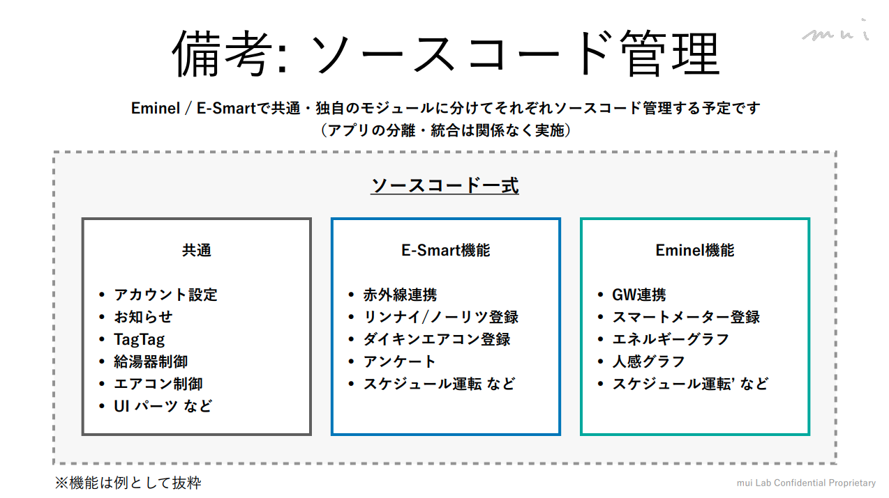
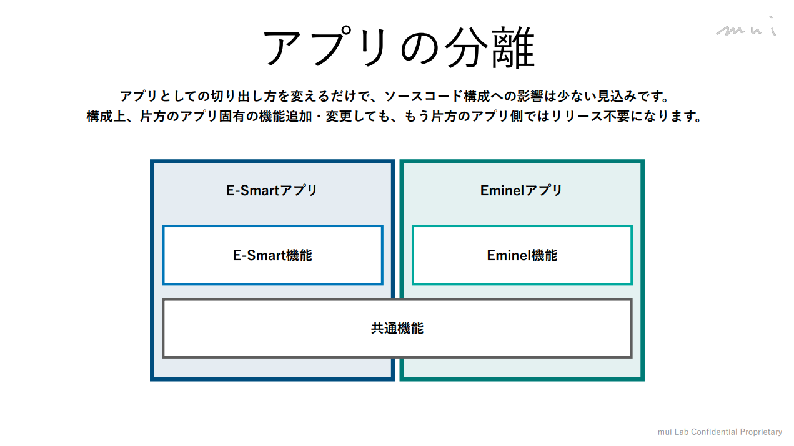

# 依頼: モバイルアプリ構成の変更

# 依頼内容

OneDriveにアップロードされている[Eminelアプリ分割](Eminelアプリ分割について.pdf)についての内容に合わせて**syp-eminelstandard-app**のディレクトリ構成を変更してほしい。

## ステップ

1. 変更後のディレクトリ構成の提案（SYP）[8/3 - 8/14]
2. muiレビュー（mui, SYP）←お盆明け実施 [8/17 - 8/19]
    1. レビュー反映 [8/20 - 8/21]
3. 実装（SYP）[8/24 - 8/28週]

## 背景

eGWアプリは**syp-eminelstandard-app**リポジトリにアプリを同居させる。

- 共通要素を使いまわしたい
    - UI要素
    - ログイン
    - ESTAとの共通ロジックなど

アプリストアは別なので、アプリビルドの出し分けを行いたい。

# ゴール

1. アプリ層と共通層に分け、複数のアプリの管理を1つのrepositoryで行えること
    - 今後コードを付け足しやすい構成になっていること
2. ESTAアプリとEMINELアプリをそれぞれ別アプリとしてビルドできること
3. EMINELアプリのコードを付け足す際に、ESTAアプリの開発に影響がないこと

# 参考

同様の構成
[kurashi-for-energy](https://app.notion.com/p/muilab/3b12d31d0e4080ea8d0ecc19054128fc?source=copy_link#3b12d31d0e4080168c97dda2d5b97865)